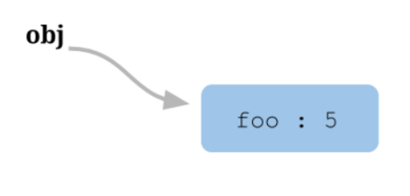

# this

### 一句话

函数可以在不同的运行环境执行，**所以需要有一种机制，能够在函数体内部获得当前的运行环境（context）**。

所以，`this` 就出现了，**它的设计目的就是在函数体内部，指代函数当前的运行环境**

### 概念

**this 指的是函数运行时所在的环境**.

```js
var obj = {
  foo: function () { console.log(this.bar) },
  bar: 1
};

var foo = obj.foo;
var bar = 2;

obj.foo() // 1
foo() // 2
```

对于 `obj.foo()` 来说，`foo` 运行在 `obj 环境`，所以 `this` 指向 `obj`

对于 `foo()` 来说，`foo` 运行在`全局环境`，所以 `this` 指向 `全局环境`

### 内存的数据结构

JavaScript 语言之所以有 `this` 的设计，跟内存里面的数据结构有关系

```js
var obj = { foo:  5 };
```

上面的代码将一个对象赋值给变量 `obj`。JavaScript 引擎会先在内存里面，生成一个对象`{ foo: 5 }`，然后把这个对象的内存地址赋值给变量 `obj`




也就是说，变量 `obj` 是一个`地址（reference）`。后面如果要读取`obj.foo`，引擎先从`obj`拿到内存地址，然后再从该地址读出原始的对象，返回它的`foo属性`

**原始的对象**以字典结构保存，每一个属性名都对应一个属性描述对象。举例来说，上面例子的foo属性，实际上是以下面的形式保存的


```md
{
  foo: {
    [[value]]: 5
    [[writable]]: true
    [[enumerable]]: true
    [[configurable]]: true
  }
}
```

注意，`foo属性`的值保存在属性描述对象的`value属性`里面

### 函数

属性的值可能是一个函数:

```js
var obj = { foo: function () {} };
```

这时，引擎会`将函数单独保存在内存中`，然后再将函数的`地址赋值`给`foo属性`的`value属性`。


```md
{
  foo: {
    [[value]]: 函数的地址
    ...
  }
}
```

由于函数是一个单独的值，所以它可以在不同的环境（上下文）执行

```js
var f = function () {};
var obj = { f: f };

// 单独执行
f()

// obj 环境执行
obj.f()
```

### 环境变量

JavaScript 允许在函数体内部，引用当前环境的其他变量。

```js
var f = function () {
  console.log(x);
};
```

上面代码中，函数体里面使用了变量x。该变量由运行环境提供。

现在问题就来了，由于函数可以在不同的运行环境执行，**所以需要有一种机制，能够在函数体内部获得当前的运行环境（context）**。

所以，`this`就出现了，**它的设计目的就是在函数体内部，指代函数当前的运行环境**。

```js
var f = function () {
  console.log(this.x);
}
```

上面代码中，函数体里面的`this.x`就是指当前运行环境的`x`

```js
var f = function () {
  console.log(this.x);
}

var x = 1;
var obj = {
  f: f,
  x: 2,
};

// 单独执行
f() // 1

// obj 环境执行
obj.f() // 2
```

**上面代码中，函数 f 在全局环境执行，this.x 指向全局环境的 x**:


**在 obj 环境执行，this.x 指向 obj.x**:


回到本文开头提出的问题，`obj.foo()`是通过`obj`找到foo，所以就是在`obj环境执行`。

一旦`var foo = obj.foo`，`变量foo`就直接`指向函数本身`，所以`foo()`就变成`在全局环境执行`


原文链接: [学习Javascript闭包](http://www.ruanyifeng.com/blog/2009/08/learning_javascript_closures.html), by 阮一峰.