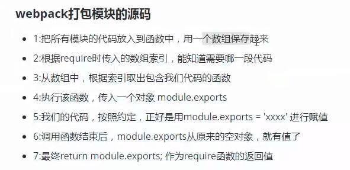

# Webpack 相关

## webpack 打包模块的源码



## 打包体积 优化思路

提取第三方库或通过引用外部文件的方式引入第三方库
代码压缩插件UglifyJsPlugin
服务器启用gzip压缩
按需加载资源文件 require.ensure
优化devtool中的source-map
剥离css文件，单独打包
去除不必要插件，通常就是开发环境与生产环境用同一套配置文件导致 #####打包效率
开发环境采用增量构建，启用热更新
开发环境不做无意义的工作如提取css计算文件hash等
配置devtool
选择合适的loader
个别loader开启cache 如babel-loader
第三方库采用引入方式
提取公共代码
优化构建时的搜索路径 指明需要构建目录及不需要构建目录
模块化引入需要的部分

## 编写一个loader

loader就是一个node模块，它输出了一个函数。当某种资源需要用这个loader转换时，这个函数会被调用。并且，这个函数可以通过提供给它的this上下文访问Loader API。
reverse-txt-loader
定义

```js
module.exports = function(src) {
  //src是原文件内容（abcde），下面对内容进行处理，这里是反转
  var result = src.split('').reverse().join(''); 
  //返回JavaScript源码，必须是String或者Buffer
  return `module.exports = '${result}'`;
}
```

使用

```js
{
	test: /\.txt$/,
	use: [
		{
			'./path/reverse-txt-loader'
		}
	]
},
```