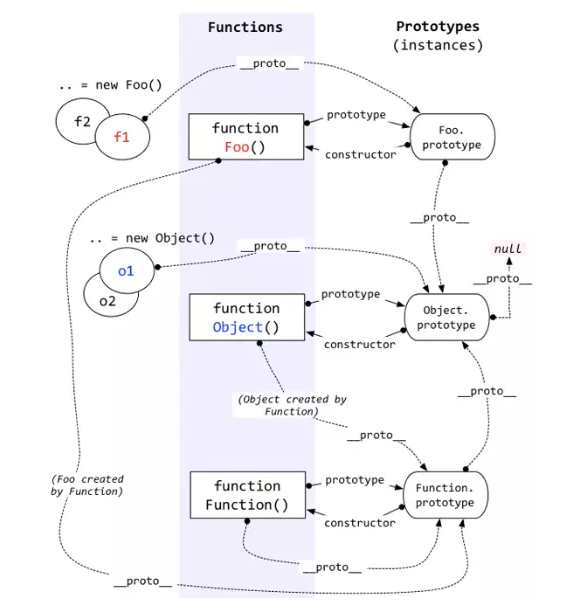
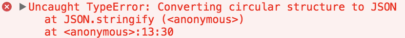

# JS 面试题

## 谈谈变量提升

当执行 JS 代码时，会生成执行环境，只要代码不是写在函数中的，就是在`全局执行环境`中，函数中的代码会产生`函数执行环境`，只此两种执行环境。
接下来让我们看一个老生常谈的例子，`var`:

```js
b() // call b
console.log(a) // undefined

var a = 'Hello world'

function b() {
    console.log('call b')
}
```

想必以上的输出大家肯定都已经明白了，这是因为函数和变量提升的原因。通常提升的解释是说将声明的代码移动到了顶部，这其实没有什么错误，便于大家理解。

但是更准确的解释应该是：在生成执行环境时，会有`两个阶段`。

第一个阶段是创建的阶段，JS 解释器会找出需要提升的变量和函数，并且给他们提前在内存中开辟好空间，函数的话会将整个函数存入内存中，变量只声明并且赋值为 `undefined`，所以在第二个阶段，也就是代码执行阶段，我们可以直接提前使用。

**在提升的过程中，相同的函数会覆盖上一个函数，并且函数优先于变量提升.**

```js
b() // call b second

function b() {
    console.log('call b fist')
}
function b() {
    console.log('call b second')
}
var b = 'Hello world'
```

`var` 会产生很多错误，所以在 `ES6` 中引入了 `let`。let 不能在声明前使用，但是这并不是常说的 let 不会提升，let 提升了，在第一阶段内存也已经为他开辟好了空间，但是因为这个声明的特性导致了并不能在声明前使用。

## bind、call、apply 区别

`call` 和 `apply` 都是为了解决改变 `this` 的指向。作用都是相同的，只是传参的方式不同。
除了第一个参数外，`call` 可以接收一个参数列表，`apply` 只接受一个参数数组。

```js
let a = {
    value: 1
}
function getValue(name, age) {
    console.log(name)
    console.log(age)
    console.log(this.value)
}
getValue.call(a, 'yck', '24')
getValue.apply(a, ['yck', '24'])
```

`bind` 和其他两个方法作用也是一致的，只是该方法会返回一个函数。并且我们可以通过 `bind` 实现柯里化。

## 如何实现一个 bind 函数

对于实现以下几个函数，可以从几个方面思考

- 不传入第一个参数，那么默认为 `window`
- 改变了 `this` 指向，让新的对象可以执行该函数。那么思路是否可以变成给新的对象添加一个函数，然后在执行完以后删除？

```js
Function.prototype.myBind = function (context) {
  if (typeof this !== 'function') {
    throw new TypeError('Error')
  }
  var _this = this
  var args = [...arguments].slice(1)
  // 返回一个函数
  return function F() {
    // 因为返回了一个函数，我们可以 new F()，所以需要判断
    if (this instanceof F) {
      return new _this(...args, ...arguments)
    }
    return _this.apply(context, args.concat(...arguments))
  }
}
```

## 如何实现一个 call 函数

```js
Function.prototype.myCall = function (context) {
  var context = context || window
  // 给 context 添加一个属性
  // getValue.call(a, 'yck', '24') => a.fn = getValue
  context.fn = this
  // 将 context 后面的参数取出来
  var args = [...arguments].slice(1)
  // getValue.call(a, 'yck', '24') => a.fn('yck', '24')
  var result = context.fn(...args)
  // 删除 fn
  delete context.fn
  return result
}
```

## 如何实现一个 apply 函数

```js
Function.prototype.myApply = function (context) {
  var context = context || window
  context.fn = this

  var result
  // 需要判断是否存储第二个参数
  // 如果存在，就将第二个参数展开
  if (arguments[1]) {
    result = context.fn(...arguments[1])
  } else {
    result = context.fn()
  }

  delete context.fn
  return result
}
```

## 简单说下原型链



每个函数都有 `prototype` 属性，除了 `Function.prototype.bind()`，该属性指向原型。

每个对象都有 `__proto__` 属性，指向了创建该对象的构造函数的原型。其实这个属性指向了 `[[prototype]]`，但是 `[[prototype]]` 是内部属性，我们并不能访问到，所以使用 `_proto_` 来访问。

对象可以通过 `__proto__` 来寻找不属于该对象的属性，`__proto__` 将对象连接起来组成了原型链。

## 怎么判断对象类型

- 可以通过 `Object.prototype.toString.call(xx)`。这样我们就可以获得类似 `[object Type]` 的字符串。
- `instanceof` 可以正确的判断对象的类型，因为内部机制是通过判断对象的原型链中是不是能找到类型的 `prototype`。

## 箭头函数的特点

```js
function a() {
    return () => {
        return () => {
          console.log(this)
        }
    }
}
console.log(a()()())
```

箭头函数其实是没有 `this` 的，这个函数中的 `this` 只取决于他外面的第一个不是箭头函数的函数的 `this`。在这个例子中，因为调用 a 符合前面代码中的第一个情况，所以 `this` 是 `window`。并且 `this` 一旦绑定了上下文，就不会被任何代码改变。

## This

`this` 是很多人会混淆的概念，但是其实他一点都不难，你只需要记住几个规则就可以了。

```js
function foo() {
  console.log(this.a)
}
var a = 1
foo()

var obj = {
  a: 2,
  foo: foo
}
obj.foo()

// 以上两者情况 `this` 只依赖于调用函数前的对象，优先级是第二个情况大于第一个情况

// 以下情况是优先级最高的，`this` 只会绑定在 `c` 上，不会被任何方式修改 `this` 指向
var c = new foo()
c.a = 3
console.log(c.a)

// 还有种就是利用 call，apply，bind 改变 this，这个优先级仅次于 new
```

## async、await 优缺点

`async` 和 `await` 相比直接使用 `Promise` 来说，优势在于处理 `then` 的调用链，能够更清晰准确的写出代码。

缺点在于滥用 `await` 可能会导致性能问题，因为 `await` 会阻塞代码，也许之后的异步代码并不依赖于前者，但仍然需要等待前者完成，导致代码失去了并发性。

下面来看一个使用 await 的代码。

```js
var a = 0
var b = async () => {
  a = a + await 10
  console.log('2', a) // -> '2' 10
  a = (await 10) + a
  console.log('3', a) // -> '3' 20
}
b()
a++
console.log('1', a) // -> '1' 1
```

对于以上代码你可能会有疑惑，这里说明下原理

- 首先函数 `b` 先执行，在执行到 `await 10` 之前变量 `a` 还是 `0`，因为在 `await` 内部实现了 `generators` ，`generators` 会保留堆栈中东西，所以这时候 `a = 0` 被保存了下来
- 因为 `await` 是异步操作，遇到 `await` 就会立即返回一个 `pending` 状态的 `Promise` 对象，暂时返回执行代码的控制权，使得函数外的代码得以继续执行，所以会先执行 `console.log('1', a)`
- 这时候同步代码执行完毕，开始执行异步代码，将保存下来的值拿出来使用，这时候 `a = 10`
- 然后后面就是常规执行代码了

## generator 原理

`Generator` 是 `ES6` 中新增的语法，和 `Promise` 一样，都可以用来异步编程

```js
// 使用 * 表示这是一个 Generator 函数
// 内部可以通过 yield 暂停代码
// 通过调用 next 恢复执行
function* test() {
  let a = 1 + 2;
  yield 2;
  yield 3;
}
let b = test();
console.log(b.next()); // >  { value: 2, done: false }
console.log(b.next()); // >  { value: 3, done: false }
console.log(b.next()); // >  { value: undefined, done: true }
```

从以上代码可以发现，加上 `*` 的函数执行后拥有了 `next` 函数，也就是说函数执行后返回了一个对象。每次调用 `next` 函数可以继续执行被暂停的代码。以下是 `Generator` 函数的简单实现

```JS
// cb 也就是编译过的 test 函数
function generator(cb) {
  return (function() {
    var object = {
      next: 0,
      stop: function() {}
    };

    return {
      next: function() {
        var ret = cb(object);
        if (ret === undefined) return { value: undefined, done: true };
        return {
          value: ret,
          done: false
        };
      }
    };
  })();
}
// 如果你使用 babel 编译后可以发现 test 函数变成了这样
function test() {
  var a;
  return generator(function(_context) {
    while (1) {
      switch ((_context.prev = _context.next)) {
        // 可以发现通过 yield 将代码分割成几块
        // 每次执行 next 函数就执行一块代码
        // 并且表明下次需要执行哪块代码
        case 0:
          a = 1 + 2;
          _context.next = 4;
          return 2;
        case 4:
          _context.next = 6;
          return 3;
        // 执行完毕
        case 6:
        case "end":
          return _context.stop();
      }
    }
  });
}
```

## Promise

`Promise` 是 `ES6` 新增的语法，解决了回调地狱的问题。

可以把 `Promise` 看成一个状态机。初始是 `pending` 状态，可以通过函数 `resolve` 和 `reject` ，将状态转变为 `resolved` 或者 `rejected` 状态，状态一旦改变就不能再次变化。
`then` 函数会返回一个 `Promise` 实例，并且该返回值是一个新的实例而不是之前的实例。因为 `Promise` 规范规定除了 `pending` 状态，其他状态是不可以改变的，如果返回的是一个相同实例的话，多个 `then` 调用就失去意义了。

对于 `then` 来说，本质上可以把它看成是 `flatMap`

## 如何实现一个 Promise

```js
// 三种状态
const PENDING = "pending";
const RESOLVED = "resolved";
const REJECTED = "rejected";
// promise 接收一个函数参数，该函数会立即执行
function MyPromise(fn) {
  let _this = this;
  _this.currentState = PENDING;
  _this.value = undefined;
  // 用于保存 then 中的回调，只有当 promise
  // 状态为 pending 时才会缓存，并且每个实例至多缓存一个
  _this.resolvedCallbacks = [];
  _this.rejectedCallbacks = [];

  _this.resolve = function (value) {
    if (value instanceof MyPromise) {
      // 如果 value 是个 Promise，递归执行
      return value.then(_this.resolve, _this.reject)
    }
    setTimeout(() => { // 异步执行，保证执行顺序
      if (_this.currentState === PENDING) {
        _this.currentState = RESOLVED;
        _this.value = value;
        _this.resolvedCallbacks.forEach(cb => cb());
      }
    })
  };

  _this.reject = function (reason) {
    setTimeout(() => { // 异步执行，保证执行顺序
      if (_this.currentState === PENDING) {
        _this.currentState = REJECTED;
        _this.value = reason;
        _this.rejectedCallbacks.forEach(cb => cb());
      }
    })
  }
  // 用于解决以下问题
  // new Promise(() => throw Error('error))
  try {
    fn(_this.resolve, _this.reject);
  } catch (e) {
    _this.reject(e);
  }
}

MyPromise.prototype.then = function (onResolved, onRejected) {
  var self = this;
  // 规范 2.2.7，then 必须返回一个新的 promise
  var promise2;
  // 规范 2.2.onResolved 和 onRejected 都为可选参数
  // 如果类型不是函数需要忽略，同时也实现了透传
  // Promise.resolve(4).then().then((value) => console.log(value))
  onResolved = typeof onResolved === 'function' ? onResolved : v => v;
  onRejected = typeof onRejected === 'function' ? onRejected : r => throw r;

  if (self.currentState === RESOLVED) {
    return (promise2 = new MyPromise(function (resolve, reject) {
      // 规范 2.2.4，保证 onFulfilled，onRjected 异步执行
      // 所以用了 setTimeout 包裹下
      setTimeout(function () {
        try {
          var x = onResolved(self.value);
          resolutionProcedure(promise2, x, resolve, reject);
        } catch (reason) {
          reject(reason);
        }
      });
    }));
  }

  if (self.currentState === REJECTED) {
    return (promise2 = new MyPromise(function (resolve, reject) {
      setTimeout(function () {
        // 异步执行onRejected
        try {
          var x = onRejected(self.value);
          resolutionProcedure(promise2, x, resolve, reject);
        } catch (reason) {
          reject(reason);
        }
      });
    }));
  }

  if (self.currentState === PENDING) {
    return (promise2 = new MyPromise(function (resolve, reject) {
      self.resolvedCallbacks.push(function () {
        // 考虑到可能会有报错，所以使用 try/catch 包裹
        try {
          var x = onResolved(self.value);
          resolutionProcedure(promise2, x, resolve, reject);
        } catch (r) {
          reject(r);
        }
      });

      self.rejectedCallbacks.push(function () {
        try {
          var x = onRejected(self.value);
          resolutionProcedure(promise2, x, resolve, reject);
        } catch (r) {
          reject(r);
        }
      });
    }));
  }
};
// 规范 2.3
function resolutionProcedure(promise2, x, resolve, reject) {
  // 规范 2.3.1，x 不能和 promise2 相同，避免循环引用
  if (promise2 === x) {
    return reject(new TypeError("Error"));
  }
  // 规范 2.3.2
  // 如果 x 为 Promise，状态为 pending 需要继续等待否则执行
  if (x instanceof MyPromise) {
    if (x.currentState === PENDING) {
      x.then(function (value) {
        // 再次调用该函数是为了确认 x resolve 的
        // 参数是什么类型，如果是基本类型就再次 resolve
        // 把值传给下个 then
        resolutionProcedure(promise2, value, resolve, reject);
      }, reject);
    } else {
      x.then(resolve, reject);
    }
    return;
  }
  // 规范 2.3.3.3.3
  // reject 或者 resolve 其中一个执行过得话，忽略其他的
  let called = false;
  // 规范 2.3.3，判断 x 是否为对象或者函数
  if (x !== null && (typeof x === "object" || typeof x === "function")) {
    // 规范 2.3.3.2，如果不能取出 then，就 reject
    try {
      // 规范 2.3.3.1
      let then = x.then;
      // 如果 then 是函数，调用 x.then
      if (typeof then === "function") {
        // 规范 2.3.3.3
        then.call(
          x,
          y => {
            if (called) return;
            called = true;
            // 规范 2.3.3.3.1
            resolutionProcedure(promise2, y, resolve, reject);
          },
          e => {
            if (called) return;
            called = true;
            reject(e);
          }
        );
      } else {
        // 规范 2.3.3.4
        resolve(x);
      }
    } catch (e) {
      if (called) return;
      called = true;
      reject(e);
    }
  } else {
    // 规范 2.3.4，x 为基本类型
    resolve(x);
  }
}
```

## == 和 ===区别，什么情况用 ==


上图中的 `toPrimitive` 就是对象转基本类型。

这里来解析一道题目 `[] == ![] // -> true` ，下面是这个表达式为何为 `true` 的步骤

```js
// [] 转成 true，然后取反变成 false
[] == false
// 根据第 8 条得出
[] == ToNumber(false)
[] == 0
// 根据第 10 条得出
ToPrimitive([]) == 0
// [].toString() -> ''
'' == 0
// 根据第 6 条得出
0 == 0 // -> true
```

`===` 用于判断两者类型和值是否相同。 在开发中，对于后端返回的 `code`，可以通过 `==` 去判断。

## 垃圾回收

`V8` 实现了准确式 `GC`，`GC` 算法采用了分代式垃圾回收机制。因此，V8 将内存（堆）分为新生代和老生代两部分。

**新生代算法:**

新生代中的对象一般存活时间较短，使用 `Scavenge GC` 算法。
在新生代空间中，内存空间分为两部分，分别为 `From` 空间和 `To` 空间。在这两个空间中，必定有一个空间是使用的，另一个空间是空闲的。新分配的对象会被放入 `From` 空间中，当 `From` 空间被占满时，新生代 `GC` 就会启动了。算法会检查 `From` 空间中存活的对象并复制到 `To` 空间中，如果有失活的对象就会销毁。当复制完成后将 `From` 空间和 `To` 空间互换，这样 `GC` 就结束了。

**老生代算法:**

老生代中的对象一般存活时间较长且数量也多，使用了两个算法，分别是标记清除算法和标记压缩算法。
在讲算法前，先来说下什么情况下对象会出现在老生代空间中：

新生代中的对象是否已经经历过一次 `Scavenge` 算法，如果经历过的话，会将对象从新生代空间移到老生代空间中。
`To` 空间的对象占比大小超过 `25 %`。在这种情况下，为了不影响到内存分配，会将对象从新生代空间移到老生代空间中。

老生代中的空间很复杂，有如下几个空间

```js
enum AllocationSpace {
  // TODO(v8:7464): Actually map this space's memory as read-only.
  RO_SPACE,    // 不变的对象空间
  NEW_SPACE,   // 新生代用于 GC 复制算法的空间
  OLD_SPACE,   // 老生代常驻对象空间
  CODE_SPACE,  // 老生代代码对象空间
  MAP_SPACE,   // 老生代 map 对象
  LO_SPACE,    // 老生代大空间对象
  NEW_LO_SPACE,  // 新生代大空间对象

  FIRST_SPACE = RO_SPACE,
  LAST_SPACE = NEW_LO_SPACE,
  FIRST_GROWABLE_PAGED_SPACE = OLD_SPACE,
  LAST_GROWABLE_PAGED_SPACE = MAP_SPACE
};
```

在老生代中，以下情况会先启动标记清除算法：

某一个空间没有分块的时候
空间中被对象超过一定限制
空间不能保证新生代中的对象移动到老生代中

在这个阶段中，会遍历堆中所有的对象，然后标记活的对象，在标记完成后，销毁所有没有被标记的对象。在标记大型对内存时，可能需要几百毫秒才能完成一次标记。这就会导致一些性能上的问题。为了解决这个问题，2011 年，`V8` 从 `stop-the-world` 标记切换到增量标志。在增量标记期间，`GC` 将标记工作分解为更小的模块，可以让 `JS` 应用逻辑在模块间隙执行一会，从而不至于让应用出现停顿情况。但在 2018 年，`GC` 技术又有了一个重大突破，这项技术名为并发标记。该技术可以让 `GC` 扫描和标记对象时，同时允许 `JS` 运行。
清除对象后会造成堆内存出现碎片的情况，当碎片超过一定限制后会启动压缩算法。在压缩过程中，将活的对象像一端移动，直到所有对象都移动完成然后清理掉不需要的内存。

## 闭包

闭包的定义很简单：`函数 A` 返回了一个`函数 B`，并且`函数 B` 中使用了`函数 A` 的变量，`函数 B` 就被称为 **闭包**。

```js
function A() {
  let a = 1
  function B() {
      console.log(a)
  }
  return B
}
```

你是否会疑惑，为什么函数 A 已经弹出调用栈了，为什么函数 B 还能引用到函数 A 中的变量。因为函数 A 中的变量这时候是存储在堆上的。现在的 JS 引擎可以通过逃逸分析辨别出哪些变量需要存储在堆上，哪些需要存储在栈上。
经典面试题，循环中使用闭包解决 `var` 定义函数的问题

```js
for ( var i=1; i<=5; i++) {
  setTimeout( function timer() {
    console.log( i );
  }, i*1000 );
}
```

首先因为 `setTimeout` 是个异步函数，所有会先把循环全部执行完毕，这时候 `i` 就是 `6` 了，所以会输出一堆 `6`。

解决办法两种，第一种使用`闭包`

```js
for (var i = 1; i <= 5; i++) {
  (function(j) {
    setTimeout(function timer() {
      console.log(j);
    }, j * 1000);
  })(i);
}
```

第二种就是使用 `setTimeout`  的第 **三个参数**

```js
for ( var i=1; i<=5; i++) {
  setTimeout( function timer(j) {
    console.log( j );
  }, i*1000, i);
}
```

第三种就是使用 `let` 定义 `i` 了

```js
for ( let i=1; i<=5; i++) {
  setTimeout( function timer() {
    console.log( i );
  }, i*1000 );
}
```

因为对于 `let` 来说，他会创建一个块级作用域，相当于

```js
{ // 形成块级作用域
  let i = 0
  {
    let ii = i
    setTimeout( function timer() {
        console.log( ii );
    }, i*1000 );
  }
  i++
  {
    let ii = i
  }
  i++
  {
    let ii = i
  }
  ...
}
```

## 基本数据类型和引⽤类型在存储上的差别

前者存储在栈上，后者存储在堆上

## 浏览器 Eventloop 和 Node 中的有什么区别

众所周知 JS 是门非阻塞单线程语言，因为在最初 JS 就是为了和浏览器交互而诞生的。如果 JS 是门多线程的语言话，我们在多个线程中处理 DOM 就可能会发生问题（一个线程中新加节点，另一个线程中删除节点），当然可以引入读写锁解决这个问题。
JS 在执行的过程中会产生执行环境，这些执行环境会被顺序的加入到执行栈中。如果遇到异步的代码，会被挂起并加入到 Task（有多种 task） 队列中。一旦执行栈为空，Event Loop 就会从 Task 队列中拿出需要执行的代码并放入执行栈中执行，所以本质上来说 JS 中的异步还是同步行为。

```js
console.log('script start');

setTimeout(function() {
  console.log('setTimeout');
}, 0);

console.log('script end');
```

以上代码虽然 setTimeout 延时为 0，其实还是异步。这是因为 HTML5 标准规定这个函数第二个参数不得小于 4 毫秒，不足会自动增加。所以 setTimeout 还是会在 script end 之后打印。
不同的任务源会被分配到不同的 Task 队列中，任务源可以分为 微任务（microtask） 和 宏任务（macrotask）。在 ES6 规范中，microtask 称为 jobs，macrotask 称为 task。

```js
console.log('script start');

setTimeout(function() {
  console.log('setTimeout');
}, 0);

new Promise((resolve) => {
    console.log('Promise')
    resolve()
}).then(function() {
  console.log('promise1');
}).then(function() {
  console.log('promise2');
});

console.log('script end');
// script start => Promise => script end => promise1 => promise2 => setTimeout
```

以上代码虽然 setTimeout 写在 Promise 之前，但是因为 Promise 属于微任务而 setTimeout 属于宏任务，所以会有以上的打印。

微任务包括 process.nextTick ，promise ，Object.observe ，MutationObserver

宏任务包括 script ， setTimeout ，setInterval ，setImmediate ，I/O ，UI rendering

很多人有个误区，认为微任务快于宏任务，其实是错误的。因为宏任务中包括了 script ，浏览器会先执行一个宏任务，接下来有异步代码的话就先执行微任务。

所以正确的一次 Event loop 顺序是这样的

- 1.执行同步代码，这属于宏任务
- 2.执行栈为空，查询是否有微任务需要执行
- 3.执行所有微任务
- 4.必要的话渲染 UI
- 5.然后开始下一轮 Event loop，执行宏任务中的异步代码

通过上述的 Event loop 顺序可知，如果宏任务中的异步代码有大量的计算并且需要操作 DOM 的话，为了更快的 界面响应，我们可以把操作 DOM 放入微任务中。

## Node 中的 Event loop

Node 中的 Event loop 和浏览器中的不相同。

Node 的 Event loop 分为6个阶段，它们会按照顺序反复运行

```js
   ┌───────────────────────┐
┌─>│        timers         │
│  └──────────┬────────────┘
│  ┌──────────┴────────────┐
│  │     I/O callbacks     │
│  └──────────┬────────────┘
│  ┌──────────┴────────────┐
│  │     idle, prepare     │
│  └──────────┬────────────┘      ┌───────────────┐
│  ┌──────────┴────────────┐      │   incoming:   │
│  │         poll          │<──connections───     │
│  └──────────┬────────────┘      │   data, etc.  │
│  ┌──────────┴────────────┐      └───────────────┘
│  │        check          │
│  └──────────┬────────────┘
│  ┌──────────┴────────────┐
└──┤    close callbacks    │
   └───────────────────────┘
```

**timer**:

timers 阶段会执行 setTimeout 和 setInterval
一个 timer 指定的时间并不是准确时间，而是在达到这个时间后尽快执行回调，可能会因为系统正在执行别的事务而延迟。
下限的时间有一个范围：[1, 2147483647] ，如果设定的时间不在这个范围，将被设置为1。

**I/O**:

I/O 阶段会执行除了 close 事件，定时器和 setImmediate 的回调

**idle, prepare**:

idle, prepare 阶段内部实现

**poll**:

poll 阶段很重要，这一阶段中，系统会做两件事情

- 执行到点的定时器
- 执行 poll 队列中的事件

并且当 poll 中没有定时器的情况下，会发现以下两件事情

- 如果 poll 队列不为空，会遍历回调队列并同步执行，直到队列为空或者系统限制
- 如果 poll 队列为空，会有两件事发生
  - 如果有 setImmediate 需要执行，poll 阶段会停止并且进入到 check 阶段执行 setImmediate
  - 如果没有 setImmediate 需要执行，会等待回调被加入到队列中并立即执行回调

如果有别的定时器需要被执行，会回到 timer 阶段执行回调。

**check**:

check 阶段执行 setImmediate

**close callbacks**:

close callbacks 阶段执行 close 事件

并且在 Node 中，有些情况下的定时器执行顺序是随机的

```js
setTimeout(() => {
    console.log('setTimeout');
}, 0);
setImmediate(() => {
    console.log('setImmediate');
})
// 这里可能会输出 setTimeout，setImmediate
// 可能也会相反的输出，这取决于性能
// 因为可能进入 event loop 用了不到 1 毫秒，这时候会执行 setImmediate
// 否则会执行 setTimeout
```

当然在这种情况下，执行顺序是相同的

```js
var fs = require('fs')

fs.readFile(__filename, () => {
    setTimeout(() => {
        console.log('timeout');
    }, 0);
    setImmediate(() => {
        console.log('immediate');
    });
});
// 因为 readFile 的回调在 poll 中执行
// 发现有 setImmediate ，所以会立即跳到 check 阶段执行回调
// 再去 timer 阶段执行 setTimeout
// 所以以上输出一定是 setImmediate，setTimeout
```

上面介绍的都是 macrotask 的执行情况，microtask 会在以上每个阶段完成后立即执行。

```js
setTimeout(()=>{
    console.log('timer1')

    Promise.resolve().then(function() {
        console.log('promise1')
    })
}, 0)

setTimeout(()=>{
    console.log('timer2')

    Promise.resolve().then(function() {
        console.log('promise2')
    })
}, 0)

// 以上代码在浏览器和 node 中打印情况是不同的
// 浏览器中一定打印 timer1, promise1, timer2, promise2
// node 中可能打印 timer1, timer2, promise1, promise2
// 也可能打印 timer1, promise1, timer2, promise2
```

Node 中的 process.nextTick 会先于其他 microtask 执行。

```js
setTimeout(() => {
  console.log("timer1");

  Promise.resolve().then(function() {
    console.log("promise1");
  });
}, 0);

process.nextTick(() => {
  console.log("nextTick");
});
// nextTick, timer1, promise1
```

## setTimeout 倒计时误差

JS 是单线程的，所以 setTimeout 的误差其实是无法被完全解决的，原因有很多，可能是回调中的，有可能是浏览器中的各种事件导致。这也是为什么页面开久了，定时器会不准的原因，当然我们可以通过一定的办法去减少这个误差。

以下是一个相对准备的倒计时实现

```js
var period = 60 * 1000 * 60 * 2
var startTime = new Date().getTime();
var count = 0
var end = new Date().getTime() + period
var interval = 1000
var currentInterval = interval

function loop() {
  count++
  var offset = new Date().getTime() - (startTime + count * interval); // 代码执行所消耗的时间
  var diff = end - new Date().getTime()
  var h = Math.floor(diff / (60 * 1000 * 60))
  var hdiff = diff % (60 * 1000 * 60)
  var m = Math.floor(hdiff / (60 * 1000))
  var mdiff = hdiff % (60 * 1000)
  var s = mdiff / (1000)
  var sCeil = Math.ceil(s)
  var sFloor = Math.floor(s)
  currentInterval = interval - offset // 得到下一次循环所消耗的时间
  console.log('时：'+h, '分：'+m, '毫秒：'+s, '秒向上取整：'+sCeil, '代码执行时间：'+offset, '下次循环间隔'+currentInterval) // 打印 时 分 秒 代码执行时间 下次循环间隔

  setTimeout(loop, currentInterval)
}

setTimeout(loop, currentInterval)
```

## 防抖

你是否在日常开发中遇到一个问题，在滚动事件中需要做个复杂计算或者实现一个按钮的防二次点击操作。

这些需求都可以通过函数防抖动来实现。尤其是第一个需求，如果在频繁的事件回调中做复杂计算，很有可能导致页面卡顿，不如将多次计算合并为一次计算，只在一个精确点做操作。

PS：防抖和节流的作用都是防止函数多次调用。区别在于，假设一个用户一直触发这个函数，且每次触发函数的间隔小于wait，防抖的情况下只会调用一次，而节流的 情况会每隔一定时间（参数wait）调用函数。

我们先来看一个袖珍版的防抖理解一下防抖的实现：

```js
// func是用户传入需要防抖的函数
// wait是等待时间
const debounce = (func, wait = 50) => {
  // 缓存一个定时器id
  let timer = 0
  // 这里返回的函数是每次用户实际调用的防抖函数
  // 如果已经设定过定时器了就清空上一次的定时器
  // 开始一个新的定时器，延迟执行用户传入的方法
  return function(...args) {
    if (timer) clearTimeout(timer)
    timer = setTimeout(() => {
      func.apply(this, args)
    }, wait)
  }
}
// 不难看出如果用户调用该函数的间隔小于wait的情况下，上一次的时间还未到就被清除了，并不会执行函数
```

这是一个简单版的防抖，但是有缺陷，这个防抖只能在最后调用。一般的防抖会有immediate选项，表示是否立即调用。这两者的区别，举个栗子来说：

- 例如在搜索引擎搜索问题的时候，我们当然是希望用户输入完最后一个字才调用查询接口，这个时候适用延迟执行的防抖函数，它总是在一连串（间隔小于wait的）函数触发之后调用。
- 例如用户给interviewMap点star的时候，我们希望用户点第一下的时候就去调用接口，并且成功之后改变star按钮的样子，用户就可以立马得到反馈是否star成功了，这个情况适用立即执行的防抖函数，它总是在第一次调用，并且下一次调用必须与前一次调用的时间间隔大于wait才会触发。

下面我们来实现一个带有立即执行选项的防抖函数

```js
// 这个是用来获取当前时间戳的
function now() {
  return +new Date()
}
/**
 * 防抖函数，返回函数连续调用时，空闲时间必须大于或等于 wait，func 才会执行
 *
 * @param  {function} func        回调函数
 * @param  {number}   wait        表示时间窗口的间隔
 * @param  {boolean}  immediate   设置为ture时，是否立即调用函数
 * @return {function}             返回客户调用函数
 */
function debounce (func, wait = 50, immediate = true) {
  let timer, context, args
  
  // 延迟执行函数
  const later = () => setTimeout(() => {
    // 延迟函数执行完毕，清空缓存的定时器序号
    timer = null
    // 延迟执行的情况下，函数会在延迟函数中执行
    // 使用到之前缓存的参数和上下文
    if (!immediate) {
      func.apply(context, args)
      context = args = null
    }
  }, wait)

  // 这里返回的函数是每次实际调用的函数
  return function(...params) {
    // 如果没有创建延迟执行函数（later），就创建一个
    if (!timer) {
      timer = later()
      // 如果是立即执行，调用函数
      // 否则缓存参数和调用上下文
      if (immediate) {
        func.apply(this, params)
      } else {
        context = this
        args = params
      }
    // 如果已有延迟执行函数（later），调用的时候清除原来的并重新设定一个
    // 这样做延迟函数会重新计时
    } else {
      clearTimeout(timer)
      timer = later()
    }
  }
}
```

整体函数实现的不难，总结一下。

- 对于按钮防点击来说的实现：如果函数是立即执行的，就立即调用，如果函数是延迟执行的，就缓存上下文和参数，放到延迟函数中去执行。一旦我开始一个定时器，只要我定时器还在，你每次点击我都重新计时。一旦你点累了，定时器时间到，定时器重置为 null，就可以再次点击了。
- 对于延时执行函数来说的实现：清除定时器ID，如果是延迟调用就调用函数

## 数组降维

```js
[1, [2], 3].flatMap((v) => v + 1)
// -> [2, 3, 4]
```

如果想将一个多维数组彻底的降维，可以这样实现

```js
const flattenDeep = (arr) => Array.isArray(arr)
  ? arr.reduce( (a, b) => [...a, ...flattenDeep(b)] , [])
  : [arr]

flattenDeep([1, [[2], [3, [4]], 5]])
```

## 深拷贝

这个问题通常可以通过 JSON.parse(JSON.stringify(object)) 来解决。

```js
let a = {
    age: 1,
    jobs: {
        first: 'FE'
    }
}
let b = JSON.parse(JSON.stringify(a))
a.jobs.first = 'native'
console.log(b.jobs.first) // FE
```

但是该方法也是有局限性的：

- 会忽略 undefined
- 会忽略 symbol
- 不能序列化函数
- 不能解决循环引用的对象

```js
let obj = {
  a: 1,
  b: {
    c: 2,
    d: 3,
  },
}
obj.c = obj.b
obj.e = obj.a
obj.b.c = obj.c
obj.b.d = obj.b
obj.b.e = obj.b.c
let newObj = JSON.parse(JSON.stringify(obj))
console.log(newObj)
```

如果你有这么一个循环引用对象，你会发现你不能通过该方法深拷贝



在遇到函数、 undefined 或者 symbol 的时候，该对象也不能正常的序列化

```js
let a = {
    age: undefined,
    sex: Symbol('male'),
    jobs: function() {},
    name: 'yck'
}
let b = JSON.parse(JSON.stringify(a))
console.log(b) // {name: "yck"}
```

你会发现在上述情况中，该方法会忽略掉函数和 undefined 。

但是在通常情况下，复杂数据都是可以序列化的，所以这个函数可以解决大部分问题，并且该函数是内置函数中处理深拷贝性能最快的。当然如果你的数据中含有以上三种情况下，可以使用 lodash 的深拷贝函数。

如果你所需拷贝的对象含有内置类型并且不包含函数，可以使用 MessageChannel

```js
function structuralClone(obj) {
  return new Promise(resolve => {
    const {port1, port2} = new MessageChannel();
    port2.onmessage = ev => resolve(ev.data);
    port1.postMessage(obj);
  });
}

var obj = {a: 1, b: {
    c: b
}}
// 注意该方法是异步的
// 可以处理 undefined 和循环引用对象
(async () => {
  const clone = await structuralClone(obj)
})()
```

## typeof 于 instanceof 区别

typeof 对于基本类型，除了 null 都可以显示正确的类型

```js
typeof 1 // 'number'
typeof '1' // 'string'
typeof undefined // 'undefined'
typeof true // 'boolean'
typeof Symbol() // 'symbol'
typeof b // b 没有声明，但是还会显示 undefined
```

typeof 对于对象，除了函数都会显示 object

```js
typeof [] // 'object'
typeof {} // 'object'
typeof console.log // 'function'
```

对于 null 来说，虽然它是基本类型，但是会显示 object，这是一个存在很久了的 Bug

```js
typeof null // 'object'
```

PS：为什么会出现这种情况呢？因为在 JS 的最初版本中，使用的是 32 位系统，为了性能考虑使用低位存储了变量的类型信息，000 开头代表是对象，然而 null 表示为全零，所以将它错误的判断为 object 。虽然现在的内部类型判断代码已经改变了，但是对于这个 Bug 却是一直流传下来。

instanceof 可以正确的判断对象的类型，因为内部机制是通过判断对象的原型链中是不是能找到类型的 prototype。

我们也可以试着实现一下 instanceof

```js
function instanceof(left, right) {
    // 获得类型的原型
    let prototype = right.prototype
    // 获得对象的原型
    left = left.__proto__
    // 判断对象的类型是否等于类型的原型
    while (true) {
      if (left === null)
        return false
      if (prototype === left)
        return true
      left = left.__proto__
    }
}
```

::: tip 参考链接
[大厂面经](https://juejin.im/post/5ba34e54e51d450e5162789b), by 夕阳.
:::