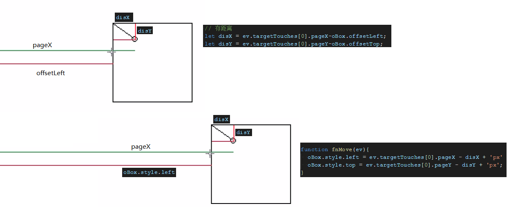
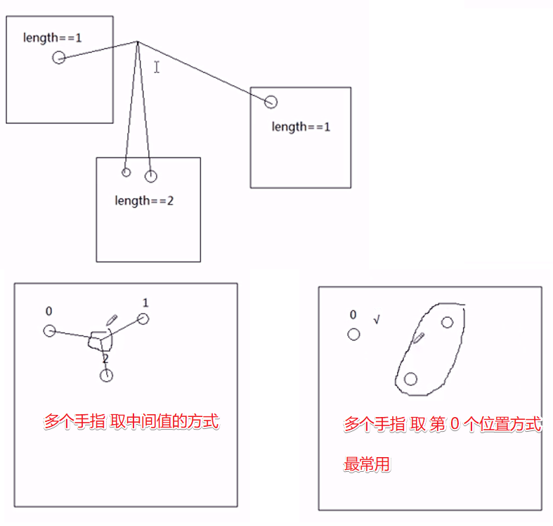
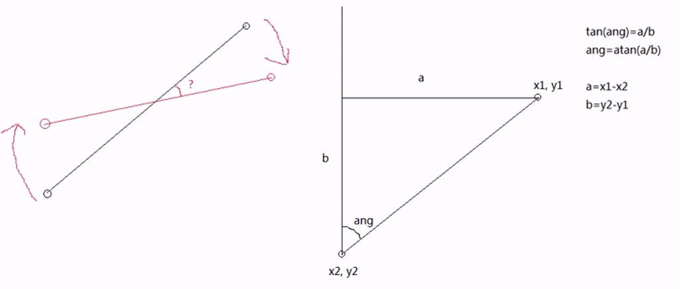
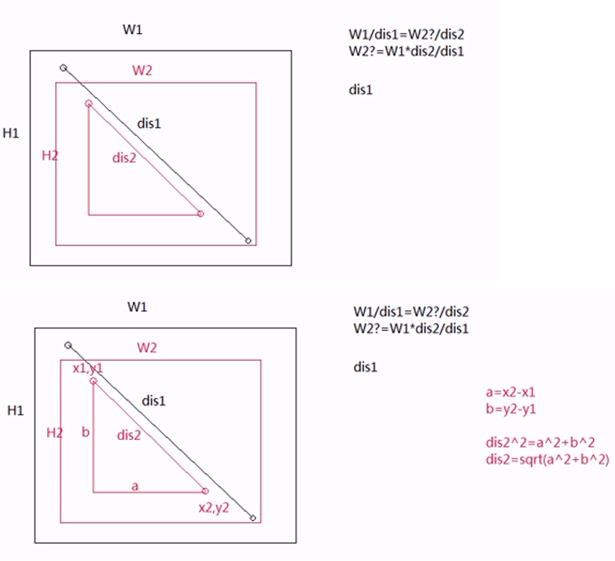

# touch

`DOM3` 事件: `ontouchstart`、`ontouchmove`、`ontouchend`(类似PC的 `onmousedown`、`onmousemove`、`onmouseup`)

**单点触摸**:



```html
<!DOCTYPE html>
<html lang="en">
<head>
  <meta charset="UTF-8">
  <meta name="viewport" content="width=device-width, initial-scale=1.0">
  <title>Document</title>
  <style>
    *{margin: 0;padding: 0;list-style: none;}
    .box{width: 100px;height: 100px;background: #ccc; position: absolute;left: 0;top:0;}
  </style>
  <script>
    window.onload = function () {
      let oBox = document.getElementsByClassName('box')[0];
      oBox.addEventListener('touchstart', function(ev){
        // 存距离
        let disX = ev.targetTouches[0].pageX-oBox.offsetLeft;
        let disY = ev.targetTouches[0].pageY-oBox.offsetTop;

        // 阻止冒泡和默认事件
        ev.cancelBubble = true;
        ev.preventDefault();

        function fnMove(ev){
          oBox.style.left = ev.targetTouches[0].pageX - disX + 'px'
          oBox.style.top = ev.targetTouches[0].pageY - disY + 'px';

          // winphone 要加
          ev.preventDefault();
        }
        function fnEnd() {
          oBox.removeEventListener('touchmove', fnMove, false)
          oBox.removeEventListener('touchend', fnEnd, false)
        }
        oBox.addEventListener('touchmove', fnMove, false)
        oBox.addEventListener('touchend', fnEnd, false)
      }, false)
    }
  </script>
</head>
<body>
  <div class="box"></div>
</body>
</html>
```

**多点触摸**:



```html
<!DOCTYPE html>
<html lang="en">
<head>
  <meta charset="UTF-8">
  <meta name="viewport" content="width=device-width, initial-scale=1.0">
  <title>Document</title>
  <style>
    *{margin: 0;padding: 0;list-style: none;}
    .box{width: 100px;height: 100px;background: #ccc; position: absolute;}
    .a1{background: red; left: 10px; top: 10px;}
    .a2{background: green; left: 210px; top: 50px;}
    .a3{background: yellow; left: 150px; top: 130px;}
  </style>
  <script>
    window.onload = function () {
      let aBox = document.getElementsByClassName('box');

      Array.from(aBox).forEach(box=>{
        drag(box)
      })

      function drag(obj) {
        obj.addEventListener('touchstart', ev => {
          // start 要加
          ev.preventDefault()

          // 存 id
          let id = ev.targetTouches[0].identifier

          // 无论放几个手指, 取第 0 个, 这种最常用
          let disX = ev.targetTouches[0].pageX - obj.offsetLeft
          let disY = ev.targetTouches[0].pageY - obj.offsetTop

          function fnMove(ev) {

            obj.style.left = ev.targetTouches[0].pageX - disX + 'px'
            obj.style.top = ev.targetTouches[0].pageY - disY + 'px'

            // move 也要加
            ev.preventDefault()
          }
          function fnEnd(ev) {
            let found = false
            Array.from(ev.changedTouches).forEach(touch=>{
              if(touch.identifier == id){
                found = true;
              }
            })

            if(found){
              obj.removeEventListener('touchmove', fnMove, false)
              obj.removeEventListener('touchend', fnEnd, false)
            }
          }

          obj.addEventListener('touchmove', fnMove, false)
          obj.addEventListener('touchend', fnEnd, false)

        }, false)
      }
    }
  </script>
</head>
<body>
  <div class="box a1"></div>
  <div class="box a2"></div>
  <div class="box a3"></div>
</body>
</html>
```

```md
1. targetTouches: 目标上面的手指们
  一个物体上有多个手指, targetTouches 就有多个东西
  整个页面不伦总共有几个手指, targetTouches只是当前物体上
2. start/move 都有 ev.preventDefault
3. touchend里面
  targetTouches 还在物体身上没离开的手指
  changedTouches 离开的手指
```

```js
// 多个手指会绑定多个事件, 比如两个手指, 那么就绑定了两个 touchend 事件
// touchmove 时感觉不到, 但是离开一个手指, touchend 触发, 会 removue 掉所有的 touchend 事件
// 导致两个手指都失效, 所以要判断手指
function fnEnd(ev) {
  obj.removeEventListener('touchmove', fnMove, false)
  obj.removeEventListener('touchend', fnEnd, false)
}

obj.addEventListener('touchend', fnEnd, false)
obj.addEventListener('touchend', fnEnd, false)
```

**手势**:

1.旋转 2.缩放



