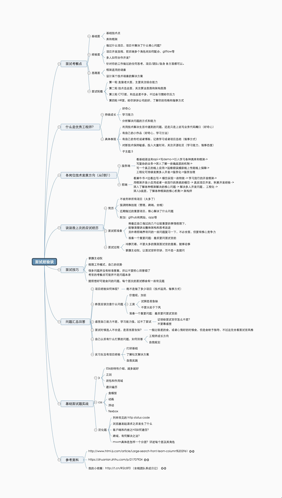
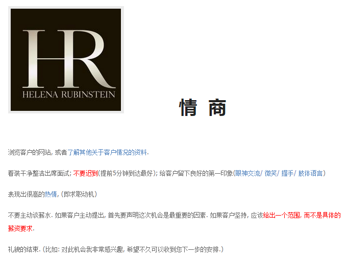
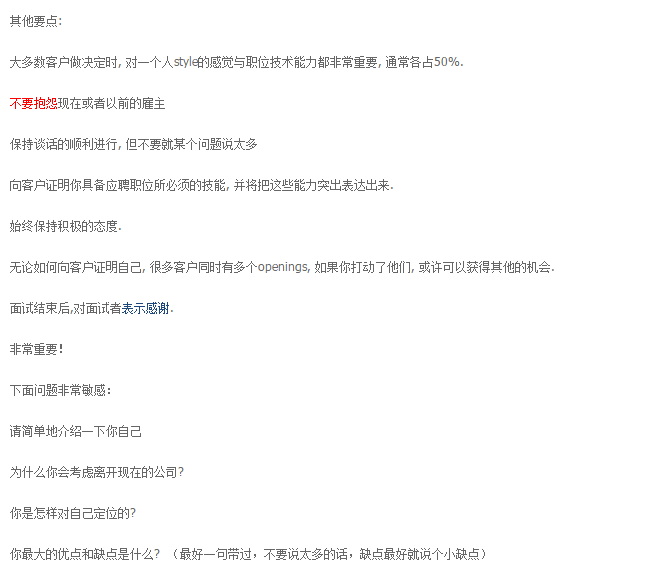
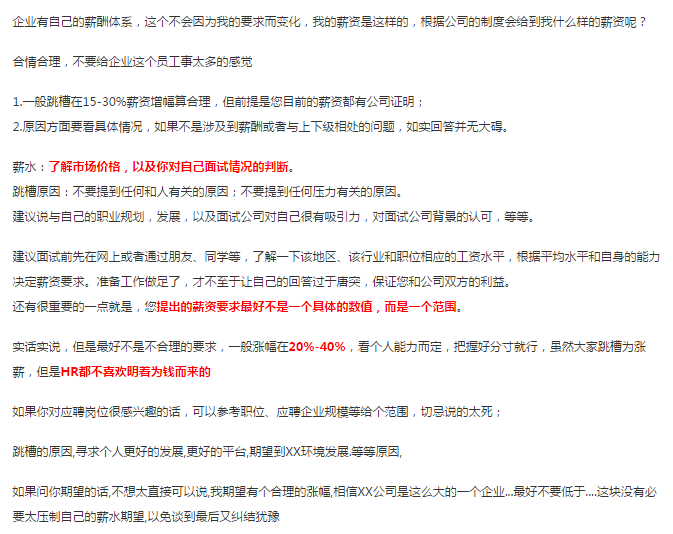
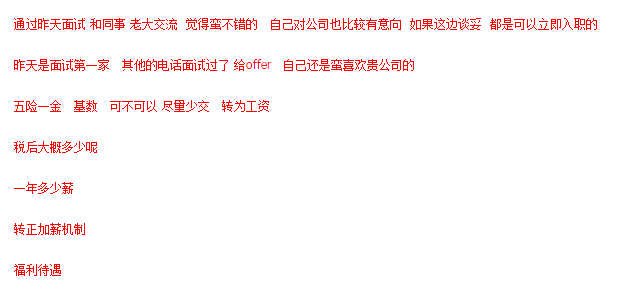
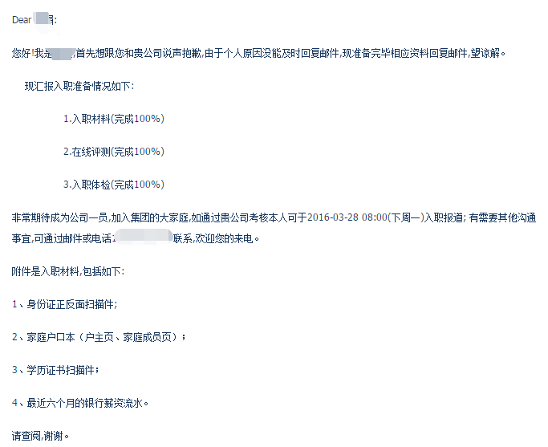
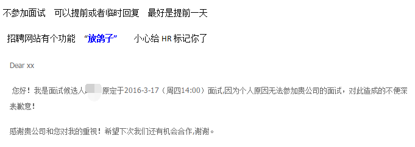

# 面试技巧

## 写在前面

**找工作不是技术好就一定能找到好工作, 运气和机遇很重要.**

**别不懂装懂, 不要让面试官有被欺骗的感觉.**

## 如何写一个漂亮的简历

简历不是一份记流水账的东西，而是让用人方了解你的亮点的。

**很多简历都有如下特征:**

- 喜欢说自己的特长、优点，用人方真的不关注你的性格是否阳光等等
- 个人技能能够占半页的篇幅，而且长得也都差不多
- 项目经验流水账，比如我会用这个 API 实现了某某功能
- 简历页数过多，真心看不下去

**简历页数控制在 2 页以下:**

- 技术名词注意大小写
- 突出个人亮点，扩充内容。比如在项目中如何找到 Bug，解决 Bug 的过程；比如如何发现的性能问题，如何解决性能问题，最终提升了多少性能；比如为何如此选型，目的是什么，较其他有什么优点等等。总体思路就是不写流水账，突出你在项目中具有不错的解决问题的能力和独立思考的能力。
- 斟酌熟悉、精通等字眼，不要给自己挖坑
- 确保每一个写上去的技术点自己都能说出点什么，杜绝面试官问你一个技术点，你只能答出会用 API 这种减分的情况

## 自我介绍

## 项目介绍

## 职业规划

## 离职原因

## 个人优缺点

## 注意事项及谈薪

## 一些面试要求

面试过程回答要循序渐进 别急着给最优答案

比如回答 继承, 写出不同方式  然后给出优缺点

一步步.

不是说故意拖时间, 回答的题目越多, 越容易减分.

大家期望的往往不是一个真实的你, 而是一个合理的你.

公司很好, 是我自己的原因想辞职.

为什么不让说以前的薪水发不出来好?

不要让自己以一个失败者的身份去重新开始, 不是说不能这么做, 而是没有必要这么说这么谈.

换句话你想一下, 你从一家公司走出来, 去新的公司, 是被挖走.

你从一家倒闭的公司走出来, 去新的公司, 是被收留.

背调只会想知道你是不是被开除的, 有没有劳动纠纷, 有没有保密协议等.

## 11条面试官的套路

- 第一，如果面试官对你说请你简单介绍一下自己的时候，他可能意味着之前根本没有看你的简历。

- 第二，当他说你为什么想来我们公司的时候，很可能意味着你是唯一的一个到他们公司面试的人。

- 第三，当他向你具体的描述一个问题的时候，很可能是他自己解决不了这个问题，是想通过面试把它解决了。

- 第四，当他问你能够接受加班吗？意思就是能够接受加班没有加班费吗？

- 第五，当他问你你抗压吗？他的意思是你能够接受压力大但薪水低吗？

- 第六，当他说我们公司很有前景的时候，肯定是意味着他们公司现状不怎么样。

- 第七，当他问你你最大的优点是什么，很可能意味着你的简历写的太糟糕了，一点亮点看不出来。

- 第八，当他问你你有什么业余爱好吗？千万不要说自驾游、高尔夫球什么的，你应该说爱读书、爱听音乐，因为这些爱好不费钱。

- 第九，当他问你你结婚了吗？他并不是想给你介绍对象，他就想借机八卦一下。

- 第十，当他问你你对未来有什么规划的时候，他其实就想了解一下现在的年轻人怎么吹牛。

- 第十一，当他说五天以后我给你答复的时候，可能是意味着五天之内，如果他们找不到更合适的人选才会联系你。

::: tip 参考链接
[大厂面经](https://juejin.im/post/5ba34e54e51d450e5162789b), by 夕阳.
:::