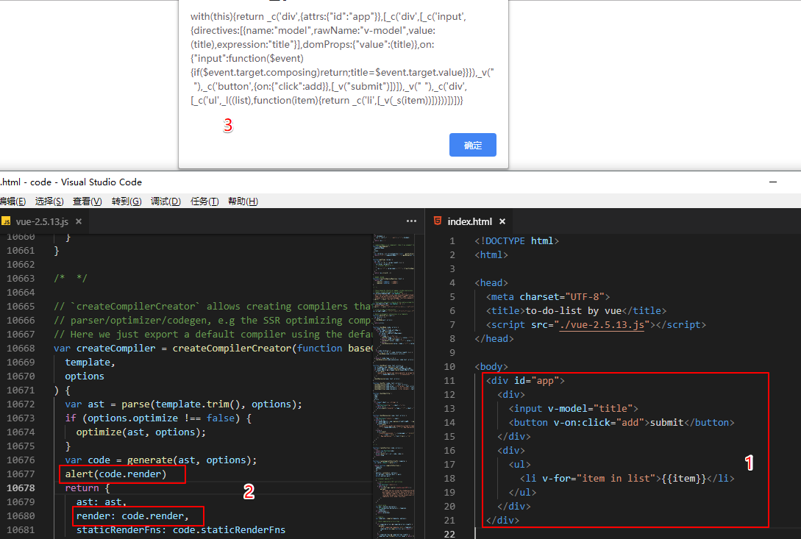

# Vue 的 render 函数深入

`Vue 2.0` 开始支持预编译, 在开发环境写模版, 编译打包后, 生产环境看到的就是 `JS`, 如下面的 `with` 一样.

### 查看 render 函数



页面代码如下:

```html
<!DOCTYPE html>
<html>

<head>
  <meta charset="UTF-8">
  <title>to-do-list by vue</title>
  <script src="./vue-2.5.13.js"></script>
</head>

<body>
  <div id="app">
    <div>
      <input v-model="title">
      <button v-on:click="add">submit</button>
    </div>
    <div>
      <ul>
        <li v-for="item in list">{{item}}</li>
      </ul>
    </div>
  </div>

  <script type="text/javascript">
    // data 独立
    var data = {
      title: '',
      list: []
    }
    // 初始化 Vue 实例
    var vm = new Vue({
      el: '#app',
      data: data,
      methods: {
        add: function () {
          this.list.push(this.title)
          this.title = ''
        }
      }
    })
  </script>
</body>

</html>
```

根据上面 `html`, `render` 函数 `alert` 的内容如下:

```js
with(this) {
  return _c('div', {
    attrs: {
      "id": "app"
    }
  }, [_c('div', [_c('input', {
    directives: [{
      name: "model",
      rawName: "v-model",
      value: (title),
      expression: "title"
    }],
    domProps: {
      "value": (title)
    },
    on: {
      "input": function ($event) {
        if ($event.target.composing) return;
        title = $event.target.value
      }
    }
  }), _v(" "), _c('button', {
    on: {
      "click": add
    }
  }, [_v("submit")])]), _v(" "), _c('div', [_c('ul', _l((list), function (item) {
    return _c('li', [_v(_s(item))])
  }))])])
}
```

### vm._l

控制台直接输入 `vm._l` 看到是一个 `for` 循环, 就是对应你代码的 `v-for`:

```js
ƒ renderList (
  val,
  render
) {
  var ret, i, l, keys, key;
  if (Array.isArray(val) || typeof val === 'string') {
    ret = new Array(val.length);
    for (i = 0, l = val.length; i < l; i++) {
    …
```

### 小结

- `v-model`: 双向数据绑定, 根据 `get/set`

- `v-click`: 绑定一个事件

- `v-for`: 就是一个遍历