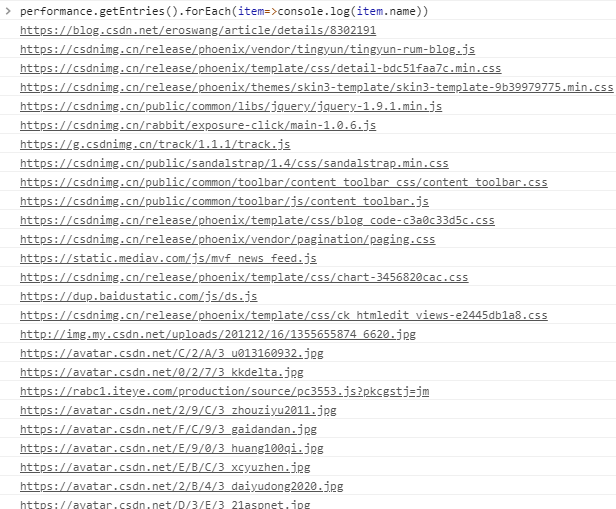
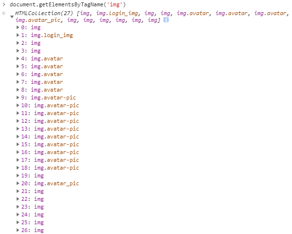
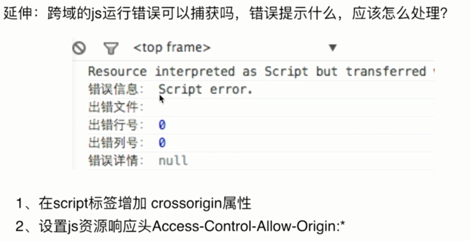

# 错误的捕获方式

### 即时运行错误: 代码错误

#### 方法一 `try...catch`

#### 方法二 `window.onerror`: 只能捕获即时运行错误, 不会捕获资源加载错误

### 资源加载错误: 不会冒泡, 但是可以捕获

#### 方法一 object.onerror (img script)

`img` 和 `script` 等标签的 `onerror` 事件, 注意不会冒泡.

#### 方法二 performance.getEntries

高级浏览器用来获取所有已加载资源的加载时长, 间接拿到没有加载的资源错误.

利用 `performance.getEntries` 拿到所有已加载资源的数组:

```JS
performance.getEntries().forEach(item => console.log(item.name))
```



利用 `document.getElementsByTagName` 拿到所有要加载的资源的数组:

```JS
document.getElementsByTagName('img')
```



**进行对比, 得出谁没有加载.**

#### 方法三 Error 事件捕获

不能用冒泡, 但是可以捕获

```html
<!DOCTYPE html>
<html>
  <head>
    <meta charset="utf-8">
    <title>错误监控</title>
    <script type="text/javascript">
      // 第三个参数一定要是 true, true 才表示捕获, 冒泡是不行的.
      window.addEventListener('error', function (e) {
          console.log('捕获', e);
      }, true);
    </script>
  </head>
  <body>
    <script src="//badu.com/test.js" charset="utf-8"></script>
  </body>
</html>
```

输出:

```js
捕获 Event {isTrusted: true, type: "error", target: script, currentTarget: Window, eventPhase: 1, …}
```

### 跨域的 JS 运行错误可以捕获吗, 错误提示什么, 应该怎么处理

跨域只能捕获到 `Script error.` 这个错误信息, 没有其他具体信息



处理办法:

- 客户端中在 `script` 标签增加 `crossorigin` 属性

- 服务端设置 `js` 资源响应头 `Access-Control-Allow-Origin: *` (或域名)