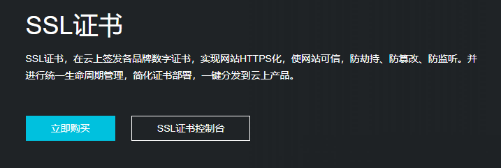
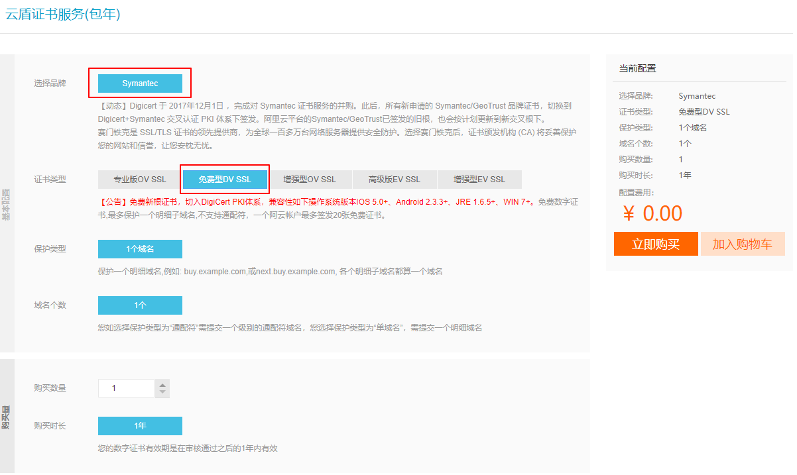

# HTTPS 和 SSL 证书

这里介绍阿里云免费的 `CA` 证书, 如果要自己签发可以看 `Nginx` 章节的自签教程.

- 购买 `SSL` 证书(免费)

登录阿里云后, 访问 [SSL证书](https://cn.aliyun.com/product/cas) 点击立即购买.



选择 `Symantec` 的 `免费型 DV SSL` 点击购买. 如果 `免费型 DV SSL` 不展示, 切换下 `证书类型`的 `tab` 就有了.



- 下载证书,  配置 `nginx`

[下载证书](https://yundun.console.aliyun.com/?spm=a2c1d.8251892.aliyun_sidebar.13.708d5b76ZRPW9o&p=cas#/cas/download/214758036890959?regionId=)

文件说明：

1. 证书文件`214758036890959.pem`，包含两段内容，请不要删除任何一段内容。

2. 如果是证书系统创建的 `CSR` ，还包含：证书私钥文件`214758036890959.key`。

( 1 ) 在 `Nginx` 的安装目录下创建 `cert` 目录，并且将下载的全部文件拷贝到 `cert` 目录中。如果申请证书时是自己创建的 `CSR` 文件，请将对应的私钥文件放到 `cert` 目录下并且命名为`214758036890959.key`；

( 2 ) 打开 `Nginx` 安装目录下 `conf` 目录中的 `nginx.conf` 文件增加以下配置:

```bash
server {
    listen 443;
    server_name localhost;
    ssl on;
    root html;
    index index.html index.htm;
    ssl_certificate   cert/214758036890959.pem;
    ssl_certificate_key  cert/214758036890959.key;
    ssl_session_timeout 5m;
    ssl_ciphers ECDHE-RSA-AES128-GCM-SHA256:ECDHE:ECDH:AES:HIGH:!NULL:!aNULL:!MD5:!ADH:!RC4;
    ssl_protocols TLSv1 TLSv1.1 TLSv1.2;
    ssl_prefer_server_ciphers on;
    location / {
        root html;
        index index.html index.htm;
    }
}
```

( 4 ) `nginx -s reload` 重启 `Nginx。`

( 5 ) 通过 `https` 方式访问您的站点，测试站点证书的安装配置。