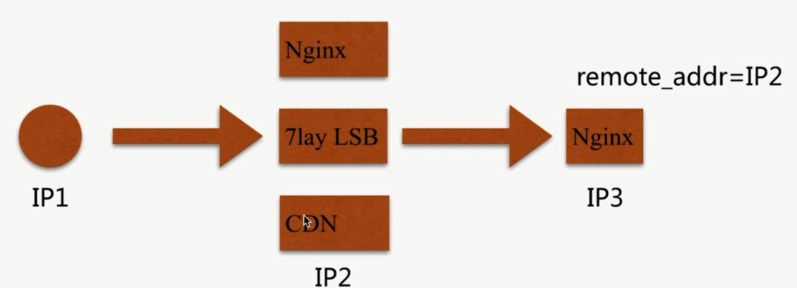
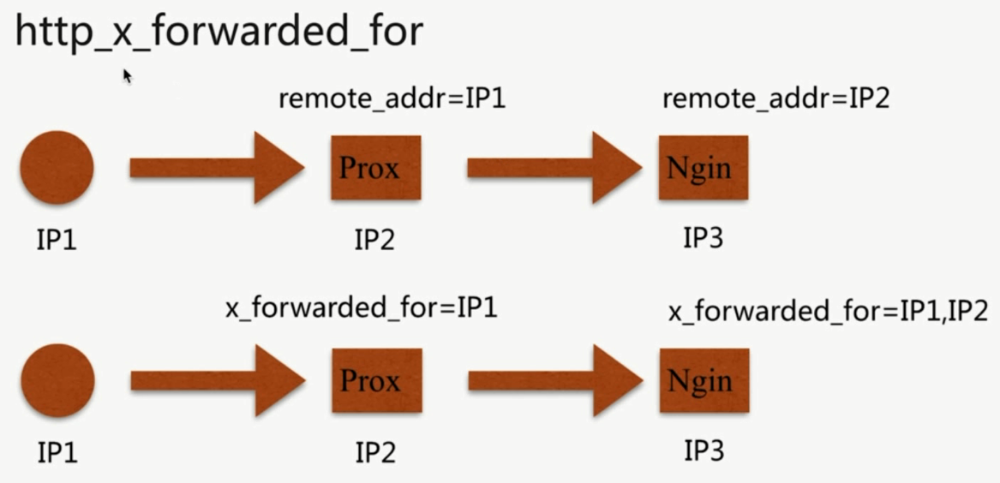
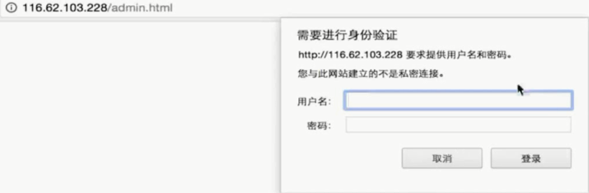

# 访问控制

基于 IP 的访问控制 - `http_access_module`

基于用户的信任登录 - `http_auth_basic_module`

### `http_access_module`

```bash
# address 地址, CIDR 网段, unix: socket访问, all 允许所有
Syntax: allow address|CIDR|unix:|all;
Default: ---
Context: http, server, location, limit_except
```

`allow ip`, `deny all`, 成对配置.

```bash
# 模式匹配, 根目录下 以 admin.html 开头的
location ~ ^/admin.html {
    root   /opt/app/code;
    allow 222.128.189.0/24;
    deny all;
    index  index.html index.htm;
}
```

```bash
# address 地址, CIDR 网段, unix: socket访问, all 允许所有
Syntax: deny address|CIDR|unix:|all;
Default: ---
Context: http, server, location, limit_except
```

`deny ip`, `allow all`, 成对配置.

```bash
# 模式匹配, 根目录下 以 admin.html 开头的
location ~ ^/admin.html {
    root   /opt/app/code;
    deny 222.128.189.17;
    allow all;
    index  index.html index.htm;
}
```

- **http_access_module** 局限:

`http_access_module` 只能通过 `$remote_addr` 控制信任, 通过第三方的话, 准确性不高.



所以有另一个方案 `http_x_forwarded_for`

`http_x_forwarded_for = ClientIP, proxy(1)IP,proxy(2)IP,...`



- 解决 **http_access_module** 局限:

采用别的 `HTTP` 头信息控制访问, 如 `HTTP_X_FORWARD_FOR`

结合 `geo` 模块

通过 `HTTP` 自定义变量传递

### `http_auth_basic_module`

```bash
# string 表示认证提示信息
Syntax: auth_basic string|off;
Default: auth_basic off;
Context: http, server, location, limit_except
```

```bash
# 存储认证信息的文件
Syntax: auth_basic_user_file file;
Default: ---
Context: http, server, location, limit_except
```

认证 `file` 格式, 其他加密方式参考官网:

```bash
# comment
name1:password1
name2:password2:comment
name3:password3
```

`htpasswd` 生成认证文件:

```bash
[root nginx]# htpasswd -c ./auth_conf awoke
New password:
Re-type new password:
Adding password for user gaodaqian
[root nginx]# more ./auth_conf
gaodaqian:$apr1$454OKZYI$pN8rPUWs1oGsaf/ad6hJs1
```

```bash
location ~ ^/admin.html {
  root   /opt/app/code;
  auth_basic "Auth access test!input your password!";
  auth_basic_user_file /etc/nginx/auth_conf
  index  index.html index.htm;
}
```



- **http_auth_basic_module** 局限:

用户信息依赖文件方式

操作管理机械, 效率低下

- 解决 **http_auth_basic_module** 局限:

`nginx` 结合 `LUA` 实现高效验证

`nginx` 和 `LDAP` 打通, 利用 `nginx-auth-ldap` 模块