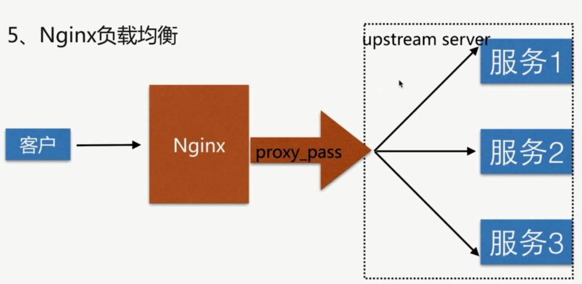

# upstream 负载均衡配置

### Nginx 的负载均衡原理

核心是 `proxy_pass` 和虚拟服务池 `upstream`



### 配置语法

```bash
Syntax: upstream name {...}
Default: ---
Context: `http`
```

注意 `upstream` 需要配置在 `http` 中, 下面的是通过 `include` 到 `nginx.conf` 的 `http` 中

```bash {1,15}
upstream imooc {
    server 116.62.103.228:8001;
    server 116.62.103.228:8002;
    server 116.62.103.228:8003;
}

server {
    listen       80;
    server_name  localhost gaodaqian.com;

    access_log  /var/log/nginx/test_proxy.access.log  main;
    resolver  8.8.8.8;

    location / {
        proxy_pass http://imooc;
        include proxy_params;
    }
}
```

### upstream 举例

```bash
upstream backend {
  # weight 权重
  server backend1.example.com weight=5;
  server backend2.example.com: 8080;
  server unix:/tmp/backend3;

  server backup1.example.com:8080 backup;
  server backup2.example.com:8080 backup;
}
```

#### 后端服务器在负载均衡调度中的状态

 参数 | 作用
----------|---------
`down` | 当前的 `server` 暂时不参与负载均衡
`backup`  | 预留的备份服务器
`max_fails`  | 允许请求失败的次数
`fail_timeout`   | 经过 `max_fails` 失败后, 服务暂停的时间
`max_conns`   | 限制最大的接收的连接数

```bash
upstream imooc {
  server 116.62.103.228:8001 down;
  server 116.62.103.228:8002 backup;
  server 116.62.103.228:8003 max_fails=1 fail_timeout=10s;
}
```