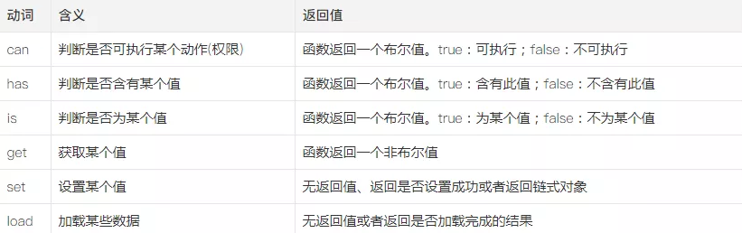

# 命名规范

### JS 变量名

- 命名方式：小驼峰
- 命名规范：前缀名词
- 命名建议：语义化

**推荐**:

```JS
let maxCount = 10;
let tableTitle = 'LoginTable';
```

**不推荐**:

```JS
let setCount = 10;
let getTitle = 'LoginTable';
```

**如果变量是一个布尔值，变量名最好加上 `is`、`has` 或 `can` 作为前缀**:

**推荐**:

```JS
let isPerson = true;
let hasAge = true;
let canDance = true;
```

**不推荐**:

```JS
let person = true;
let age = true;
let dance = true;
```

### 常量名

- 命名方式：全部大写
- 命名规范：使用大写字母和下划线来组合命名，下划线用以分割单词
- 命名建议：语义化

```js
const MAX_COUNT = 10;
const URL = 'http://www.foreverz.com';
```

### 函数名

- 命名方式：小驼峰式命名法。
- 命名规范：前缀应当为动词。
- 命名建议：语义化

可以参考如下的动作



```js
// 是否可阅读
function canRead() {
  return true;
}
// 获取名称
function getName() {
  return this.name;
}
```

### 类、构造函数命名

- 命名方式：大驼峰式命名法，首字母大写
- 命名规范：前缀为名称。
- 命名建议：语义化

案例:

```js
class Person {
  public name: string;
  constructor(name) {
    this.name = name;
  }
}
const person = new Person('mevyn');
```

- 公共属性和方法：跟变量和函数的命名一样。
- 私有属性和方法：前缀为_(下划线)，后面跟公共属性和方法一样的命名方式。

### CSS（class、id）命名规则 BEM

- `class` 命名使用 `BEM` 其实是块（`block`）、元素（`element`）、修饰符（`modifier`）的缩写，利用不同的区块，功能以及样式来给元素命名。

- 这三个部分使用 `__` 与 `--` 连接（这里用两个而不是一个是为了留下用于块儿的命名）。

命名约定的模式如下：

```css
.block{}
.block__element{}
.block--modifier{}

block 代表了更高级别的抽象或组件
block__element 代表 block 的后代，用于形成一个完整的 block 的整体
block--modifier代表 block 的不同状态或不同版本
```

- `id` 一般参与样式，命名的话使用驼峰，如果是给 `js` 调用钩子就需要设置为 `js_xxxx` 的方式

案例

```js
class Person {
  private _name: string;
  constructor() { }
  // 公共方法
  getName() {
    return this._name;
  }
  // 公共方法
  setName(name) {
    this._name = name;
  }
}
const person = new Person();
person.setName('mervyn');
person.getName(); // ->mervyn
```
