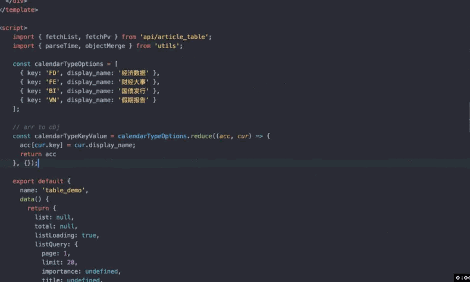
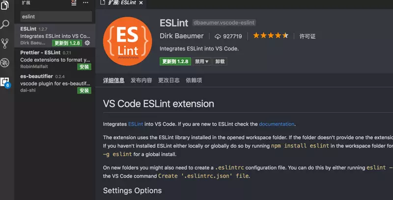

# vscode 配置 ESLint

不管是多人合作还是个人项目，代码规范是很重要的。这样做不仅可以很大程度地避免基本语法错误，也保证了代码的可读性。

**所有的配置文件都在 `.eslintrc.js` 中(本篇内容最后).**

本项目基本规范是依托于 `vue` 官方的 `eslint` 规则 [eslint-config-vue](https://github.com/vuejs/eslint-config-vue) 做了少许的修改。大家可以按照自己的需求进行定制化配置。

推荐使用 [eslint-plugin-vue](https://github.com/vuejs/eslint-plugin-vue) 来更好的校验 `vue` 相关代码。

默认情况下使用了最严格的 `plugin:vue/recommended` 来校验代码，若你觉得太严格可自行修改。

```js
module.exports = {
  extends: ['plugin:vue/recommended', 'eslint:recommended']
  //你可以修改为  extends: ['plugin:vue/essential', 'eslint:recommended']
}
```

### 消 ESLint 校验

如果你实在是不想使用 `ESLint` 校验，只要找到 `vue` 项目 `webpack.base.conf.js` 文件。 将 `useEslint: true` 设置为 `useEslint: false` 即可

### vscode 配置 ESLint

这所谓工欲善其事，必先利其器，个人推荐 `eslint+vscode` 来写 `vue`，绝对有种飞一般的感觉。效果如图：



每次保存，`vscode` 就能标红不符合 `eslint` 规则的地方，同时还会做一些简单的自我修正。安装步骤如下：

首先安装 `eslint` 插件



安装并配置完成 `ESLint` 后，我们继续回到 `VSCode` 进行扩展设置，依次点击 文件 > 首选项 > 设置 打开 `VSCode` 配置文件,添加如下配置

```js
{
  "files.autoSave": "off",
  "eslint.validate": [
    "javascript",
    "javascriptreact",
    "vue-html",
    {
      "language": "vue",
      "autoFix": true
    }
  ],
  "eslint.options": {
    "plugins": ["vue"]
  },
  "eslint.run": "onSave",
  "eslint.autoFixOnSave": true
}
```

这样每次保存的时候就可以根据根目录下 `.eslintrc.js` 你配置的 `eslint` 规则来检查和做一些简单的 `fix`。每个人和团队都有自己的代码规范，统一就好了，去打造一份属于自己的 `eslint` 规则上传到 `npm` 吧，如饿了么团队的 [config](https://www.npmjs.com/package/eslint-config-elemefe)，vue 的 [config](https://github.com/vuejs/eslint-config-vue)。

### webpack

你还可以通过配置 `eslint-loader` 让你有不符合 `eslint` 的时候在命令行或者界面里提示你有什么错误。

```js
{
 test: /\.(js|vue)$/,
  loader: 'eslint-loader',
  enforce: 'pre',
  include: [resolve('src'), resolve('test')],
  options: {
    formatter: require('eslint-friendly-formatter'),
    emitWarning: !config.dev.showEslintErrorsInOverlay
  }
}
```

`config/index.js` 中 `showEslintErrorsInOverlay` 这个变量可以控制错误提示是否需要在浏览器界面中提示。

### .eslintrc.js

`.eslintrc.js` 完整内容如下:

```js
module.exports = {
  root: true,
  parserOptions: {
    parser: 'babel-eslint',
    sourceType: 'module'
  },
  env: {
    browser: true,
    node: true,
    es6: true,
  },
  extends: ['plugin:vue/recommended', 'eslint:recommended'],

  // add your custom rules here
  //it is base on https://github.com/vuejs/eslint-config-vue
  rules: {
    "vue/max-attributes-per-line": [2, {
      "singleline": 10,
      "multiline": {
        "max": 1,
        "allowFirstLine": false
      }
    }],
    "vue/name-property-casing": ["error", "PascalCase"],
    'accessor-pairs': 2,
    'arrow-spacing': [2, {
      'before': true,
      'after': true
    }],
    'block-spacing': [2, 'always'],
    'brace-style': [2, '1tbs', {
      'allowSingleLine': true
    }],
    'camelcase': [0, {
      'properties': 'always'
    }],
    'comma-dangle': [2, 'never'],
    'comma-spacing': [2, {
      'before': false,
      'after': true
    }],
    'comma-style': [2, 'last'],
    'constructor-super': 2,
    'curly': [2, 'multi-line'],
    'dot-location': [2, 'property'],
    'eol-last': 2,
    'eqeqeq': [2, 'allow-null'],
    'generator-star-spacing': [2, {
      'before': true,
      'after': true
    }],
    'handle-callback-err': [2, '^(err|error)$'],
    'indent': [2, 2, {
      'SwitchCase': 1
    }],
    'jsx-quotes': [2, 'prefer-single'],
    'key-spacing': [2, {
      'beforeColon': false,
      'afterColon': true
    }],
    'keyword-spacing': [2, {
      'before': true,
      'after': true
    }],
    'new-cap': [2, {
      'newIsCap': true,
      'capIsNew': false
    }],
    'new-parens': 2,
    'no-array-constructor': 2,
    'no-caller': 2,
    'no-console': 'off',
    'no-class-assign': 2,
    'no-cond-assign': 2,
    'no-const-assign': 2,
    'no-control-regex': 0,
    'no-delete-var': 2,
    'no-dupe-args': 2,
    'no-dupe-class-members': 2,
    'no-dupe-keys': 2,
    'no-duplicate-case': 2,
    'no-empty-character-class': 2,
    'no-empty-pattern': 2,
    'no-eval': 2,
    'no-ex-assign': 2,
    'no-extend-native': 2,
    'no-extra-bind': 2,
    'no-extra-boolean-cast': 2,
    'no-extra-parens': [2, 'functions'],
    'no-fallthrough': 2,
    'no-floating-decimal': 2,
    'no-func-assign': 2,
    'no-implied-eval': 2,
    'no-inner-declarations': [2, 'functions'],
    'no-invalid-regexp': 2,
    'no-irregular-whitespace': 2,
    'no-iterator': 2,
    'no-label-var': 2,
    'no-labels': [2, {
      'allowLoop': false,
      'allowSwitch': false
    }],
    'no-lone-blocks': 2,
    'no-mixed-spaces-and-tabs': 2,
    'no-multi-spaces': 2,
    'no-multi-str': 2,
    'no-multiple-empty-lines': [2, {
      'max': 1
    }],
    'no-native-reassign': 2,
    'no-negated-in-lhs': 2,
    'no-new-object': 2,
    'no-new-require': 2,
    'no-new-symbol': 2,
    'no-new-wrappers': 2,
    'no-obj-calls': 2,
    'no-octal': 2,
    'no-octal-escape': 2,
    'no-path-concat': 2,
    'no-proto': 2,
    'no-redeclare': 2,
    'no-regex-spaces': 2,
    'no-return-assign': [2, 'except-parens'],
    'no-self-assign': 2,
    'no-self-compare': 2,
    'no-sequences': 2,
    'no-shadow-restricted-names': 2,
    'no-spaced-func': 2,
    'no-sparse-arrays': 2,
    'no-this-before-super': 2,
    'no-throw-literal': 2,
    'no-trailing-spaces': 2,
    'no-undef': 2,
    'no-undef-init': 2,
    'no-unexpected-multiline': 2,
    'no-unmodified-loop-condition': 2,
    'no-unneeded-ternary': [2, {
      'defaultAssignment': false
    }],
    'no-unreachable': 2,
    'no-unsafe-finally': 2,
    'no-unused-vars': [2, {
      'vars': 'all',
      'args': 'none'
    }],
    'no-useless-call': 2,
    'no-useless-computed-key': 2,
    'no-useless-constructor': 2,
    'no-useless-escape': 0,
    'no-whitespace-before-property': 2,
    'no-with': 2,
    'one-var': [2, {
      'initialized': 'never'
    }],
    'operator-linebreak': [2, 'after', {
      'overrides': {
        '?': 'before',
        ':': 'before'
      }
    }],
    'padded-blocks': [2, 'never'],
    'quotes': [2, 'single', {
      'avoidEscape': true,
      'allowTemplateLiterals': true
    }],
    'semi': [2, 'never'],
    'semi-spacing': [2, {
      'before': false,
      'after': true
    }],
    'space-before-blocks': [2, 'always'],
    'space-before-function-paren': [2, 'never'],
    'space-in-parens': [2, 'never'],
    'space-infix-ops': 2,
    'space-unary-ops': [2, {
      'words': true,
      'nonwords': false
    }],
    'spaced-comment': [2, 'always', {
      'markers': ['global', 'globals', 'eslint', 'eslint-disable', '*package', '!', ',']
    }],
    'template-curly-spacing': [2, 'never'],
    'use-isnan': 2,
    'valid-typeof': 2,
    'wrap-iife': [2, 'any'],
    'yield-star-spacing': [2, 'both'],
    'yoda': [2, 'never'],
    'prefer-const': 2,
    'no-debugger': process.env.NODE_ENV === 'production' ? 2 : 0,
    'object-curly-spacing': [2, 'always', {
      objectsInObjects: false
    }],
    'array-bracket-spacing': [2, 'never']
  }
}
```