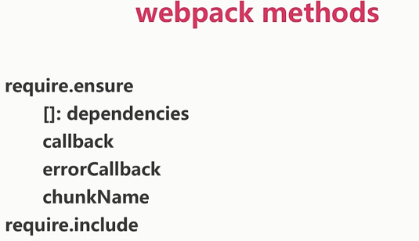
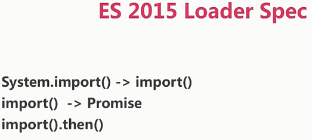
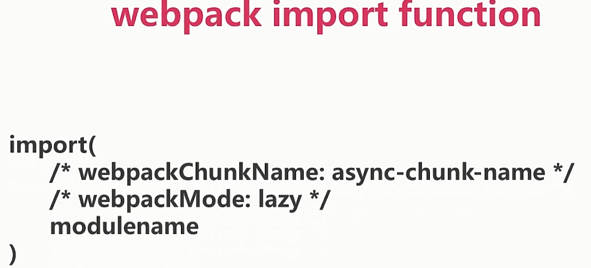
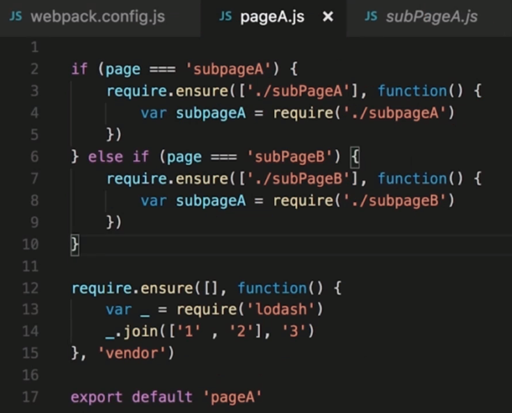
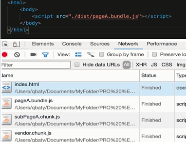
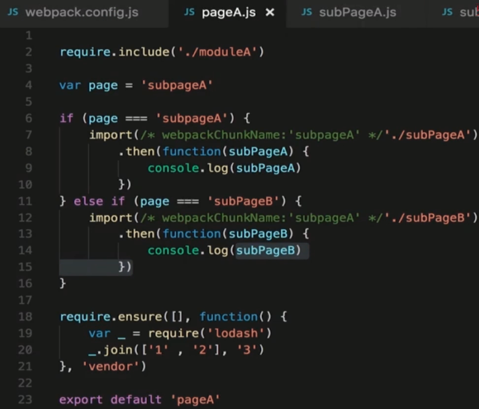
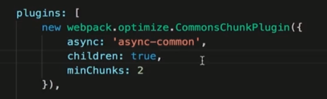

# 代码分割和懒加载

webpack methods

ES 2015 Loader spec

### webpack methods



### ES 2015 Loader spec



### webpack import function



### 代码分割

分离业务代码 和 第三方依赖

分离业务代码 和 业务公共代码 和 第三方依赖

分离首次加载 和 访问后加载的代码

### 案例



`webpack.config.js`

```js
var webpack = require('webpack')
var path = require('path')

module.exports = {
  entry: {
    'pageA': './pageA',
    // 'pageB': './pageB',
    // 'vendor': ['lodash']
  },
  output: {
    path: path.resolve(__dirname, './dist'),
    publicPath: './dist/',
    filename: '[name].bundle.js',
    chunkFilename: '[name].chunk.js'
  },
  /* plugins: [
    new webpack.optimize.CommonsChunkPlugin({
      name: 'common',
      minChunks: 2,
      chunks: ['pageA', 'pageB']
    }),
    new webpack.optimize.CommonsChunkPlugin({
      names: ['vendor', 'manifest'],
      minChunks: Infinity
    })
  ] */
}
```

会动态加载需要的 js:



import 方式:



async 配置:

