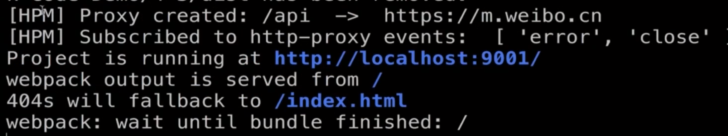

# Proxy 接口代理

代理远程接口请求: http-proxy-middleware

参数: target、changeOrigin、headers、logLevel、pathRewrite

配置 webpack.config.js:

```js
// 不需要 require
devSever: {
  port: 9001,
  proxy: {
    '/': {
      target: 'https://m.weibo.cn',
      changeOrigin: true, // 跨域
      logLevel: 'debug', // 控制台输出代理信息
      pathRewrite: {
        '^/comments': '/api/comments'
      },
      headers: {
        'Cookie': 'XXX'
      }
    }
  },
  ...
}
```


