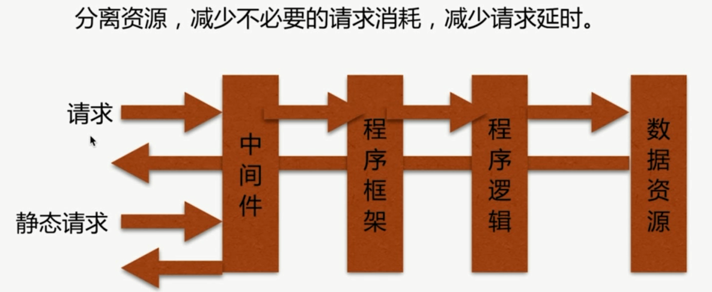
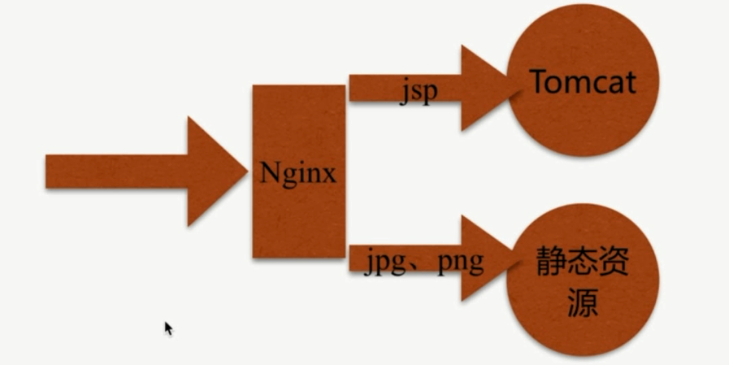

# 动静分离

通过中间件将动态请求和静态请求分离.

分离资源, 减少不必要的请求消耗, 减少请求延时.





```bash {2,12,14,18}
# java_api
upstream java_api{
    server 127.0.0.1:8080;
}
server {
    listen       80;
    server_name  localhost;

    access_log  /var/log/nginx/log/host.access.log  main;
    root /opt/app/code;  
    # jsp 动态资源
    location ~ \.jsp$ {
        # java_api
        proxy_pass http://java_api;
        index  index.html index.htm;
    }
    # 静态资源
    location ~ \.(jpg|png|gif)$ {
        expires 1h;
        gzip on;
    }

    location /{
        index  index.html index.htm;
    }

    error_page   500 502 503 504 404  /50x.html;
    location = /50x.html {
        root   /usr/share/nginx/html;
    }
}
```