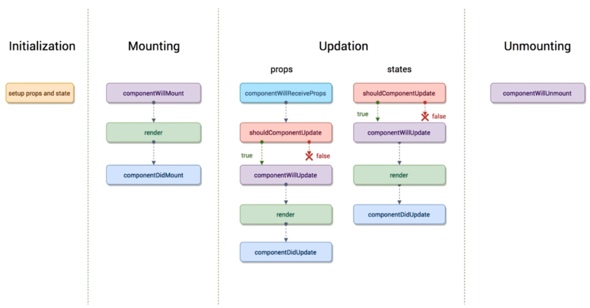

# 生命周期函数

:::tip
生命周期函数指在某一个时刻组件会自动调用执行的函数.
:::

- 初始化 `Initialization`

`constructor` 在组件一创建就会执行, 设置 `props` 和 `state`.

- 挂载 `Mounting`

**componentWillMount:** 在组件即将被挂载到页面的时刻自动执行, 只执行一次.

**render:**  第一次执行时是在 `componentWillMount` 之后,`componentDidMount` 之前. 后面 `props` 或 `state` 改变时会重复执行.

**componentDidMount:** 组件被挂载到页面之后自动执行, 只执行一次.

- 更新 `Updation`

::: warning
`componentWillReceiveProps` 是 `props` 才有, 下面其他几个生命周期 `props` 和 `state` 都有.
:::

**componentWillReceiveProps:** 一个组件要从父组件接受参数, 只要父组件的 `render` 函数被重新执行了, 子组件的这个生命周期函数就会被执行. (如果这个组件第一次存在于父组件中, 不会被执行. 如果这个组件之前已经存在于父组件中, 才会执行.)

**shouldComponentUpdate:** 组件被更新之前, 会被自动执行, 要求返回一个布尔值, `true` 则更新, `false` 不更新, 如果为 `false` 则下面的几个生命周期函数不会执行了.

**componentWillUpdate:** 组件被更新之前, 会自动执行, 但是它在 `shouldComponentUpdate` 之后执行, 当 `shouldComponentUpdate` 返回 `true` 才执行, `shouldComponentUpdate` 返回 `false` 则这个函数不会被执行.

**render:** 同上的 `render`.

**componentDidUpdate:** 组件更新完成之后, 会被执行.

- 卸载 `Unmounting`

**componentWillUnmount:** 当组件即将被从页面中剔除的时候, 会被执行.