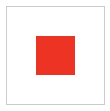

# 10.5 垂直居中对齐

:::danger 问题：css 如何实现垂直居中样式
:::

:::tip 第一种：外层边框部分高度固定，内部块级结构居中
:::



html结构：

```html
//<!-- - ->注释掉空格
<div class="verMiddle outerLayerWrap"><!--
        --><div class="innerLayer">
</div>
```

style样式：

```css
//通用样式
.verMiddle::before{
    display: inline-block;
    vertical-align: middle;
    content: '';
    height: 100%;
    width: 0;
    overflow: hidden;
}
//外层样式
.outerLayerWrap{
    width:100px;
    height:100px;
    border:1px solid #ccc;
    text-align:center;
}
//内层样式
.innerLayer{
    width:40px;
    height:40px;
    background:red;
    vertical-align:middle;
    display:inline-block;
}
```
