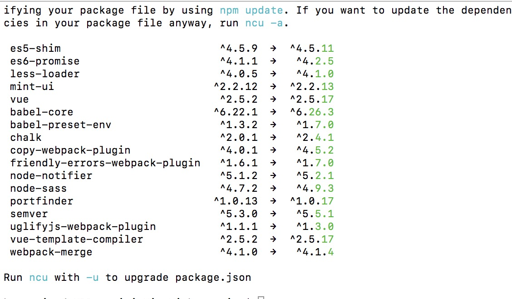

# 4.7 vue-cli 工程升级 vue 版本

:::danger vue-cli如何进行工程升级
:::

>前言：此命令谨慎使用，实际开发中如需升级建议直接使用 vue-cli 脚手架搭建，只需要了解即可！

推荐使用：

```bash
//升级插件
npm-check-updates
```

首先安装插件，建议用 npm 源安装，测试时用 cnpm 安装未下载成功：

```bash
npm install npm-check-updates -g
```

然后在待升级工程的目录结构下，命令行输入：

```bash
ncu
```

执行效果图：



然后升级所有版本，命令行输入：

```bash
ncu -a
```

再输入：

```bash
npm install
```