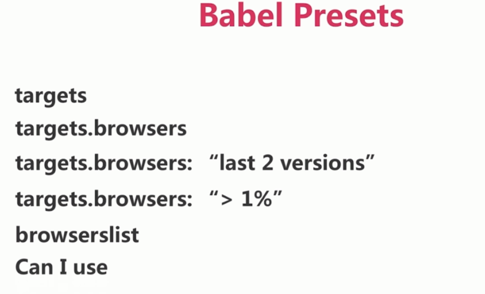

# 编译 ES6

### 打包 JS

`webpack app.js bundle.js`, 把 `app.js` 打包成 `bundle.js`

`webpack` 默认配置文件是 `webpack.config.js` 如果不是就需要 `--config` 指定配置文件:

`webpack --config webpack.conf.js`

### babel

`webpack` 使用需要 `babel-loader`

安装: `npm i babel-loader babel-core -D`

### babel presets

babel presets 是 babel 的规范的总结.

包括 ES2015、ES2016、ES2017、env`, 我们常用 env, env 包括 ES2015、ES2016、ES2017 及 latested、babel-preset-react、babel-preset-stage 0-3.

安装: `npm i babel-preset-env -D`

参数:



### babel polifill 和 babel runtime transform

babel presets 针对的是语法, babel polifill 和 babel runtime transform 针对函数和方法.

比如 generator、set、map、array.from 和 includes 等.

- babel polifill

全局垫片, 为应用准备, 全局变量(污染)

安装: `npm i babel-polyfill -S`

使用: `import 'babel-polyfill'`

- babel runtime transform

局部垫片, 为开发框架准备, 不会污染全局

安装: `npm i babel-plugin-transform-runtime -D`

`npm i bable-runtime -S`

使用: 新建 `.babelrc` 文件, 然后去配置

### webpack.config.js

```js
module.exports = {
  entry: {
    app: './app.js'
  },
  output: {
    filename: '[name].[hash:8].js'
  },
  module: {
    rules: [
      {
        test: /\.js$/,
        use: {
          loader: 'babel-loader',
          options: {
            /* presets: [
              [
                '@babel/preset-env', {
                targets: {
                  browsers: ['> 1%', 'last 2 versions']
                }
              }]
            ] */
          }
        },
        exclude: '/node_modules/'
      }
    ]
  }
}
```

### .babelrc

```json
{
  "presets": [
    [
      "@babel/preset-env", {
      "targets": {
        "browsers": ["> 1%", "last 2 versions"]
      }
    }]
  ],
  "plugins": ["@babel/transform-runtime"]
}
```

如果执行 `webpack` 命令打包报错, 则更改下版本:

`npm i @babel/runtime -S`

`npm i @babel/plugin-transform-runtime -D`