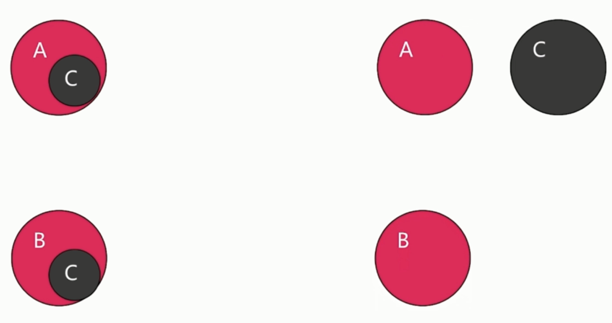

# 提取公用代码 CommonsChunkPlugin

`webpack.optimize.CommonsChunkPlugin`

减少代码冗余、提高加载速度



### 配置项

options.name or options.names

options.filename

options.minChunks, 当是数字时, 表现出现次数多少时就打包到公共代码

options.chunks, 指定提取范围

options.children

option.deepChildren

option.async

### 场景

单页应用

单页应用 + 第三方依赖

多页应用 + 第三方依赖 + webpack 生成代码

### 配置 webpack.config.js

因为插件来自 `webpack.optimize.CommonsChunkPlugin`

所以项目需要安装 `webpack`: `npm i webpack -D`

各 js 内容忽略(一些模块间的引入和公共库 lodash 演示),

配置 `webpack.config.js`:

```js
var webpack = require('webpack')
var path = require('path')

module.exports = {
  entry: {
    'pageA': './pageA',
    'pageB': './pageB',
    'vendor': ['lodash']
  },
  output: {
    path: path.resolve(__dirname, './dist'),
    filename: '[name].bundle.js',
    chunkFilename: '[name].chunk.js'
  },
  plugins: [
    new webpack.optimize.CommonsChunkPlugin({
      name: 'common',
      minChunks: 2,
      chunks: ['pageA', 'pageB']
    }),
    new webpack.optimize.CommonsChunkPlugin({
      names: ['vendor', 'manifest'],
      minChunks: Infinity
    })
  ]
}
```