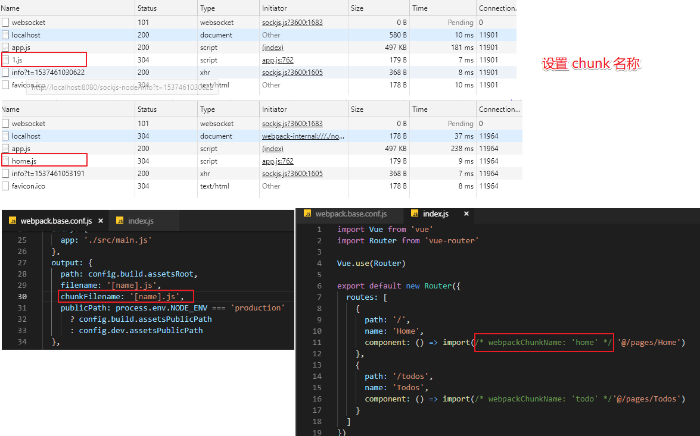

# Vue 和 Webpack

### 安装 vue-cli

`npm i vue-cli -g`

`vue --help`

### 查看模版

`vue list`

```bash
# vue list

  Available official templates:

  ★  browserify - A full-featured Browserify + vueify setup with hot-reload, linting & unit testing.
  ★  browserify-simple - A simple Browserify + vueify setup for quick prototyping.
  ★  pwa - PWA template for vue-cli based on the webpack template
  ★  simple - The simplest possible Vue setup in a single HTML file
  ★  webpack - A full-featured Webpack + vue-loader setup with hot reload, linting, testing & css extraction.
  ★  webpack-simple - A simple Webpack + vue-loader setup for quick prototyping.
```

### 使用模版

`vue init 模版名称 项目名称`

`vue init git地址 项目名称`

```bash
$ vue init webpack tutorial

? Project name `tutorial`
? Project description `A Vue.js project`
? Author `awokelee <awokelee@gmail.com>`
? Vue build standalone
> Runtime + Compiler: recommended for most users
  Runtime-only: about 6KB lighter min+gzip, but templates (or any Vue-specific HTML) are ONLY allowed in .vue files - r ender functions are required elsewhere
? Install vue-router? `Yes`
? Use ESLint to lint your code? `Yes`
? Pick an ESLint preset `Standard`
? Set up unit tests `No`
? Setup e2e tests with Nightwatch? `No`
? Should we run `npm install` for you after the project has been created?
# Project initialization finished!
# ========================

To get started:

  `cd tutorial`
  `npm run dev`

Documentation can be found at https://vuejs-templates.github.io/webpack
```

### 项目结构

```bash
├── .babelrc
├── .editorconfig
├── .eslintignore
├── .eslintrc.js
├── .gitignore
├── .postcssrc.js
├── build
|  ├── build.js
|  ├── check-versions.js
|  ├── logo.png
|  ├── utils.js
|  ├── vue-loader.conf.js
|  ├── webpack.base.conf.js
|  ├── webpack.dev.conf.js
|  └── webpack.prod.conf.js
├── config
|  ├── dev.env.js
|  ├── index.js
|  └── prod.env.js
├── index.html
├── package-lock.json
├── package.json
├── README.md
├── src
|  ├── App.vue
|  ├── assets
|  |  └── logo.png
|  ├── components
|  |  └── HelloWorld.vue
|  ├── main.js
|  └── router
|     └── index.js
└── static
   └── .gitkeep
```

### 基本命令

```bash
# npm run dev

# npm run server

# npm run lint

# npm run build

# npm run build --report
```

### 设置 chunk 名称

