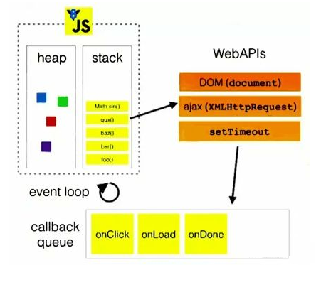
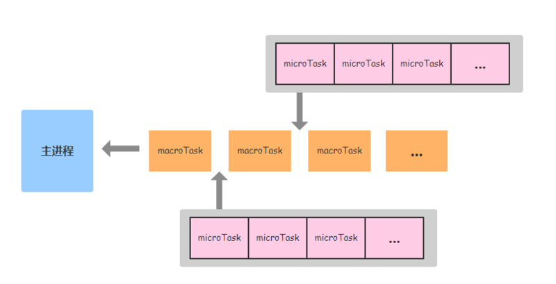
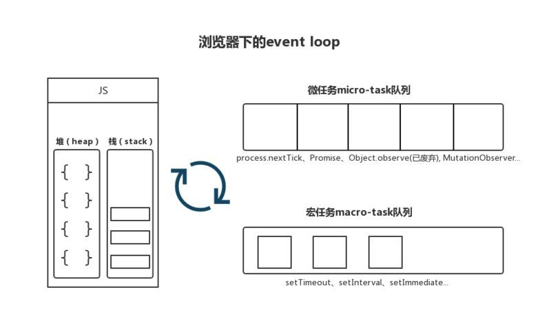
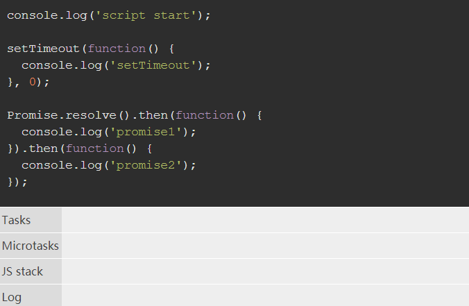

# Event-Loop 事件循环

nodejs 和浏览器的 event loop 是两个有明确区分的事物，不能混为一谈.

`nodejs` 的 `event` 是基于 `libuv`，而浏览器的 `event loop` 则在 `html5` 的规范中明确定义。

`libuv` 已经对 `event loop` 作出了实现，而 `html5` 规范中只是定义了浏览器中 `event loop` 的模型，`具体实现留给了浏览器厂商`

## 开始

JavaScript 是一门 **单线程**、**非阻塞** 的脚本语言，目的是为了实现与浏览器交互。

## 单线程

**单线程** 是指 JavaScript 在执行的时候，有且只有 **一个主线程** 来处理所有的任务。

**为什么一定是单线程，而不是多线程的呢**？

如果 JavaScript 是多线程的，现在我们在浏览器中同时操作一个 DOM，一个线程要求浏览器在这个 DOM 中添加节点，而另一个线程却要求浏览器删掉这个 DOM 节点，那这个时候浏览器就会很郁闷，他不知道应该以哪个线程为准。

所以为了避免此类现象的发生，降低复杂度，JavaScript 选择只用一个主线程来执行代码，以此来保证程序执行的一致性。

## 非阻塞

那非阻塞又是如何实现的呢？这就要说到我们今天的主角 `Event Loop`。

在了解 Event Loop 之前，我们先来熟悉一下 **执行栈** 和 **事件队列** 这两个概念。

## 执行栈

当我们调用一个方法的时候，js 会生成一个与这个方法相对应的执行环境，也叫执行上下文，这个执行环境存在着这个方法的私有作用域、参数、this对象等等。

因为 js 是单线程的，同一时间只能执行一个方法，所以当一系列的方法被依次调用的时候，js 会先解析这些方法，把其中的同步任务按照执行顺序排队到一个地方，这个地方叫做 **执行栈**。

## 事件队列

当我们发出一个 ajax 请求，他并不会立刻返回结果，为了防止浏览器出现假死或者空白，主线程会把这个异步任务挂起(pending)，继续执行执行栈中的其他任务，等异步任务返回结果后，js 会将这个异步任务按照执行顺序，加入到与执行栈不同的另一个队列，也就是 **事件队列**。

## 浏览器中的 Event Loop

为什么要有 Event Loop, 因为 Javascript 设计之初就是一门单线程语言，因此为了实现主线程的不阻塞，Event Loop 这样的方案应运而生。



1. 主线程运行的时候会生成`堆（heap）`和 `栈（stack）`；
2. **js 从上到下解析方法**，将其中的 **同步任务按照执行顺序排列到执行栈中**；
3. 当程序调用外部的 API时，比如 ajax、setTimeout 等，会将此类 **异步任务挂起**，继续执行执行栈中的任务，等异步任务返回结果后，再按照执行顺序排列到事件队列中；
4. 主线程先将执行栈中的同步任务清空，然后检查事件队列中是否有任务，如果有，就将第一个事件对应的回调推到执行栈中执行，若在执行过程中遇到异步任务，则继续将这个异步任务排列到事件队列中。
5. 主线程每次将执行栈清空后，就去事件队列中检查是否有任务，如果有，就每次取出一个推到执行栈中执行，这个过程是循环往复的... ...，

这个过程被称为 **Event Loop 事件循环**。

## Event Loop

为了协调 `事件（event）`，`用户交互（user interaction）`，`脚本（script）`，`渲染（rendering）`，`网络（networking）`等，`用户代理（user agent）`必须使用 `事件循环（event loops）`。

事件：事件就是由于某种外在或内在的信息状态发生的变化，从而导致出现了对应的反应。比如说用户点击了一个按钮，就是一个事件；HTML 页面完成加载，也是一个事件。一个事件中会包含多个任务。

我们在之前的文章中提到过，`JavaScript 引擎` 又称为 `JavaScript 解释器`，是 JavaScript 解释为机器码的工具，分别运行在浏览器和 `Node` 中。而根据上下文的不同，`Event loop` 也有不同的实现：其中 `Node` 使用了 `libuv` 库来实现 `Event loop`; 而在浏览器中，html 规范定义了 `Event loop`，具体的实现则交给不同的厂商去完成。

所以，**浏览器的 Event loop 和 Node 的 Event loop 是两个概念**，下面分别来看一下。

## 浏览器上的实现

在 JavaScript 中，任务被分为 `Task`（又称为 `MacroTask`, `宏任务`）和 `MicroTask（微任务）` 两种。

在 `ES6` 规范中, `MacroTask` 称为 `task`, `MicroTask` 称为 `jobs`.

它们分别包含以下内容：

**Task(macroTask):**  `setTimeout`, `setInterval`, setImmediate（node独有）, I/O, UI rendering, script(整体代码)

**MicroTask:** process.nextTick（node独有）, `Promise`, Object.observe(废弃), MutationObserver, MutaionObserver

浏览器中，一个事件循环里有很多个来自不同任务源的任务队列（task queues），每一个任务队列里的任务是严格按照 **先进先出** 的顺序执行的。但是，因为 **浏览器自己调度的关系，不同任务队列的任务的执行顺序是不确定的**。

具体来说，浏览器会 **不断从 task 队列中按顺序取 task 执行，每执行完一个 task 都会检查 microtask 队列是否为空**（执行完一个 task 的具体标志是函数执行栈为空），如果 **不为空则会一次性执行完所有 microtask**。然后再进入下一个循环去 task 队列中取下一个 task 执行，以此类推。



**注意**：图中橙色的 MacroTask 任务队列也应该是在不断被切换着的。



具体过程：

1. 浏览器中，先执行当前栈，执行完主执行线程中的任务。
2. 取出 Microtask 微任务队列中任务执行直到清空。
3. 取出 Macrotask 宏任务中 一个 任务执行。
4. 检查Microtask微任务中有没有任务，如果有任务执行直到清空。
5. 重复3和4。

整个的这种运行机制又称为 Event Loop(事件循环)

了解浏览器的 Event loop 后，查看下面例子，猜测浏览器是怎么输出的:

```js
console.log(1);
console.log(2);
setTimeout(function(){
  console.log('setTimeout1');
  Promise.resolve().then(function(){
    console.log('Promise')
  })
})
setTimeout(function(){
  console.log('setTimeout2');
})

// 浏览器输出：1 2 setTimeout1 Promise setTimeout2
```

实验一下，请看下段代码:

```js
setTimeout(function() {
  console.log(4);
}, 0);

var promise = new Promise(function executor(resolve) {
  console.log(1);
  for (var i = 0; i < 10000; i++) {
    i == 9999 && resolve();
  }
  console.log(2);
}).then(function() {
  console.log(5);
});

console.log(3);

// 输出 1 2 3 5 4
```

这说明 Promise.then 注册的任务先执行了。

我们再来看一下之前说的 Promise 注册的任务属于microTask,setTimeout 属于 Task，两者有何差别？

实际上，microTasks 和 Tasks 并不在同一个队列里面，他们的调度机制也不相同。比较具体的是这样：

1. event-loop start
2. microTasks 队列开始清空（执行）
3. 检查 Tasks 是否清空，有则跳到 4，无则跳到 6
4. 从 Tasks 队列抽取一个任务，执行
5. 检查 microTasks 是否清空，若有则跳到 2，无则跳到 3
6. 结束 event-loop

也就是说，microTasks 队列在一次事件循环里面不止检查一次，我们做个实验:

```js
// 添加三个 Task
// Task 1
setTimeout(function() {
  console.log(4);
}, 0);

// Task 2
setTimeout(function() {
  console.log(6);
  // 添加 microTask
  promise.then(function() {
    console.log(8);
  });
}, 0);

// Task 3
setTimeout(function() {
  console.log(7);
}, 0);

var promise = new Promise(function executor(resolve) {
  console.log(1);
  for (var i = 0; i < 10000; i++) {
    i == 9999 && resolve();
  }
  console.log(2);
}).then(function() {
  console.log(5);
});

console.log(3);

// 输出为 1 2 3 5 4 6 8 7
```

microTasks 会在每个 Task 执行完毕之后检查清空，而这次 event-loop 的新 task 会在下次 event-loop 检测。

其他案例:

```js
console.log('script start');

setTimeout(function() {
  console.log('setTimeout');
}, 0);

Promise.resolve().then(function() {
  console.log('promise1');
}).then(function() {
  console.log('promise2');
});
```



## 案例分析

```js
console.log(1)

setTimeout(() => {
    console.log(2)
    new Promise(resolve => {
        console.log(4)
        resolve()
    }).then(() => {
        console.log(5)
    })
})

new Promise(resolve => {
    console.log(7)
    resolve()
}).then(() => {
    console.log(8)
})

setTimeout(() => {
    console.log(9)
    new Promise(resolve => {
        console.log(11)
        resolve()
    }).then(() => {
        console.log(12)
    })
})
```

分析如下：

1. 同步运行的代码首先输出：1、7
2. 接着，清空microtask队列：8
3. 第一个task执行：2、4
4. 接着，清空microtask队列：5
5. 第二个task执行：9、11
6. 接着，清空microtask队列：12

**process.nextTick 注册的函数优先级高于 Promise**!!!

我们来分析一段较复杂的代码，看看你是否真的掌握了js的执行机制：

```js
console.log('1');

setTimeout(function() {
    console.log('2');
    process.nextTick(function() {
        console.log('3');
    })
    new Promise(function(resolve) {
        console.log('4');
        resolve();
    }).then(function() {
        console.log('5')
    })
})
process.nextTick(function() {
    console.log('6');
})
new Promise(function(resolve) {
    console.log('7');
    resolve();
}).then(function() {
    console.log('8')
})

setTimeout(function() {
    console.log('9');
    process.nextTick(function() {
        console.log('10');
    })
    new Promise(function(resolve) {
        console.log('11');
        resolve();
    }).then(function() {
        console.log('12')
    })
})
```

第一轮事件循环流程分析如下：

- 整体script作为第一个宏任务进入主线程，遇到 `console.log`，输出1。
- 遇到`setTimeout`，其回调函数被分发到宏任务Event Queue中。我们暂且记为`setTimeout1`。
- 遇到`process.nextTick()`，其回调函数被分发到微任务Event Queue中。我们记为`process1`。
- 遇到`Promise`，`new Promise`直接执行，输出7。`then`被分发到微任务Event Queue中。我们记为`then1`。
- 又遇到了`setTimeout`，其回调函数被分发到宏任务Event Queue中，我们记为`setTimeout2`。

宏任务 Event Queue | 微任务 Event Queue
---------|----------
 setTimeout1 | process1
 setTimeout2 | then1

- 上表是第一轮事件循环宏任务结束时各Event Queue的情况，此时已经输出了1和7。
- 我们发现了`process1`和`then1`两个微任务。
- 执行`process1`,输出6。
- 执行`then1`，输出8。

好了，第一轮事件循环正式结束，这一轮的结果是输出1，7，6，8。那么第二轮时间循环从`setTimeout1`宏任务开始：

宏任务 Event Queue | 微任务 Event Queue
---------|----------
 setTimeout2 | process2
  | then2

- 第二轮事件循环宏任务结束，我们发现有`process2`和`then2`两个微任务可以执行。
- 输出3。
- 输出5。
- 第二轮事件循环结束，第二轮输出2，4，3，5。
- 第三轮事件循环开始，此时只剩`setTimeout2`了，执行。
- 直接输出9。
- 将`process.nextTick()`分发到微任务Event Queue中。记为`process3`。
- 直接执行`new Promise`，输出11。
- 将`then`分发到微任务Event Queue中，记为`then3`。

宏任务 Event Queue | 微任务 Event Queue
---------|----------
  | process3
  | then3

第三轮事件循环宏任务执行结束，执行两个微任务`process3`和`then3`。
输出10。
输出12。
第三轮事件循环结束，第三轮输出9，11，10，12。

整段代码，共进行了三次事件循环，完整的输出为1，7，6，8，2，4，3，5，9，11，10，12。(请注意，**node环境下的事件监听依赖libuv与前端环境不完全相同，输出顺序可能会有误差**)

## timer 最小值

规范无法囊括所有场景，虽然 chrome 和 node 都基于 v8引擎，但引擎只负责管理内存堆栈，API 还是由各 runtime 自行设计并实现的。

Timer 是整个 Event Loop 中非常重要的一环，我们先从 timer 切入，来切身体会下规范和实现的差异。

首先再来一个小测试，它的输出会是什么呢？

```js
setTimeout(() => {
  console.log(2)
}, 2)

setTimeout(() => {
  console.log(1)
}, 1)

setTimeout(() => {
  console.log(0)
}, 0)
```

没有深入接触过 timer 的同学如果直接从代码中的延时设置来看，会回答：`0、1、2`。

而另一些有一定经验的同学可能会回答：`2、1、0`。因为 `MDN` 的 setTimeout 文档中提到 HTML 规范最低延时为 `4ms`：

而真正痛过的同学会告诉你，答案是：`1、0、2`。（经多次验证，node 下的输出顺序依然是无法保证的，node 的 timer 真是一门玄学~）

## Chrome 中的 timer

从上面结果可以看出，0ms 和 1ms 的延时效果是一致的，那背后的原因是为什么呢？我们先查查 blink 的实现。

```js
// https://chromium.googlesource.com/chromium/blink/+/master/Source/core/frame/DOMTimer.cpp#93

double intervalMilliseconds = std::max(oneMillisecond, interval * oneMillisecond);
```

这里 interval 就是传入的数值，可以看出传入 0和传入 1结果都是 oneMillisecond，即 `1ms`。

这样解释了为何 1ms和 0ms行为是一致的，那4ms到底是怎么回事？我再次确认了HTML规范，发现虽然有 `4ms`的限制，但是是存在条件的，详见规范第11点：

**If nesting level is greater than 5, and timeout is less than 4, then set timeout to 4.**

并且有意思的是，MDN英文文档的说明也已经贴合了这个规范。

我斗胆推测，一开始HTML5规范确实有定最低4ms的规范，不过在后续修订中进行了修改，我认为甚至不排除规范在向实现看齐，即逆向影响。

## Node 中的 timer

那 node 中，为什么 0ms和 1ms的延时效果一致呢？

```js
// https://github.com/nodejs/node/blob/v8.9.4/lib/timers.js#L456
if (!(after >= 1 && after <= TIMEOUT_MAX))
  after = 1; // schedule on next tick, follows browser behavior
```

代码中的注释直接说明了，设置最低1ms的行为是为了向浏览器行为看齐。

## Node 中的 Event Loop

`nodejs` 的 `event loop` 分为 **6个阶段**，它们会按照顺序反复运行，分别如下：

```me
1. timers：执行setTimeout() 和 setInterval()中到期的callback。
2. I/O callbacks：上一轮循环中有少数的I/Ocallback会被延迟到这一轮的这一阶段执行
3. idle, prepare：队列的移动，仅内部使用
4. poll：最为重要的阶段，执行I/O callback，在适当的条件下会阻塞在这个阶段
5. check：执行setImmediate的callback
6. close callbacks：执行close事件的callback，例如socket.on("close",func)
```

**不同于浏览器的是，在每个阶段完成后，而不是 MacroTask 任务完成后，microTask 队列就会被执行**。这就导致了同样的代码在不同的上下文环境下会出现不同的结果。我们在下文中会探讨。

另外需要注意的是，如果在 timers 阶段执行时创建了 setImmediate 则会在此轮循环的 check 阶段执行，如果在 timers 阶段创建了 setTimeout，由于 timers 已取出完毕，则会进入下轮循环，check 阶段创建 timers 任务同理。


## 示例

```js
setTimeout(()=>{
    console.log('timer1')

    Promise.resolve().then(function() {
        console.log('promise1')
    })
}, 0)

setTimeout(()=>{
    console.log('timer2')

    Promise.resolve().then(function() {
        console.log('promise2')
    })
}, 0)

/*
浏览器输出：
time1
promise1
time2
promise2

Node输出：
time1
time2
promise1
promise2
/*
```

在这个例子中，Node 的逻辑如下：

最初 timer1 和 timer2 就在 timers 阶段中。开始时首先进入 timers 阶段，执行 timer1 的回调函数，打印timer1，并将 promise1.then 回调放入 microtask 队列，同样的步骤执行 timer2，打印 timer2；

至此，timer 阶段执行结束，event loop 进入下一个阶段之前，执行 microtask 队列的所有任务，依次打印promise1、promise2。

而 **浏览器** 则因为两个 setTimeout 作为两个 MacroTask, 所以先输出 timer1, promise1，再输出 timer2，promise2。

为了证明我们的理论，把代码改成下面的样子：

```js
setImmediate(() => {
  console.log('timer1')

  Promise.resolve().then(function () {
    console.log('promise1')
  })
})

setTimeout(() => {
  console.log('timer2')

  Promise.resolve().then(function () {
    console.log('promise2')
  })
}, 0)

/*
Node输出：
timer1               timer2
promise1    或者     promise2
timer2               timer1
promise2             promise1
*/
```

按理说 setTimeout(fn,0) 应该比 setImmediate(fn )快，应该只有第二种结果，为什么会出现两种结果呢？
这是因为 **Node 做不到 0毫秒，最少也需要 1毫秒**。实际执行的时候，进入事件循环以后，有可能到了1毫秒，也可能还没到1毫秒，取决于系统当时的状况。如果没到1毫秒，那么 timers 阶段就会跳过，进入 check 阶段，先执行setImmediate 的回调函数。

另外，如果已经过了 Timer 阶段，那么 setImmediate 会比 setTimeout 更快，例如：

```js
const fs = require('fs');

fs.readFile('test.js', () => {
  setTimeout(() => console.log(1));
  setImmediate(() => console.log(2));
});
```

上面代码会先进入 I/O callbacks 阶段，然后是 check 阶段，最后才是 timers 阶段。因此，setImmediate才会早于setTimeout执行。

**不同异步任务执行的快慢**:

```js
setTimeout(() => console.log(1));
setImmediate(() => console.log(2));

Promise.resolve().then(() => console.log(3));
process.nextTick(() => console.log(4));

// 输出结果：4 3 1 2 或者 4 3 2 1
```

因为我们上文说过 microTask 会优于 macroTask 运行，所以先输出下面两个，而在 Node 中 process.nextTick 比 Promise 更加优先[3]，所以4在3前。而根据我们之前所说的 Node 没有绝对意义上的 0ms，所以1,2的顺序不固定。

**MicroTask 队列与 MacroTask 队列**:

```js
setTimeout(function () {
       console.log(1);
   },0);
   console.log(2);
   process.nextTick(() => {
       console.log(3);
   });
   new Promise(function (resolve, rejected) {
       console.log(4);
       resolve()
   }).then(res=>{
       console.log(5);
   })
   setImmediate(function () {
       console.log(6)
   })
   console.log('end');

/*
Node输出：
2 4 end 3 5 1 6
*/
```

## 总结

综上，关于最关键的顺序，我们要依据以下几条规则:

- 同一个上下文下，MicroTask会比MacroTask先运行
- 然后浏览器按照一个MacroTask任务，所有MicroTask的顺序运行，Node按照六个阶段的顺序运行，并在每个阶段后面都会运行MicroTask队列
- 同个MicroTask队列下process.tick()会优于Promise

:::tip 原文链接
[一篇文章教会你Event loop——浏览器和Node](https://segmentfault.com/a/1190000013861128#articleHeader2), by 这是你的玩具车吗.

[理解event loop（浏览器环境与nodejs环境）](http://imweb.io/topic/5b148768d4c96b9b1b4c4ea1), by sugerpocket.

[Event Loop 这个循环你晓得么](https://zhuanlan.zhihu.com/p/41543963), by 罂粟.

[Event Loop的规范和实现](https://zhuanlan.zhihu.com/p/33087629), by 小鹿.

[这一次，彻底弄懂 JavaScript 执行机制](https://juejin.im/post/59e85eebf265da430d571f89), by 
ssssyoki.
:::