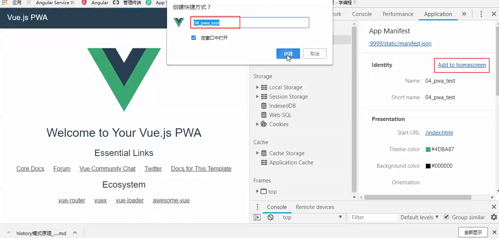
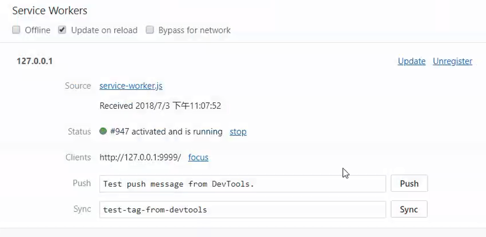
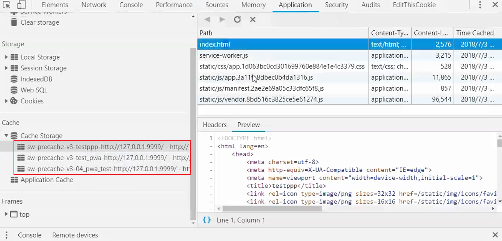
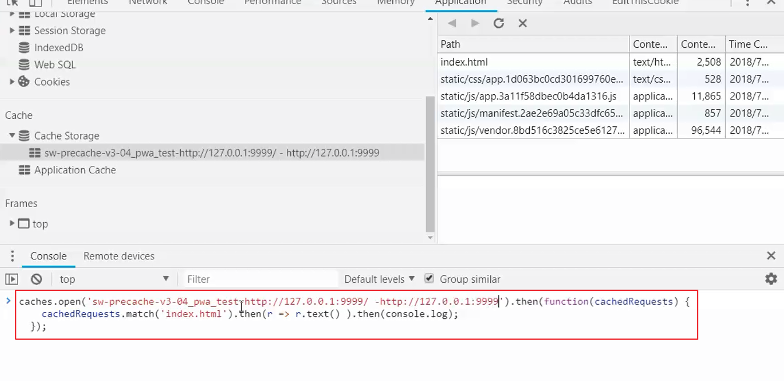
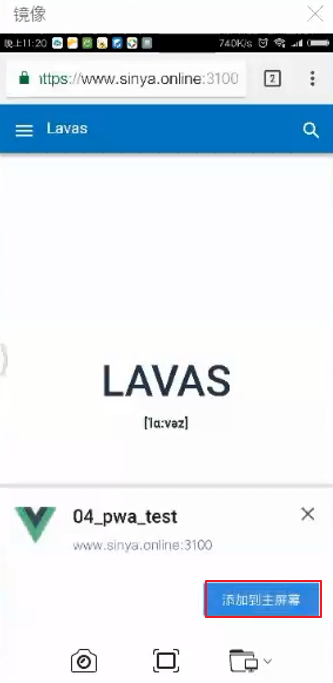
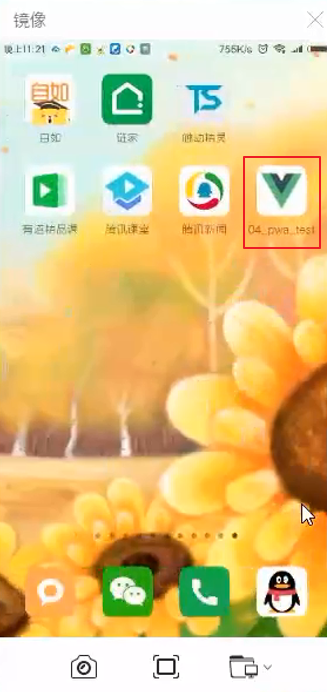

# pwa

PWA(渐进式 WEB application)

1. `离线浏览` web 应用,
2. `生成桌面应用`,
3. `顶部通知`(页面都可以不存在),
4. `预缓存`(在你的页面没有启动以前, 请求资源保存到浏览器), 真正访问的时候, 非常快, 请求本地
5. `骨架屏`
6. `appshell`(上面头部,下面底部, 利用缓存机制保存css+html+js等等)
7. `分享`
8. `全屏图标`
9. `service-worker` 相当于 `node`

`chrome` 一直推出 `pwa` 但是一直没有火起来

手机端 `chrome55` 以上才支持这些所有, `iOS` `safari` 考虑支持

英文看支持率: caniuse

中文就是 lavas 官网可以看到

- 初始化

```bash {1}
λ vue init pwa vue-pwa

  A newer version of vue-cli is available.

  latest:    2.9.6
  installed: 2.9.3

? Project name vue-pwa
? Project short name: fewer than 12 characters to not be truncated on homescreens (default: same as name)
? Project description A Vue.js project
? Author awokelee <awokelee@gmail.com>
? Vue build standalone
? Install vue-router? No
? Use ESLint to lint your code? No
? Setup unit tests with Karma + Mocha? No
? Setup e2e tests with Nightwatch? No

   vue-cli · Generated "vue-pwa".

   To get started:

     cd vue-pwa
     npm install
     npm run dev

   Documentation can be found at https://vuejs-templates.github.io/webpack
```














