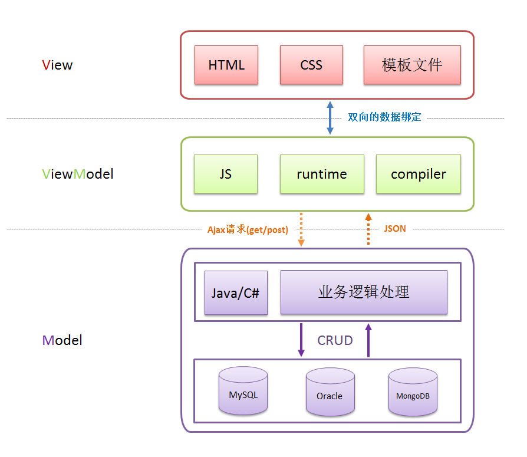
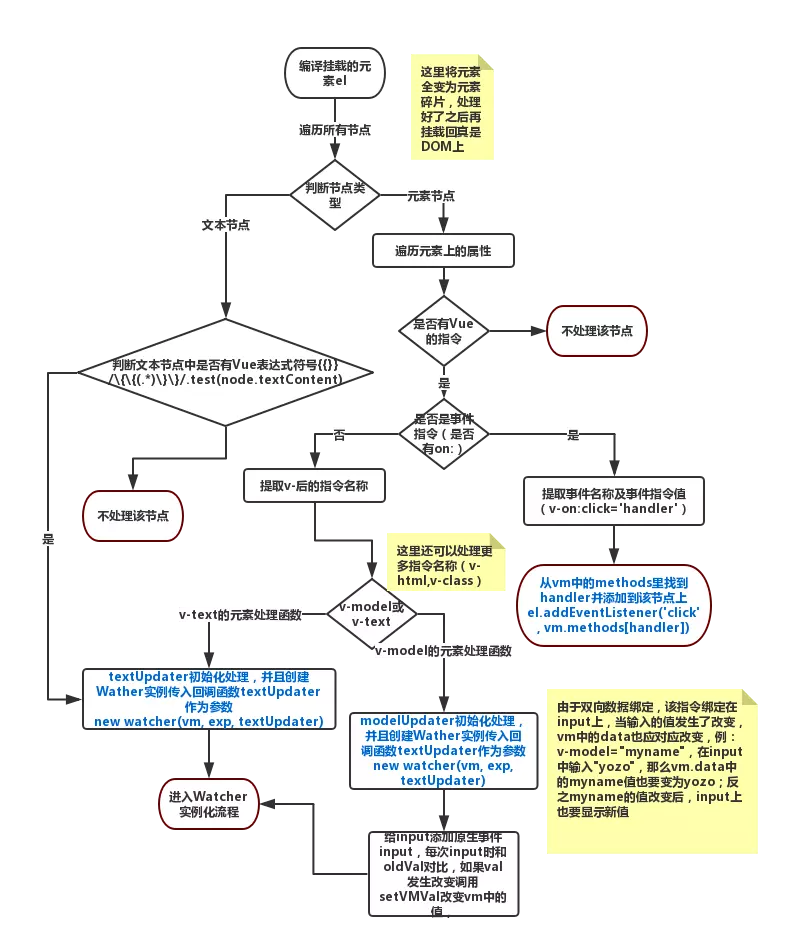

# Vue 相关

## 分析过框架的缺陷

Vue.js:

```md
优点
强化的HTML，也就是说Vue.js有着很多和Angular相似的特点。
详细的文档，Vue.js有着超级友好的文档，开发者可以快速的学会，这将会节省很多时间；
可适用性：你可以很快地从其它框架转移到Vue.js，因为它和Angular以及React都有一定的相似性；
非常棒的整合性：Vue.js可以同时用于单页面应用和更加复杂的网页应用。主要在于你可以用它编写很小的可交互部件，然后可以很容易地整合到现有的项目中而不会影响到整个系统；
可扩展性：Vue.js可以用于快速开发大型复用模板；
体积小：Vue.js只有20KB左右的大小，使得其速度和灵活性相对于其它框架都好不少。

Vue 官方对于 ie 浏览器版本兼容情况的描述是 ie9+，即是 ie9 及更高的版本.
```

AngularJS：

```md
完善：是一个比较完善的前端MVW框架，包含模板，数据双向绑定，路由，模块化，服务，依赖注入等所有功能，模板功能强大丰富，并且是声明式的，自带了丰富的 Angular 指令。

大而全：学习起来有难度，对于我来讲学习曲线很曲折，比较难理解一些。
```

React:

```md
```

Vue 使用模板系统而不是 JSX，使其对现有应用的升级更加容易。这是因为模板用的就是普通的HTML，通过Vue来整合现有的系统是比较容易的，不需要整体重构
Vue 2.0版本 与React的其中最大一个相似之处，就是他们都使用了一种叫'Virtual DOM'的东西

Vue宣称可以更快地计算出Virtual DOM的差异，这是由于它在渲染过程中，会跟踪每一个组件的依赖关系，不需要重新渲染整个组件树

对于React而言，每当应用的状态被改变时，全部子组件都会重新渲染。当然，这可以通过shouldComponentUpdate这个生命周期方法来进行控制，但Vue将此视为默认的优化

## token 存在哪里

## Vue 权限

## MVVM


Model–View–ViewModel(`MVVM`) 是一个`软件架构设计模式`，由微软开发(Angular), 是一种简化用户界面的事件驱动编程方式。

MVVM 促进前后端分离，极大地提高了前端开发效率.

MVVM 的核心是 `ViewModel` 层，它就`像是一个中转站`（value converter），负责`转换 Model 中的数据对象`来让数据变得更容易管理和使用，该层`向上与视图层进行双向数据绑定`，`向下与 Model 层通过接口请求进行数据交互`，起呈上启下作用



**优点**:

MVVM模 式简化了界面与业务的依赖，`解决了数据频繁更新`。MVVM 在使用当中，利用双向绑定技术，使得 Model 变化时，ViewModel 会自动更新，而 ViewModel 变化时，View 也会自动变化。

**缺点**:

第一点：`数据绑定使得 Bug 很难被调试`。你看到界面异常了，有可能是你 View 的代码有 Bug，也可能是 Model 的代码有问题。数据绑定使得一个位置的 Bug 被快速传递到别的位置，要定位原始出问题的地方就变得不那么容易了。

第二点：`对于过大的项目，数据绑定需要花费更多的内存`。

## 响应式原理(MVVM 原理)


Vue `采用数据劫持` & `发布-订阅模式`的方式，`通过 ES5` 提供的 `Object.defineProperty()` 方法来`劫持`（监控）`各属性的 getter 、setter` ，并在`数据（对象）发生变动时通知订阅者`，`触发`相应的监听`回调`。并且，由于是在不同的数据上触发同步，可以精确的将变更发送给绑定的视图，而不是对所有的数据都执行一次检测。


要实现 Vue 中的双向数据绑定，大致可以划分三个模块：Compile、Observer、Watcher

**模板编译 Compile**:

解析 `{{}}` `v-` 等

**数据劫持 Observer**:

`Object.defineProperty( )` 方法来`劫持`（监控）`各属性变化`，即给所有的对象上的某一些数据都`加上get`、`set方法`。

**观察者 Watcher**:

`数据变化`了，就要`告诉视图重新编译模板`，那么编译模板和数据劫持之间就`需要一个关联`，那就是 `Watcher`。而`Compile 和 Observer` 的`具体通信靠`的就是`订阅者 Dep`


## 双向绑定

`input` 事件: 输入过程发生, `change` 事件: 失去焦点发生

双向数据绑定的实现流程:

在解析 v-model 指令时, 给当前元素`添加 input 监听`, `当 input 的 value 发生改变时`, 将最新的`值赋`值给当前表达式所对应的 `data 属性`

## mvvm.js


## complie.js



## watcher.js


## observer.js


## computed、methods 和 watch 的区别与使用场景

**methods 和 computed** 看起来都是一个`函数`, 但是`计算属性会根据它的依赖进行缓存`, 当它相关依赖发生改变才会重新求值, 也就是不发生改变的话就不会再次执行函数. 而只要发生重新渲染，`method` 调用总会执行该函数.

**watch 和 computed** 对比的话, 计算属性主要是简化模版复杂表达式, 返回的是个属性值, 而 watch 更注重的是`监视的对象发生变化你要去做什么`, 比如调接口什么的.

## 数组为什么不能通过修改下标来通知视图发生变化

数组在 Vue 中是可以实现响应式更新的, 但 Vue 对数组的响应 `不是通过 Object.defineProperty` 来实现的

是通过对 `'push', 'pop','shift','unshift','splice', 'sort','reverse'`这几个改变数组本身的方法执行后来通知监听达到的 

尤大大说 `性能代价和获得的用户体验收益不成正比` [Vue 源码](https://github.com/vuejs/vue/blob/16700c95e1cff5b28f838562d3ebff8699378998/src/core/observer/array.js#L14)

官方也提供了 `Vue.set` 方法.


## 生命周期的理解

- `beforeCreate` 和 `created` 始终都会执行, 服务端渲染只有这两个生命周期, 因为 `没有 DOM`.

- 当不指定 `el: '#root'` 不会触发 `beforeMount` 和 `mounted`, 指定 `el: '#root'` 或者手动挂载 `app.$mount('#root')` 会触发这两个方法.

- 案例中 app.text 的数据改变时触发 `beforeUpdate` 和 `updated`.

- `activated` 和 `deactivated` 是组件 `keep-alive 组件激活和停用时调用`.

- `beforeDestroy` 和 `destroyed` 是 `$destroy` 销毁时触发.

- `renderError` 只有在 开发时 才会被调用, 用于调试 `render` 函数的错误, 只限于本组件, 不包含子组件.

- `errorCaptured` 会向上冒泡，并且 正式环境 可以使用, 所有子组件都可以捕获到.


## 组件通信

- 父子组件传值 `props` 和 `$emit`

父组件传给子组件：子组件通过`props`方法接受数据;
子组件传给父组件：`$emit`方法传递参数

- 非父子组件, 兄弟组件传值 `EventBus`

`bus` 皆为导入的 `bus 实例`

```js {2}
// bus
const bus = new Vue()

// 数据接收组件, 当前组件接收值则
bus.$on('event1', (val)=>{})

// 数据发出组件, 当前组件发出值则
bus.$emit('event1', val)
```

可以看出本质是一个 `Vue实例` 充当事件绑定的媒介, 在所有实例中使用其进行数据的通信。

## Vuex 状态管理


Vue `组件接收交互行为`，`调用 dispatch` 方法`触发 action` 相关处理，若页面`状态需要改变`，则调用 `commit 方法提交 mutation 修改 state`，通过 `getters 获取到 state 新值`，`重新渲染` Vue Components，界面随之更新


```bash
Vue Components：Vue组件。HTML页面上，负责接收用户操作等交互行为，执行dispatch方法触发对应action进行回应

dispatch：操作行为触发方法，是唯一能执行action的方法

actions：操作行为处理模块

commit：状态改变提交操作方法

mutations：状态改变操作方法

state：页面状态管理容器对象

getters：state对象读取方法, 图中没有单独列出该模块，应该被包含在了render中，Vue Components通过该方法读取全局state对象
```


## Object.defineProperty（）和 proxy 对比


`Object.defineProperty` 的第一个缺陷, `无法监听数组变化`, 由于只针对了八种方法进行了hack,所以其他数组的属性也是检测不到的

`Object.defineProperty` 的第二个缺陷, `只能劫持对象的属性`,因此我们需要对每个对象的每个属性进行遍历，如果属性值也是对象那么需要深度遍历,显然能劫持一个完整的对象是更好的选择。

`Proxy` 在 `ES2015` 规范中被正式发布, Proxy 是 Object.defineProperty 的全方位加强版

Proxy `可以直接监听对象而非属性`

Proxy `可以直接监听数组的变化`

Proxy `有多达13种拦截方法`

Proxy `返回的是一个新对象`,我 们可以只操作新的对象达到目的, 而 `Object.defineProperty 只能遍历对象属性直接修改`。

Proxy 的 **劣势就是兼容性问题**, 而且无法用polyfill磨平,因此Vue的作者才声明需要等到下个大版本(3.0)才能用Proxy重写

## 过滤器

**全局过滤器**:

```js
Vue.filter('过滤器名字', function (value) {
  // 你的逻辑
  return '最后的值'
})
```

**组件内定义过滤器**:

```js
var vm=new Vue({
    el:"#app",
    data:{
        msg:''
    },
    filters: {
      '过滤器名字': function (value) {
          // 你的逻辑
          return '最后的值'
      }
    }
})
```

**使用**:

```html
<div id="app">
     {{msg| '过滤器名字' }}
</div>
```

## 指令

**全局指令**:

```js
Vue.directive('dir2', {
    inserted(el) {
        console.log(el);
    }
})
```

**局部指令**:

```js
var app = new Vue({
    el: '#app',
    data: {
    },
    directives: {
        // 指令名称
        dir1: {
            inserted(el) {
                // 你的逻辑
                // 对DOM进行操作
                el.style.width = '200px';
            }
        }
    }
})
```

**指令的使用**:

```html
<div id="app">
    <div v-dir1></div>
    <div v-dir2></div>
</div>
```

## Vue 过渡和动画

6 个 class 切换.

`v-enter`：定义进入过渡的开始状态

`v-enter-active`：定义进入过渡生效时的状态

`v-enter-to`: 2.1.8版及以上 定义进入过渡的结束状态

`v-leave`: 定义离开过渡的开始状态

`v-leave-active`：定义离开过渡生效时的状态

`v-leave-to`: 2.1.8版及以上 定义离开过渡的结束状态


```html
<div id="example-1">
  <button @click="show = !show">
    Toggle render
  </button>
  <transition name="slide-fade">
    <p v-if="show">hello</p>
  </transition>
</div>
```

```css
.slide-fade-enter-active {
  transition: all .3s ease;
}
.slide-fade-leave-active {
  transition: all .8s cubic-bezier(1.0, 0.5, 0.8, 1.0);
}
.slide-fade-enter, .slide-fade-leave-to
/* .slide-fade-leave-active for below version 2.1.8 */ {
  transform: translateX(10px);
  opacity: 0;
}
```

## v-if 和 v-show 区别

`v-if` 按照条件是否渲染，`v-show` 是 `display` 的 `block` 或 `none`

需要来回切换的用 `v-show`

## 路由中 hash 模式和 history 模式区别

**hash 模式**：在浏览器中符号“#”，# 以及 # 后面的字符称之为 hash，用 `window.location.hash` 读取；
特点：hash 虽然在 URL 中，但不被包括在 HTTP 请求中；用来指导浏览器动作，对服务端安全无用，`hash 不会重加载页面`。

**history 模式**：`history` 采用 `HTML5` 的新特性；且提供了两个新方法：`pushState（）`，`replaceState（）`可以对浏览器历史记录栈进行修改，以及 `popState 事件`的监听到状态变更。

**注意点**:

- 当访问 http://001.smj123dev.com/newsDetails/2/5 出现 `404`, 是因为在 `nginx` 配置的根目录下面没有 /newsDetails/2/5 这个真实资源存在，这些访问资源都是在 js 里渲染的.

- vue-router `默认 hash 模式` —— `使用 URL 的 hash 来模拟一个完整的 URL`，于是当 `URL 改变时`，`页面不会重新加载`

- `history` 模式，`利用 history.pushState API 来完成 URL 跳转`, 也就是动态的通过 js 操作 window.history 来改变浏览器地址栏里的路径，并没有发起 http 请求，但是当直接在浏览器里输入这个地址(刷新)的时候，就一定要对服务器发起 http 请求，但是这个目标在服务器上又不存在，所以会返回 `404`

## 路由中 $route 和 $router 的区别

`$route` 是“路由信息`对象`”，包括 `path`，`params`，`hash`，`query`，fullPath，matched，name等路由信息参数。

`$router` 是“路由`实例`”对象包括了路由的跳转方法，钩子函数等

## Vue 优缺点及 React Angular对吧

**优点**: 前后端分离, SEO 和 首屏快.

**缺点**: 不利于 SEO, 首屏渲染慢.

**AngularJS**: 依赖注入、依赖对数据做脏检查, 所以 Watcher 越多越慢

**Vue**: 使用基于依赖追踪的观察并且使用异步队列更新，所有的数据都是独立触发的

**React**: JSX 语法

AngualrJS 可以看成一种框架, 什么都帮你做好了, 估计几年后威力更大.

Vue、React 只是一个库, 专注数据, React 开发时更多的是自己动手, 而 Vue 很多都帮你做好了.

## vue 中 key 值的作用

当 Vue.js 用 v-for 正在更新已渲染过的元素列表时，它默认用“就地复用”策略。

如果数据项的顺序被改变，Vue 将不会移动 DOM 元素来匹配数据项的顺序， 而是简单复用此处每个元素，并且确保它在特定索引下显示已被渲染过的每个元素。

**key 的作用主要是为了高效的更新虚拟 DOM**。

## 对 keep-alive 的了解

`keep-alive` 是 Vue `内置的一个组件`，可以使被包含的组件`保留状态`，或`避免重新渲染`

在 vue 2.1.0 版本之后，keep-alive 新加入了两个属性: `include`(包含的组件缓存) 与 `exclude`(排除的组件不缓存，优先级大于include) 。

```js
<keep-alive include='include_components' exclude='exclude_components'>
  <component>
    <!-- 该组件是否缓存取决于include和exclude属性 -->
  </component>
</keep-alive>
```

## SSR

Vue 的 SPA 项目中 html 是 `<div id="app"></div>` 这样, 通过 js 异步调接口获取数据, 这样有两个问题一个是 SEO, 一个是首屏渲染慢.

根据你项目情况, 如果需要 SEO 则可以采用 服务端渲染(SSR).

Vue SSR 本质是 利用 Node 服务器生成调完接口的带数据 html, 返回给前端, 前后端都是用的 Vue, 前端有个 Vue 管理的不带数据的 html, 拿到后台返回的 HTML 渲染到前端 HTML 特定标签即可.

具体实现:

**Node 端**: `npm install vue-server-renderer --save` 安装一个 `vue-server-renderer` 库, node 利用 express 服务：1.解析服务器端路由；2.返回一个vue实例用于渲染

**前端**: 在 `index.html` 外层模板文件中，插入一个`<!--vue-ssr-outlet-->`注释标记，用来标识服务器渲染的html代码片段插入的地方,同时删掉原先的`<div id="app">`. 服务器端会在这个标记的位置自动生成一个`<div id="app" data-server-rendered="true">`，客户端会通过`app.$mount('#app')`挂载到服务端生成的元素上，并变为响应式的

## Nuxt.js

一个 Vue SSR 框架, 也就是不需要我们手动去配置.

Nuxt.js 集成了如下模块: Vue-Router, Vue-Meta 和 Vuex, 不需要手工配置依赖，不需要同时在客户端和服务端配置相同的库.