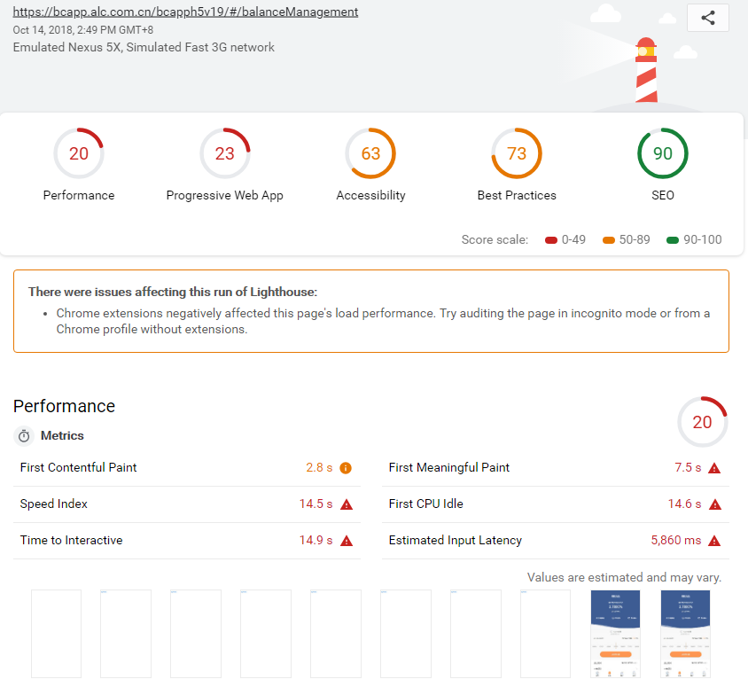
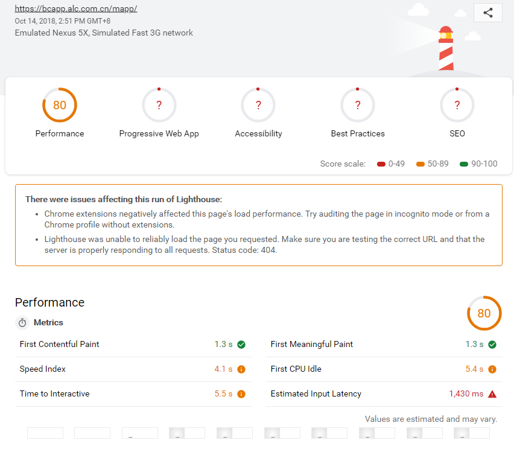
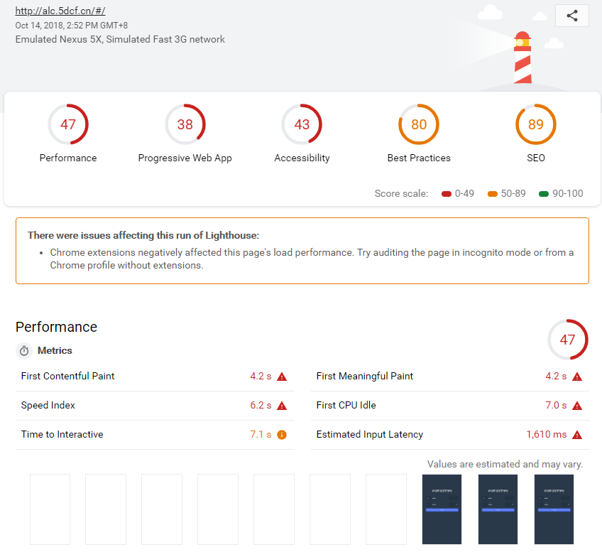
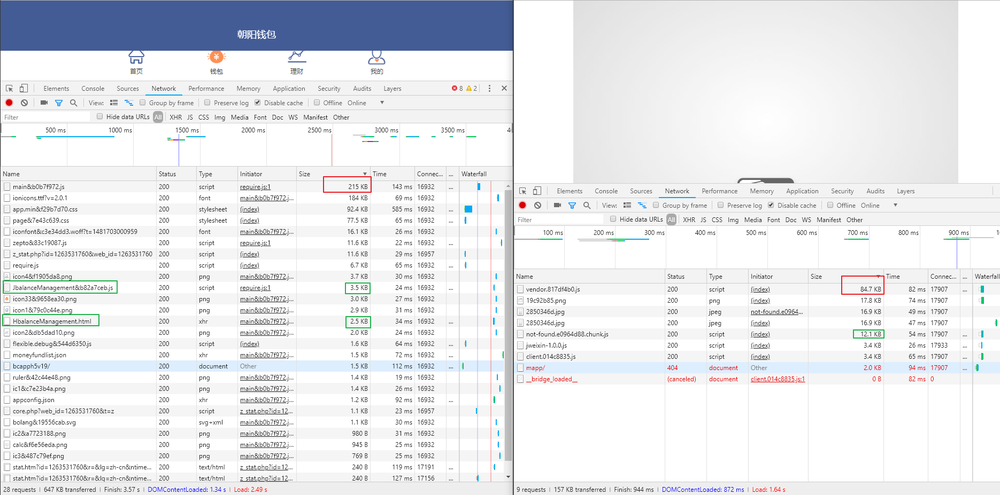
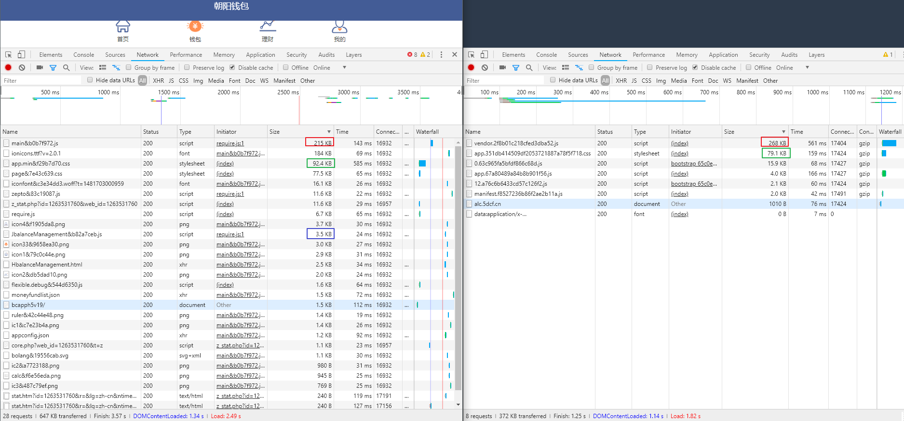

# 三个框架性能对比

三个框架对比 | ng1 | vue2 | react16
---------|----------|---------|---------
 `vendor.js/main.js` | `215` KB | `268` KB| `84.7` KB
 请求数 | `28` 个 | `8` 个| `9` 个
 请求大小 | `647` KB | `372` KB| `157` KB
 加载耗时 | `3.57` S | `1.25` S| `994` ms
 白屏时间 | `756.00` ms | `764.00` ms| `571.00` ms

白屏时间 是根据 `hiper` 得到的.

## light-house

- `ng1`

- `react16`

- `vue2`

## 访问截图

- `ng-react`

- `ng-vue`

