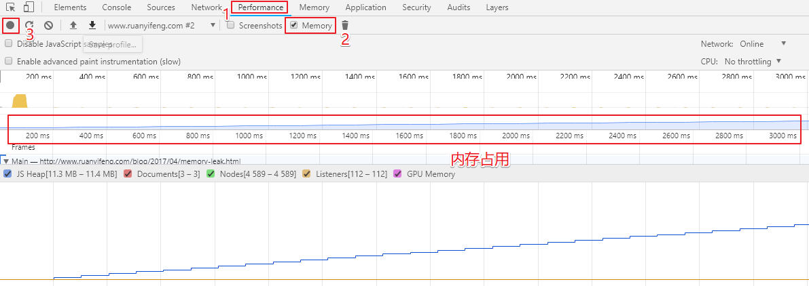

# 内存泄漏

### 一句话

**不再用到的内存，没有及时释放，就叫做内存泄漏（memory leak）**.

### 内存生命周期

不管什么程序语言，内存生命周期基本是一致的：

1. 分配你所需要的内存
2. 使用分配到的内存（读、写）
3. 不需要时将其释放\归还

### JavaScript 的内存分配

- **值的初始化**

为了不让程序员费心分配内存，JavaScript 在定义变量时就完成了内存分配。

```js
var n = 123; // 给数值变量分配内存
var s = "azerty"; // 给字符串分配内存

var o = {
  a: 1,
  b: null
}; // 给对象及其包含的值分配内存

// 给数组及其包含的值分配内存（就像对象一样）
var a = [1, null, "abra"];

function f(a){
  return a + 2;
} // 给函数（可调用的对象）分配内存
```

- **通过函数调用分配内存**

有些`函数调用结果是分配对象内存`：

```js
var d = new Date(); // 分配一个 Date 对象

var e = document.createElement('div'); // 分配一个 DOM 元素
```

有些`方法分配新变量`或者`新对象`：

```js
var s = "azerty";
var s2 = s.substr(0, 3); // s2 是一个新的字符串
// 因为字符串是不变量，
// JavaScript 可能决定不分配内存，
// 只是存储了 [0-3] 的范围。
```

### 内存泄漏的识别方法

怎样可以观察到内存泄漏呢？

经验法则是，如果`连续五次垃圾回收`之后，`内存占用一次比一次大`，就有内存泄漏。这就要求实时查看内存占用



### 常见内存泄漏

- 闭包, 所以用完记得赋值为 null

- vue 定时器使用, vue 组件 destory 记得清除定时器
