# 骨架屏

`客户端渲染`, 与 PWA 有关

以前做法是 `loading`, `骨架屏`的话用户可以看到大概有什么东西, `谷歌`退出的 `PWA` 的一套方案.

- 骨架屏, 代替 loading 图标, 用户体验好, 可以提前预览结构

- 如果其配合上 PWA 的 `Service Workers` 就可以缓存各种数据, 不必请求多余的资源(包括骨架屏)

- `Service Workers` 可以实现离线浏览(所有资源缓存在其中, 拦截浏览器请求相应保存的结果)


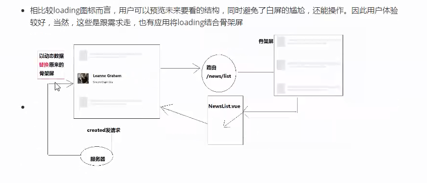

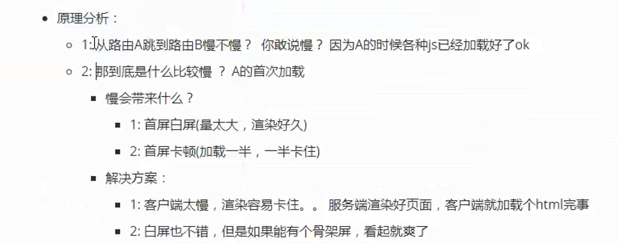

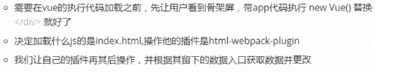

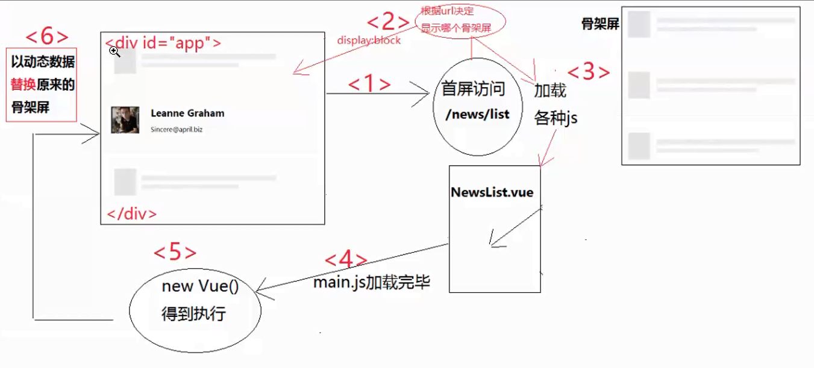

## 操作步骤

1. 安装 `npm i -g lavas`
2. `lavas init`
3. 选择包含 `app_shell` 也包含了骨架屏的功能

```bash
λ lavas init
LAVAS INFO 欢迎使用 Lavas 解决方案
LAVAS INFO 开始新建一个 Lavas PWA 项目

? 请选择一个模版类型 (按上下键选择):  AppShell
? 请输入项目名称:  pwa-project
? 请输入项目作者:  awokelee
? 请输入email:  awokelee@gmail.com
? 请输入项目描述:  这是一个 Lavas PWA 项目

LAVAS INFO 项目已创建成功
LAVAS INFO 您可以操作如下命令快速开始开发 Lavas 工程：

cd pwa-project
npm install
lavas dev
```

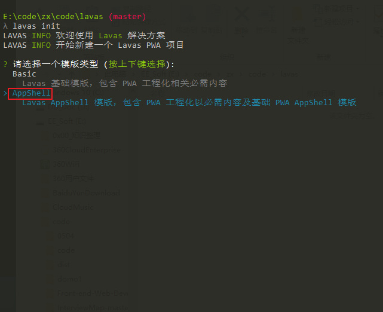

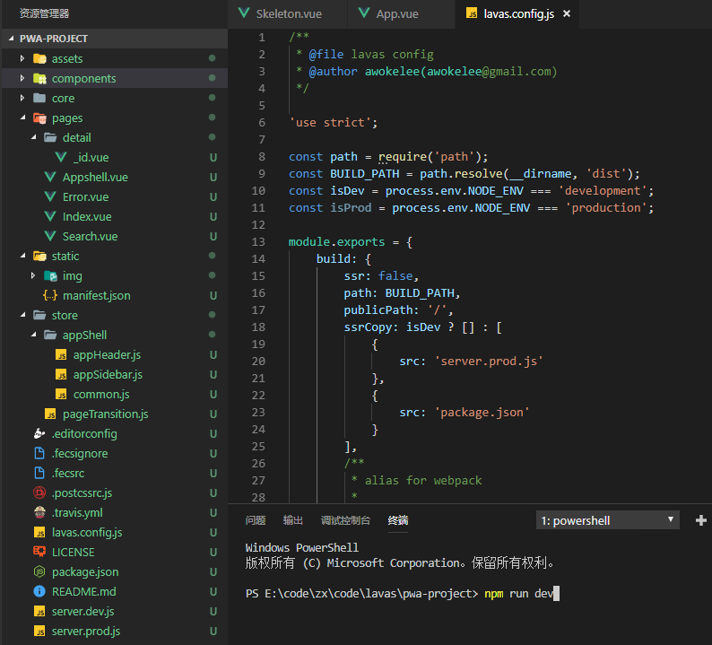

`Service Workers` 还可以可以 离线查看

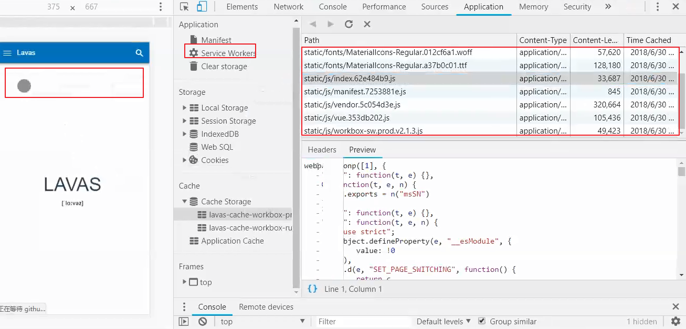

## webpack 生成自己的骨架屏

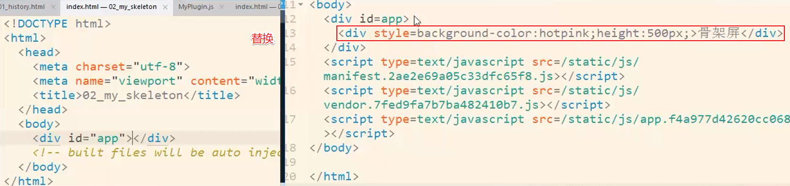

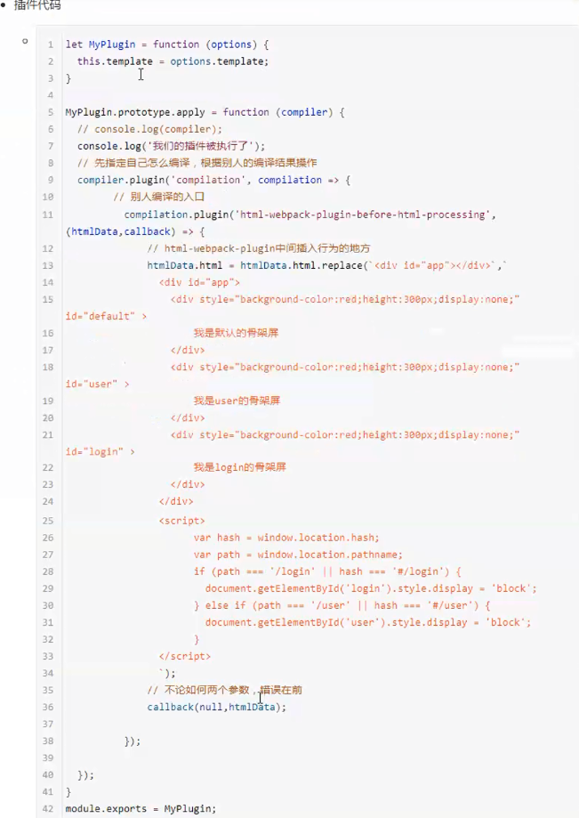

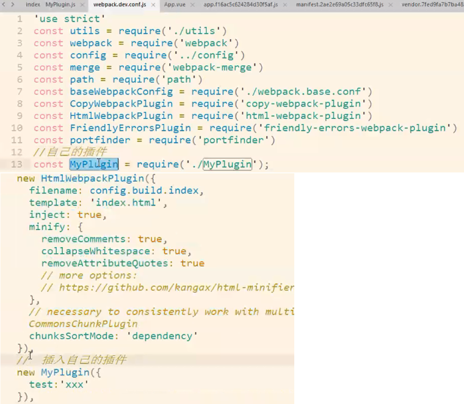

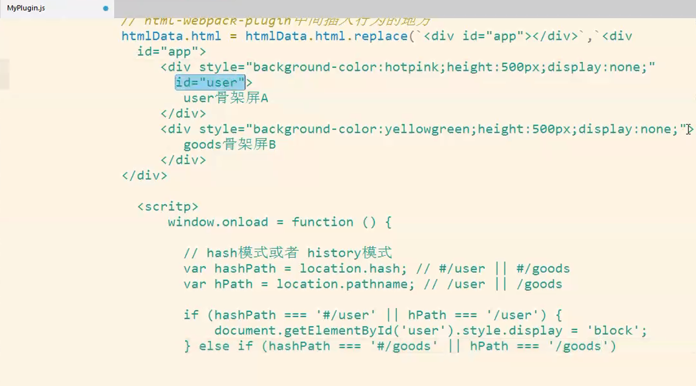