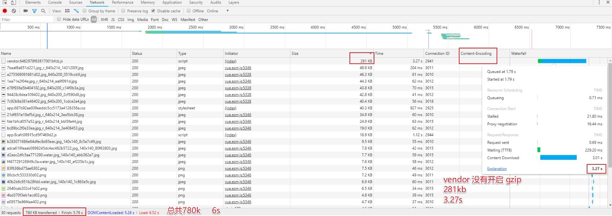
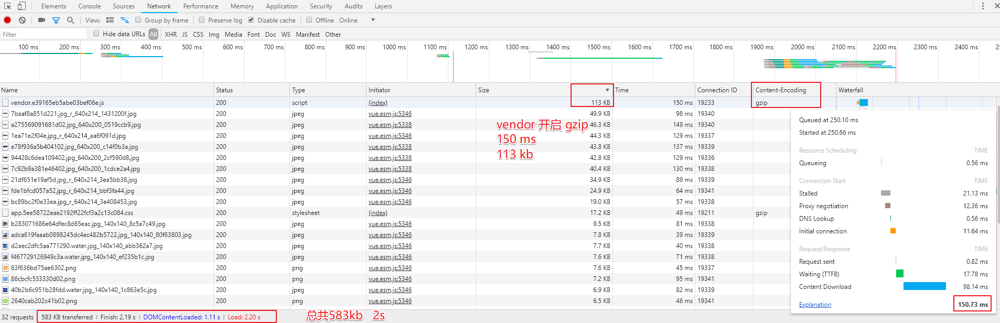

# 开启 GZIP 优化性能

### Vue 项目开启 GZIP

- 找到 `config/index.js` 把 `productionGzip: false,` 改为 `productionGzip: true,`

```js
// npm install --save-dev compression-webpack-plugin
productionGzip: true,
```

- 安装依赖 `npm install --save-dev compression-webpack-plugin`

如果 `npm run build` 打包报错如下:

```js
ValidationError: Compression Plugin Invalid Options

options should NOT have additional properties

    at validateOptions (E:\code\zx\vue-qunar\node_modules\compression-webpack-plugin\node_modules\schema-utils\src\validateOptions.js:32:11)
    at new CompressionPlugin (E:\code\zx\vue-qunar\node_modules\compression-webpack-plugin\dist\index.js:55:31)
    at Object.<anonymous> (E:\code\zx\vue-qunar\build\webpack.prod.conf.js:126:5)
    at Module._compile (module.js:573:30)
    at Object.Module._extensions..js (module.js:584:10)
    at Module.load (module.js:507:32)
    at tryModuleLoad (module.js:470:12)
    at Function.Module._load (module.js:462:3)
    at Module.require (module.js:517:17)
    at require (internal/module.js:11:18)
    at Object.<anonymous> (E:\code\zx\vue-qunar\build\build.js:12:23)
    at Module._compile (module.js:573:30)
    at Object.Module._extensions..js (module.js:584:10)
    at Module.load (module.js:507:32)
    at tryModuleLoad (module.js:470:12)
    at Function.Module._load (module.js:462:3)
```

则切换版本 `npm install --save-dev compression-webpack-plugin@1.1.12` 后再 `npm run build` 即可.

### Nginx 开启 GZIP

- 找到对应站点 `Nginx` 配置文件, 默认是 `nginx.conf`, 开启 `gzip`:

```bash
# 开启gzip
gzip on;
# 启用gzip压缩的最小文件，小于设置值的文件将不会压缩
gzip_min_length 1k;
# gzip 压缩级别，1-10，数字越大压缩的越好，也越占用CPU时间，后面会有详细说明
gzip_comp_level 2;
# 进行压缩的文件类型。javascript有多种形式。其中的值可以在 mime.types 文件中找到。
gzip_types text/plain application/javascript application/x-javascript text/css application/xml text/javascript application/x-httpd-php image/jpeg image/gif image/png font/ttf font/otf image/svg+xml;
# 是否在http header中添加Vary: Accept-Encoding，建议开启
gzip_vary on;
# 禁用IE 6 gzip
gzip_disable "MSIE [1-6]\.";

# 开启缓存
location ~* ^.+\.(ico|gif|jpg|jpeg|png)$ {
    access_log   off;
    expires      30d;
}

location ~* ^.+\.(css|js|txt|xml|swf|wav)$ {
    access_log   off;
    expires      24h;
}

location ~* ^.+\.(html|htm)$ {
    expires      1h;
}

location ~* ^.+\.(eot|ttf|otf|woff|svg)$ {
    access_log   off;
    expires max;
}
```

### 开启前后性能对比

对比内容 | 开启 GZIP 前 | 开启 GZIP 后
---------|----------|---------
 vendor 大小| `281 kb` | `113 kb`
 vendor 耗时 | `3.27 s` | `150 ms`
 总大小 | `780 kb` | `583 kb`
 总耗时| `6 s` | `2 s`



