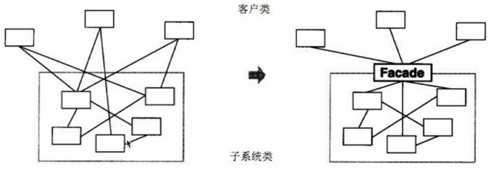

# 外观模式/门面模式

- 为子系统中的一组接口提供了一个高层接口

- 使用者使用这个高层接口



### 设计原则验证

- 不符合单一职责原则和开放封闭原则, 因此谨慎使用, 不可滥用

### 场景 - 既可以传四个参数, 也可以传三个参数

```js
function bindEvent(elem, type, selector, fn) {
  if (fn == null) {
    fn = selector
    selector = null
  }
  // ...
}

bindEvent(elem, 'click', '#div1', fn)
bindEvent(elem, 'click', fn)
```