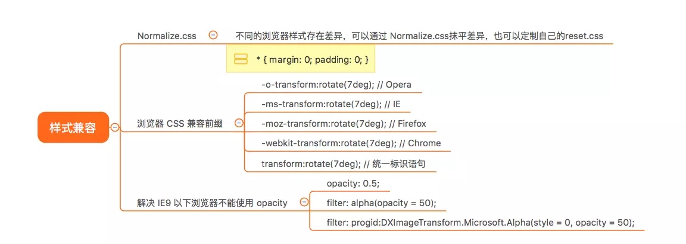
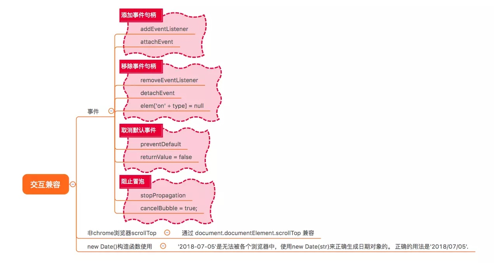
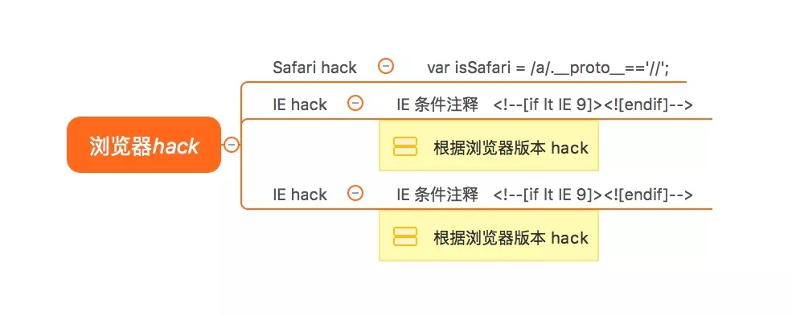

# 浏览器兼容性问题

> 虽然面试官的问题十分的笼统，浏览器的兼容性无非还是`样式兼容性（css）`，`交互兼容性（javascript）`，浏览器 `hack` 三个方面

## 样式兼容性（css）方面



- 因为历史原因，不同的浏览器样式存在差异，可以通过 `Normalize.css` 抹平差异，也可以定制自己的 `reset.css`，例如通过通配符选择器，全局重置样式

```css
 * { margin: 0; padding: 0; }
```

- 在 `CSS3` 还没有成为真正的标准时，浏览器厂商就开始支持这些属性的使用了。 `CSS3` 样式语法还存在波动时，浏览器厂商提供了针对浏览器的前缀，直到现在还是有部分的属性需要加上浏览器前缀。在开发过程中我们一般通过IDE开发插件、css 预处理器以及前端自动化构建工程帮我们处理。

浏览器内核与前缀的对应关系如下:

| 内核 | 主要代表的浏览器 | 前缀 |
| --- | --- | --- |
| Trident | IE浏览器 | -ms |
| Gecko | Firefox | -moz |
| Presto | Opera | -o |
| Webkit | Chrome和Safari | -webkit |

- 在还原设计稿的时候我们常常会需要用到透明属性，所以解决 `IE9` 以下浏览器不能使用 `opacity`。

```css
opacity: 0.5;
 filter: alpha(opacity = 50); // IE6-IE8我们习惯使用filter滤镜属性来进行实现
 filter: progid:DXImageTransform.Microsoft.Alpha(style = 0, opacity = 50); 
 // IE4-IE9都支持滤镜写法 progid:DXImageTransform.Microsoft.Alpha(Opacity=xx)
```

## 交互兼容性（javascript）



- 事件兼容的问题，我们通常需要会封装一个适配器的方法，过滤事件句柄 **绑定**、**移除**、**冒泡** 阻止以及默认事件行为处理

```js
 var  helper = {}

 // 绑定事件
 helper.on = function(target, type, handler) {
	if(target.addEventListener) {
 		target.addEventListener(type, handler, false);
 	} else {
 		target.attachEvent("on" + type,
 			function(event) {
 				return handler.call(target, event);
 		    }, false);
 	}
 };

 //取消事件监听
 helper.remove = function(target, type, handler) {
 	if(target.removeEventListener) {
 		target.removeEventListener(type, handler);
 	} else {
 		target.detachEvent("on" + type,
 	    function(event) {
 			return handler.call(target, event);
 		}, true);
     }
 };
```

- `new Date()`构造函数使用，`'2018-07-05'`是无法被各个浏览器中，使用 `new Date(str)` 来正确生成日期对象的。 正确的用法是 `'2018/07/05'`.

- 获取 `scrollTop` 通过 `document.documentElement.scrollTop` 兼容非 `chrome` 浏览器

```css
 var scrollTop = document.documentElement.scrollTop||document.body.scrollTop;
```

## 浏览器 hack



- 快速判断 `IE` 浏览器版本

```js
 <!--[if IE 8]> ie8 <![endif]-->
 
 <!--[if IE 9]> 骚气的 ie9 浏览器 <![endif]-->
```

- 判断是否是 `Safari` 浏览器

```js
/* Safari */
 var isSafari = /a/.__proto__=='//';
```

- 判断是否是 `Chrome` 浏览器

```js
 /* Chrome */
 var isChrome = Boolean(window.chrome);
```