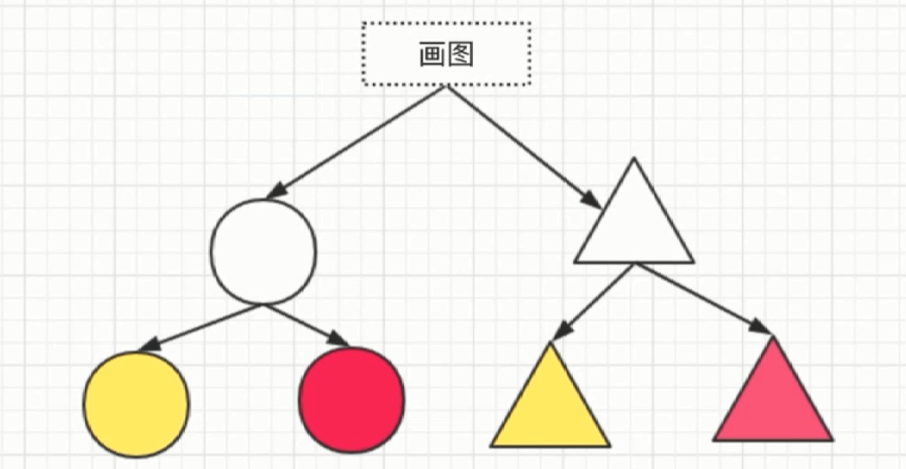
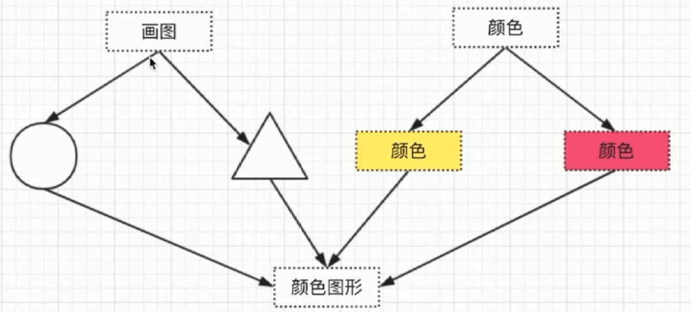

# 桥接模式

- 用于把抽象化与实现化解耦

- 使得两者可以独立变化

加入要画四个图形如下:





```js
class Color {
  constructor(name) {
    this.name = name
  }
}

class Shape {
  constructor(name, color) {
    this.name = name
    this.color = color
  }
  draw() {
    console.log(`${this.color.name} ${this.name}`)
  }
}

let red = new Color('red')
let yellow = new Shape('yellow')
let circle = new Shape('circle', red)
circle.draw()
let triangle = new Shape('triangle', yellow)
triangle.draw()
```