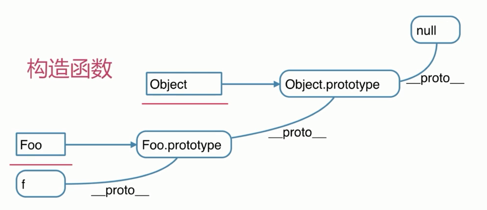

# 原型链

```js
// 构造函数
function Foo(name, age) {
  this.name = name
}
Foo.prototype.alertName = function () {
  alert(this.name)
}

// 创建示例
var f = new Foo('zhangsan')
f.printName = function () {
  console.log(this.name)
}

// 测试
f.printName()
f.alertName()
f.toString() // 要去 f.__proto__.__proto__ 中查找
```

`f.toString()`

