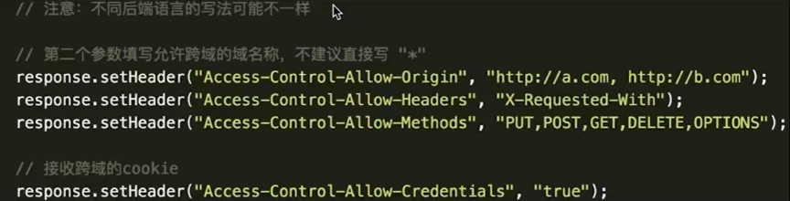

# 跨域

### 什么是跨域

浏览器有同源策略, 不允许 ajax 访问其他域接口

跨域条件: 协议、域名、端口有一个不同就算跨域

### 可以跨域的三个标签

有三个标签允许跨域加载资源

- ``

- `<link href=xxx>`

- `<script src=xxx>`

`` 用于打点统计, 统计网站可能是其他域

`<link` `<script>` 可以使用 CDN, CDN的也是其他域

`<script>` 可以用于 `JSONP`

### 跨域注意事项

- 所有的跨域请求都必须经过信息提供方允许

- 如果未经允许即可获取, 那是浏览器同源策略出现漏洞

### JSONP 原理

- 加载 http://coding.xx/class.html

- 不一定服务器真正有一个 class.html 文件

- 服务器可以根据请求, 动态生成一个文件, 返回

- 同理于 `<script src="http://coding.xx/api.js">`

- 例如你请求服务器一个接口, 服务器返回一个地址 `http://coding.xx/api.js`

- 返回内容格式如 `callback({x:100, y:200})` (可以动态生成)

```html
<script>
window.callback = function (data) {
  // 这是我们跨域得到信息
  console.log(data)
}
</script>
<script src="http://coding.xx/api.js"></script>
<!-- 以上将返回 callback({x:100, y:200}) -->
```

### 服务器设置 http header

简洁的方法, 需要服务器端来做.


