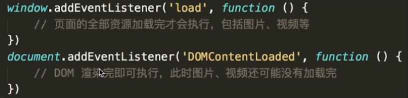

# 浏览器渲染过程

- 根据 `HTML` 结构生成 `DOM Tree`

- 根据 `CSS` 生成` CSSOM`

- 将 `DOM` 和 `CSSOM` 整合生成 `RenderTree`

- 根据 `RenderTree` 开始渲染和展示

- 遇到 `<script>` 时, 会执行并阻塞渲染

### 为什么要把 css 放在 head 中

### window.onload 和 DOMContenLoaded

