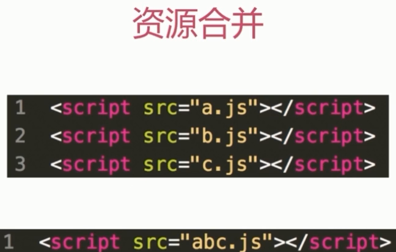
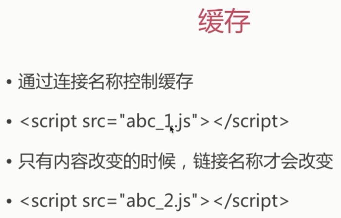
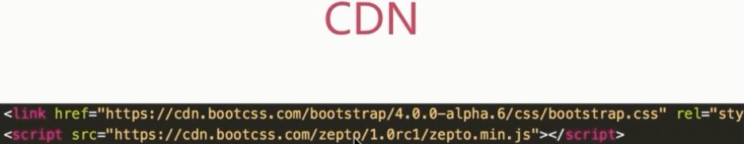
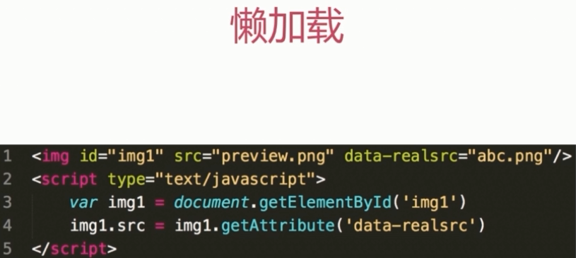
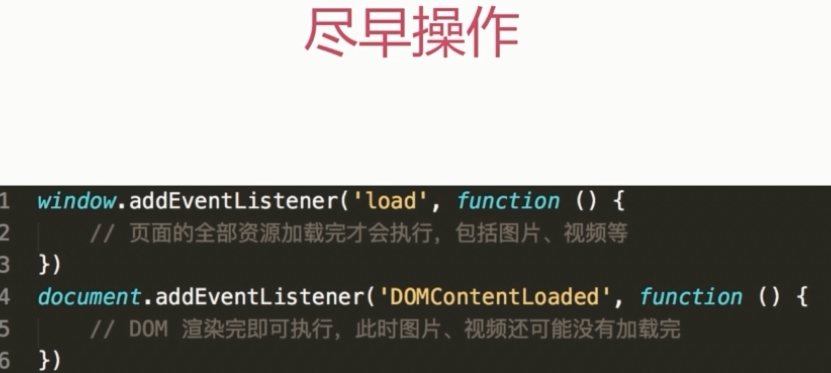

# 性能优化

### 原则

- 多使用内存、缓存或者其他方法

- 减少 CPU 计算、较少网络

### 加载资源优化

- 静态资源的压缩合并
  
- 静态资源缓存

- 使用 CDN 让资源加载更快

- 使用 SSR 后端渲染, 数据直接输出到 HTML 中

### 渲染优化

- CSS 放前面, JS 放后面

- 懒加载(图片懒加载、下拉加载更多)

- 减少 DOM 查询, 对 DOM 查询做缓存

- 减少 DOM 操作, 多个操作尽量合并在一起执行

- 事件节流

- 尽早执行操作(如 DOMContentLoaded)

