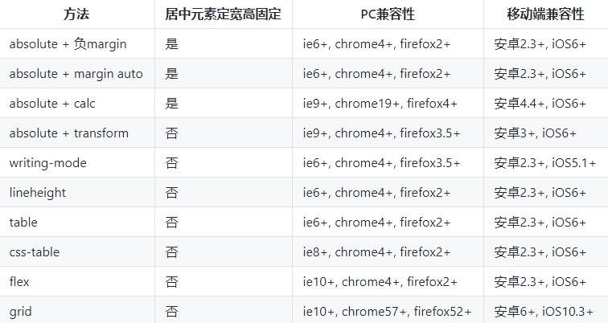

# 水平垂直居中

## 以下三种方式 - 仅居中元素定宽高适用

**注意：后面的方式不再重复这段公共代码，只会给出相应提示.**

```css
/* 公共代码 */
.wp {
    border: 1px solid red;
    width: 300px;
    height: 300px;
}

.box {
    background: green;
}

.box.size{
    width: 100px;
    height: 100px;
}
/* 公共代码 */
```

## absolute + 负 margin

为了实现上面的效果先来做些准备工作，假设 HTML 代码如下，总共两个元素，父元素和子元素

`wp` 是父元素的类名，`box` 是子元素的类名，因为有定宽和不定宽的区别，`size` 用来表示指定宽度，下面是所有效果都要用到的公共代码，主要是设置颜色和宽高

```html
<div class="wp">
    <div class="box size">123123</div>
</div>
```

绝对定位的百分比是相对于父元素的宽高，通过这个特性可以让子元素的居中显示，但绝对定位是基于子元素的左上角，期望的效果是子元素的中心居中显示

为了修正这个问题，可以借助外边距的负值，负的外边距可以让元素向相反方向定位，通过指定子元素的外边距为子元素宽度一半的负值，就可以让子元素居中了，css 代码如下

```css
/* 此处引用上面的公共代码 */
/* 此处引用上面的公共代码 */

/* 定位代码 */
.wp {
    position: relative;
}
.box {
    position: absolute;;
    top: 50%;
    left: 50%;
    margin-left: -50px;
    margin-top: -50px;
}
```

这是我比较常用的方式，这种方式比较好理解，兼容性也很好，缺点是需要知道子元素的宽高

## absolute + margin auto

这种方式也要求居中元素的宽高必须固定，HTML 代码如下

```html
<div class="wp">
    <div class="box size">123123</div>
</div>
```

这种方式通过设置各个方向的距离都是 `0`，此时再将 `margin` 设为 `auto`，就可以在各个方向上居中了

```css
/* 此处引用上面的公共代码 */
/* 此处引用上面的公共代码 */

/* 定位代码 */
.wp {
    position: relative;
}
.box {
    position: absolute;;
    top: 0;
    left: 0;
    right: 0;
    bottom: 0;
    margin: auto;
}
```

这种方法兼容性也很好，缺点是需要知道子元素的宽高

## absolute + calc

这种方式也要求居中元素的宽高必须固定，HTML 代码如下

```html
<div class="wp">
    <div class="box size">123123</div>
</div>
```

感谢 `css3` 带来了计算属性，既然 `top` 的百分比是基于元素的左上角，那么在减去宽度的一半就好了，代码如下

```css
/* 此处引用上面的公共代码 */
/* 此处引用上面的公共代码 */

/* 定位代码 */
.wp {
    position: relative;
}
.box {
    position: absolute;;
    top: calc(50% - 50px);
    left: calc(50% - 50px);
}
```

这种方法兼容性依赖 `calc` 的兼容性，缺点是需要知道子元素的宽高

## 以下七种方式 - 居中元素不定宽高适用

## absolute + transform

不需要子元素固定宽高，所以不再需要 `size` 类了, HTML 代码如下

```html
<div class="wp">
    <div class="box">123123</div>
</div>
```

修复绝对定位的问题，还可以使用 `css3` 新增的 `transform`，`transform` 的 `translate` 属性也可以设置百分比，其是相对于自身的宽和高，所以可以讲 `translate` 设置为 `-50%`，就可以做到居中了，代码如下

```css
/* 此处引用上面的公共代码 */
/* 此处引用上面的公共代码 */

/* 定位代码 */
.wp {
    position: relative;
}
.box {
    position: absolute;
    top: 50%;
    left: 50%;
    transform: translate(-50%, -50%);
}
```

复制代码这种方法兼容性依赖 `translate2d` 的兼容性

## writing-mode

很多同学一定和我一样不知道 `writing-mode` 属性，感谢@张鑫旭老师的反馈，简单来说 `writing-mode` 可以改变文字的显示方向，比如可以通过 `writing-mode` 让文字的显示变为垂直方向

```html
<div class="div1">水平方向</div>
<div class="div2">垂直方向</div>
```

```css
.div2 {
    writing-mode: vertical-lr;
}
```

显示效果如下：

```text
水平方向
垂
直
方
向
```

更神奇的是所有水平方向上的 css 属性，都会变为垂直方向上的属性，比如 `text-align`，通过 `writing-mode` 和 `text-align` 就可以做到水平和垂直方向的居中了，只不过要稍微麻烦一点

```html
<div class="wp">
    <div class="wp-inner">
        <div class="box">123123</div>
    </div>
</div>
```

```css
.wp {
    writing-mode: vertical-lr;
    text-align: center;
}
.wp-inner {
    writing-mode: horizontal-tb;
    display: inline-block;
    text-align: center;
    width: 100%;
}
.box {
    display: inline-block;
    margin: auto;
    text-align: left;
}
```

这种方法实现起来和理解起来都稍微有些复杂

## lineheight

利用行内元素居中属性也可以做到水平垂直居中，HTML 代码如下

```html
<div class="wp">
    <div class="box">123123</div>
</div>
```

把 `box` 设置为行内元素，通过 `text-align` 就可以做到水平居中，但很多同学可能不知道通过通过 `vertical-align` 也可以在垂直方向做到居中，代码如下

```css
/* 此处引用上面的公共代码 */
/* 此处引用上面的公共代码 */

/* 定位代码 */
.wp {
    line-height: 300px;
    text-align: center;
    font-size: 0px;
}
.box {
    font-size: 16px;
    display: inline-block;
    vertical-align: middle;
    line-height: initial;
    text-align: left; /* 修正文字 */
}
```

这种方法需要在子元素中将文字显示重置为想要的效果

## table

曾经 `table` 被用来做页面布局，现在没人这么做了，但 `table` 也能够实现水平垂直居中，但是会增加很多冗余代码

```html
<table>
    <tbody>
        <tr>
            <td class="wp">
                <div class="box">123123</div>
            </td>
        </tr>
    </tbody>
</table>
```

`tabel` 单元格中的内容天然就是垂直居中的，只要添加一个水平居中属性就好了

```css
.wp {
    text-align: center;
}
.box {
    display: inline-block;
}
```

这种方法就是代码太冗余，而且也不是 `table` 的正确用法

## css-table

`css` 新增的 `table` 属性，可以让我们把普通元素，变为 `table` 元素的现实效果，通过这个特性也可以实现水平垂直居中

```html
<div class="wp">
    <div class="box">123123</div>
</div>
```

下面通过css属性，可以让 `div` 显示的和 `table` 一样

```css
.wp {
    display: table-cell;
    text-align: center;
    vertical-align: middle;
}
.box {
    display: inline-block;
}
```

这种方法和 `table` 一样的原理，但却没有那么多冗余代码，兼容性也还不错

## flex

`flex` 作为现代的布局方案，颠覆了过去的经验，只需几行代码就可以优雅的做到水平垂直居中

```html
<div class="wp">
    <div class="box">123123</div>
</div>
```

```css
.wp {
    display: flex;
    justify-content: center;
    align-items: center;
}
```

目前在移动端已经完全可以使用 `flex` 了，`PC` 端需要看自己业务的兼容性情况

## grid

`css` 新出的网格布局，由于兼容性不太好，一直没太关注，通过 `grid` 也可以实现水平垂直居中

```html
<div class="wp">
    <div class="box">123123</div>
</div>
```

```css
.wp {
    display: grid;
}
.box {
    align-self: center;
    justify-self: center;
}
```

代码量也很少，但兼容性不如 `flex`，不推荐使用

## 总结

下面对比下各个方式的优缺点，肯定又双叒叕该有同学说回字的写法了，简单总结下

- `PC` 端有兼容性要求，宽高固定，推荐 `absolute + 负 margin`
- `PC` 端有兼容要求，宽高不固定，推荐 `css-table`
- `PC` 端无兼容性要求，推荐 `flex`
- 移动端推荐使用 `flex`



::: tip 参考链接
[CSS实现水平垂直居中的10种方式](https://juejin.im/post/5b9a4477f265da0ad82bf921?utm_source=gold_browser_extension), by 颜海镜.
:::
