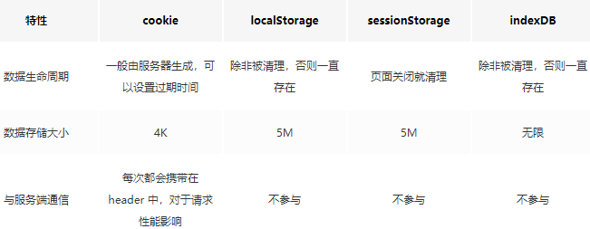
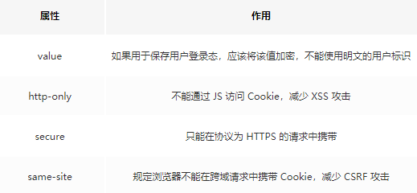
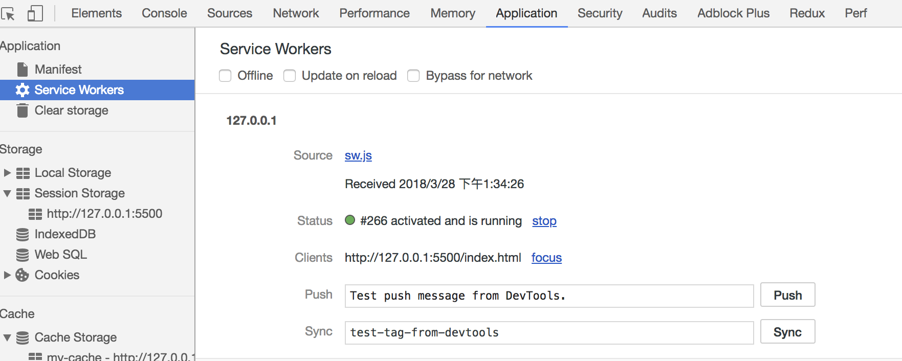
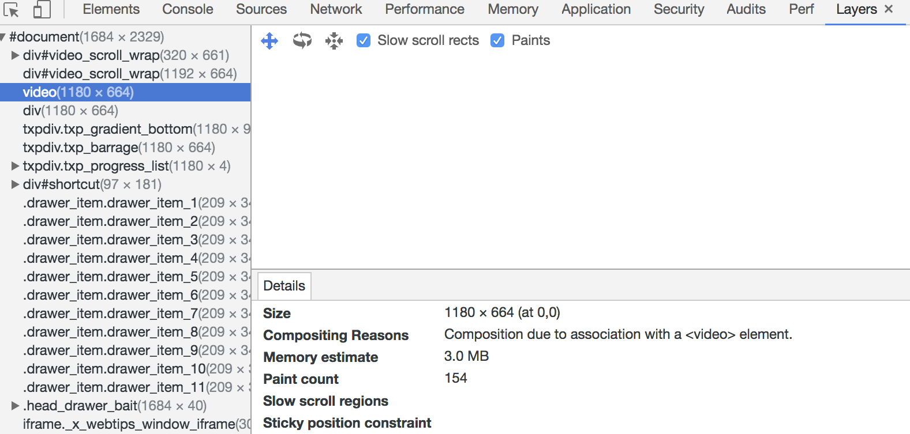

# 浏览器相关

## cookie和localSrorage、session、indexDB 的区别



从上表可以看到，cookie 已经不建议用于存储。如果没有大量数据存储需求的话，可以使用 localStorage 和 sessionStorage 。对于不怎么改变的数据尽量使用 localStorage 存储，否则可以用 sessionStorage 存储。

对于 cookie，我们还需要注意安全性。



## 怎么判断页面是否加载完成

Load 事件触发代表页面中的 DOM，CSS，JS，图片已经全部加载完毕。

DOMContentLoaded 事件触发代表初始的 HTML 被完全加载和解析，不需要等待 CSS，JS，图片加载。

## 如何解决跨域

因为浏览器出于安全考虑，有同源策略。也就是说，如果协议、域名或者端口有一个不同就是跨域，Ajax 请求会失败。

我们可以通过以下几种常用方法解决跨域的问题

**JSONP**:

SONP 的原理很简单，就是利用 `<script>` 标签没有跨域限制的漏洞。通过 `<script>` 标签指向一个需要访问的地址并提供一个回调函数来接收数据当需要通讯时。

```JS
<script src="http://domain/api?param1=a&param2=b&callback=jsonp"></script>
<script>
    function jsonp(data) {
      console.log(data)
  }
</script>
```

JSONP 使用简单且兼容性不错，但是只限于 get 请求。

在开发中可能会遇到多个 JSONP 请求的回调函数名是相同的，这时候就需要自己封装一个 JSONP，以下是简单实现

```js
function jsonp(url, jsonpCallback, success) {
  let script = document.createElement("script");
  script.src = url;
  script.async = true;
  script.type = "text/javascript";
  window[jsonpCallback] = function(data) {
    success && success(data);
  };
  document.body.appendChild(script);
}
jsonp(
  "http://xxx",
  "callback",
  function(value) {
    console.log(value);
  }
);
```

**CORS**:

CORS需要浏览器和后端同时支持。IE 8 和 9 需要通过 XDomainRequest 来实现。

浏览器会自动进行 CORS 通信，实现CORS通信的关键是后端。只要后端实现了 CORS，就实现了跨域。

服务端设置 Access-Control-Allow-Origin 就可以开启 CORS。 该属性表示哪些域名可以访问资源，如果设置通配符则表示所有网站都可以访问资源。

**document.domain**:

该方式只能用于二级域名相同的情况下，比如 a.test.com 和 b.test.com 适用于该方式。

只需要给页面添加 document.domain = 'test.com' 表示二级域名都相同就可以实现跨域

**postMessage**:

这种方式通常用于获取嵌入页面中的第三方页面数据。一个页面发送消息，另一个页面判断来源并接收消息

```js
// 发送消息端
window.parent.postMessage('message', 'http://test.com');
// 接收消息端
var mc = new MessageChannel();
mc.addEventListener('message', (event) => {
    var origin = event.origin || event.originalEvent.origin;
    if (origin === 'http://test.com') {
        console.log('验证通过')
    }
});
```

## 什么是事件代理

如果一个节点中的子节点是动态生成的，那么子节点需要注册事件的话应该注册在父节点上

```html
<ul id="ul">
  <li>1</li>
    <li>2</li>
  <li>3</li>
  <li>4</li>
  <li>5</li>
</ul>
<script>
  let ul = document.querySelector('#ul')
  ul.addEventListener('click', (event) => {
    console.log(event.target);
  })
</script>
```

事件代理的方式相对于直接给目标注册事件来说，有以下优点

- 节省内存
- 不需要给子节点注销事件

## Service worker

> Service workers 本质上充当Web应用程序与浏览器之间的代理服务器，也可以在网络可用时作为浏览器和网络间的代理。它们旨在（除其他之外）使得能够创建有效的离线体验，拦截网络请求并基于网络是否可用以及更新的资源是否驻留在服务器上来采取适当的动作。他们还允许访问推送通知和后台同步API。

目前该技术通常用来做缓存文件，提高首屏速度，可以试着来实现这个功能。

```js
// index.js
if (navigator.serviceWorker) {
  navigator.serviceWorker
    .register("sw.js")
    .then(function(registration) {
      console.log("service worker 注册成功");
    })
    .catch(function(err) {
      console.log("servcie worker 注册失败");
    });
}
// sw.js
// 监听 `install` 事件，回调中缓存所需文件
self.addEventListener("install", e => {
  e.waitUntil(
    caches.open("my-cache").then(function(cache) {
      return cache.addAll(["./index.html", "./index.js"]);
    })
  );
});

// 拦截所有请求事件
// 如果缓存中已经有请求的数据就直接用缓存，否则去请求数据
self.addEventListener("fetch", e => {
  e.respondWith(
    caches.match(e.request).then(function(response) {
      if (response) {
        return response;
      }
      console.log("fetch source");
    })
  );
});
```

打开页面，可以在开发者工具中的 Application 看到 Service Worker 已经启动了



## 浏览器缓存

缓存对于前端性能优化来说是个很重要的点，良好的缓存策略可以降低资源的重复加载提高网页的整体加载速度。

通常浏览器缓存策略分为两种：强缓存和协商缓存。

## 强缓存

实现强缓存可以通过两种响应头实现：Expires 和 Cache-Control 。强缓存表示在缓存期间不需要请求，state code 为 200

```js
Expires: Wed, 22 Oct 2018 08:41:00 GMT
```

**Expires** 是 HTTP / 1.0 的产物，表示资源会在 Wed, 22 Oct 2018 08:41:00 GMT 后过期，需要再次请求。并且 Expires 受限于本地时间，如果修改了本地时间，可能会造成缓存失效。

```js
Cache-control: max-age=30
```

**Cache-Control** 出现于 HTTP / 1.1，优先级高于 Expires 。该属性表示资源会在 30 秒后过期，需要再次请求。

## 协商缓存

如果缓存过期了，我们就可以使用协商缓存来解决问题。协商缓存需要请求，如果缓存有效会返回 304。

协商缓存需要客户端和服务端共同实现，和强缓存一样，也有两种实现方式。

**Last-Modified 和 If-Modified-Since**:

Last-Modified 表示本地文件最后修改日期，If-Modified-Since 会将 Last-Modified 的值发送给服务器，询问服务器在该日期后资源是否有更新，有更新的话就会将新的资源发送回来。

但是如果在本地打开缓存文件，就会造成 Last-Modified 被修改，所以在 HTTP / 1.1 出现了 ETag 。

**ETag 和 If-None-Match**:

ETag 类似于文件指纹，If-None-Match 会将当前 ETag 发送给服务器，询问该资源 ETag 是否变动，有变动的话就将新的资源发送回来。并且 ETag 优先级比 Last-Modified 高。

**选择合适的缓存策略**:

对于大部分的场景都可以使用强缓存配合协商缓存解决，但是在一些特殊的地方可能需要选择特殊的缓存策略

- 对于某些不需要缓存的资源，可以使用 Cache-control: no-store ，表示该资源不需要缓存
- 对于频繁变动的资源，可以使用 Cache-Control: no-cache 并配合 ETag 使用，表示该资源已被缓存，但是每次都会发送请求询问资源是否更新。
- 对于代码文件来说，通常使用 Cache-Control: max-age=31536000 并配合策略缓存使用，然后对文件进行指纹处理，一旦文件名变动就会立刻下载新的文件。

## 重绘（Repaint）和回流（Reflow）

重绘和回流是渲染步骤中的一小节，但是这两个步骤对于性能影响很大。

- 重绘是当节点需要更改外观而不会影响布局的，比如改变 color 就叫称为重绘
- 回流是布局或者几何属性需要改变就称为回流。

回流必定会发生重绘，重绘不一定会引发回流。回流所需的成本比重绘高的多，改变深层次的节点很可能导致父节点的一系列回流。

所以以下几个动作可能会导致性能问题：

- 改变 window 大小
- 改变字体
- 添加或删除样式
- 文字改变
- 定位或者浮动
- 盒模型

很多人不知道的是，重绘和回流其实和 Event loop 有关。

- 当 Event loop 执行完 Microtasks 后，会判断 document 是否需要更新。因为浏览器是 60Hz 的刷新率，每 16ms 才会更新一次。
- 然后判断是否有 resize 或者 scroll ，有的话会去触发事件，所以 resize 和 scroll 事件也是至少 16ms 才会触发一次，并且自带节流功能。
- 判断是否触发了 media query
- 更新动画并且发送事件
- 判断是否有全屏操作事件
- 执行 requestAnimationFrame 回调
- 执行 IntersectionObserver 回调，该方法用于判断元素是否可见，可以用于懒加载上，但是兼容性不好
- 更新界面
- 以上就是一帧中可能会做的事情。如果在一帧中有空闲时间，就会去执行 requestIdleCallback 回调。

[HTML 文档](https://html.spec.whatwg.org/multipage/webappapis.html#event-loop-processing-model)

## 减少重绘和回流

- 使用 translate 替代 top

```html
<div class="test"></div>
<style>
  .test {
    position: absolute;
    top: 10px;
    width: 100px;
    height: 100px;
    background: red;
  }
</style>
<script>
  setTimeout(() => {
    // 引起回流
    document.querySelector('.test').style.top = '100px'
  }, 1000)
</script>
```

- 使用 visibility 替换 display: none ，因为前者只会引起重绘，后者会引发回流（改变了布局）
- 把 DOM 离线后修改，比如：先把 DOM 给 display:none (有一次 Reflow)，然后你修改100次，然后再把它显示出来
- 不要把 DOM 结点的属性值放在一个循环里当成循环里的变量

```js
for(let i = 0; i < 1000; i++) {
  // 获取 offsetTop 会导致回流，因为需要去获取正确的值
  console.log(document.querySelector('.test').style.offsetTop)
}
```

- 不要使用 table 布局，可能很小的一个小改动会造成整个 table 的重新布局
- 动画实现的速度的选择，动画速度越快，回流次数越多，也可以选择使用 requestAnimationFrame
- CSS 选择符从右往左匹配查找，避免 DOM 深度过深
- 将频繁运行的动画变为图层，图层能够阻止该节点回流影响别的元素。比如对于 video 标签，浏览器会自动将该节点变为图层。



## 计算图片大小

对于一张 100 * 100 像素的图片来说，图像上有 10000 个像素点，如果每个像素的值是 RGBA 存储的话，那么也就是说每个像素有 4 个通道，每个通道 1 个字节（8 位 = 1个字节），所以该图片大小大概为 39KB（10000 * 1 * 4 / 1024）。

但是在实际项目中，一张图片可能并不需要使用那么多颜色去显示，我们可以通过减少每个像素的调色板来相应缩小图片的大小。
了解了如何计算图片大小的知识，那么对于如何优化图片，想必大家已经有 2 个思路了：

- 减少像素点
- 减少每个像素点能够显示的颜色

## 图片加载优化

- 不用图片。很多时候会使用到很多修饰类图片，其实这类修饰图片完全可以用 CSS 去代替。
- 对于移动端来说，屏幕宽度就那么点，完全没有必要去加载原图浪费带宽。一般图片都用 CDN 加载，可以计算出适配屏幕的宽度，然后去请求相应裁剪好的图片。
- 小图使用 base64 格式
- 将多个图标文件整合到一张图片中（雪碧图）
- 选择正确的图片格式：
  - 对于能够显示 WebP 格式的浏览器尽量使用 WebP 格式。因为 WebP 格式具有更好的图像数据压缩算法，能带来更小的图片体积，而且拥有肉眼识别无差异的图像质量，缺点就是兼容性并不好
  - 小图使用 PNG，其实对于大部分图标这类图片，完全可以使用 SVG 代替
  - 照片使用 JPEG

## 其他文件优化

- CSS 文件放在 head 中
- 服务端开启文件压缩功能
- 将 script 标签放在 body 底部，因为 JS 文件执行会阻塞渲染。当然也可以把 script 标签放在任意位置然后加上 defer ，表示该文件会并行下载，但是会放到 HTML 解析完成后顺序执行。对于没有任何依赖- 的 JS 文件可以加上 async ，表示加载和渲染后续文档元素的过程将和  JS 文件的加载与执行并行无序进行。
- 执行 JS 代码过长会卡住渲染，对于需要很多时间计算的代码可以考虑使用 Webworker。Webworker 可以让我们另开一个线程执行脚本而不影响渲染。

## CDN

静态资源尽量使用 CDN 加载，由于浏览器对于单个域名有并发请求上限，可以考虑使用多个 CDN 域名。对于 CDN 加载静态资源需要注意 CDN 域名要与主站不同，否则每次请求都会带上主站的 Cookie。

::: tip 参考链接
[大厂面经](https://juejin.im/post/5ba34e54e51d450e5162789b), by 夕阳.
:::