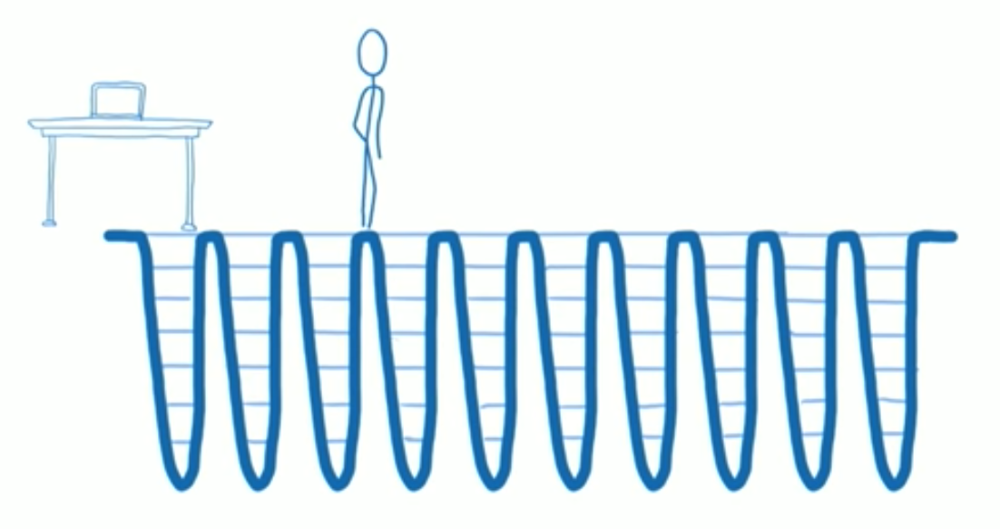

# React

## React 生命周期

在 V16 版本中引入了 Fiber 机制。这个机制一定程度上的影响了部分生命周期的调用，并且也引入了新的 2 个 API 来解决问题。

在之前的版本中，如果你拥有一个很复杂的复合组件，然后改动了最上层组件的 state，那么调用栈可能会很长


调用栈过长，再加上中间进行了复杂的操作，就可能导致长时间阻塞主线程，带来不好的用户体验。Fiber 就是为了解决该问题而生。

Fiber 本质上是一个虚拟的堆栈帧，新的调度器会按照优先级自由调度这些帧，从而将之前的同步渲染改成了异步渲染，在不影响体验的情况下去分段计算更新。



对于如何区别优先级，React 有自己的一套逻辑。对于动画这种实时性很高的东西，也就是 16 ms 必须渲染一次保证不卡顿的情况下，React 会每 16 ms（以内） 暂停一下更新，返回来继续渲染动画。

对于异步渲染，现在渲染有两个阶段：reconciliation 和 commit 。前者过程是可以打断的，后者不能暂停，会一直更新界面直到完成。

**Reconciliation 阶段**:

- componentWillMount
- componentWillReceiveProps
- shouldComponentUpdate
- componentWillUpdate

**Commit 阶段**:

- componentDidMount
- componentDidUpdate
- componentWillUnmount

因为 reconciliation 阶段是可以被打断的，所以 reconciliation 阶段会执行的生命周期函数就可能会出现调用多次的情况，从而引起 Bug。所以对于 reconciliation 阶段调用的几个函数，除了 shouldComponentUpdate 以外，其他都应该避免去使用，并且 V16 中也引入了新的 API 来解决这个问题。

getDerivedStateFromProps 用于替换 componentWillReceiveProps ，该函数会在初始化和 update 时被调用

```js
class ExampleComponent extends React.Component {
  // Initialize state in constructor,
  // Or with a property initializer.
  state = {};

  static getDerivedStateFromProps(nextProps, prevState) {
    if (prevState.someMirroredValue !== nextProps.someValue) {
      return {
        derivedData: computeDerivedState(nextProps),
        someMirroredValue: nextProps.someValue
      };
    }

    // Return null to indicate no change to state.
    return null;
  }
}
```

getSnapshotBeforeUpdate 用于替换 componentWillUpdate ，该函数会在 update 后 DOM 更新前被调用，用于读取最新的 DOM 数据。

## V16 生命周期函数用法建议

```js
class ExampleComponent extends React.Component {
  // 用于初始化 state
  constructor() {}
  // 用于替换 `componentWillReceiveProps` ，该函数会在初始化和 `update` 时被调用
  // 因为该函数是静态函数，所以取不到 `this`
  // 如果需要对比 `prevProps` 需要单独在 `state` 中维护
  static getDerivedStateFromProps(nextProps, prevState) {}
  // 判断是否需要更新组件，多用于组件性能优化
  shouldComponentUpdate(nextProps, nextState) {}
  // 组件挂载后调用
  // 可以在该函数中进行请求或者订阅
  componentDidMount() {}
  // 用于获得最新的 DOM 数据
  getSnapshotBeforeUpdate() {}
  // 组件即将销毁
  // 可以在此处移除订阅，定时器等等
  componentWillUnmount() {}
  // 组件销毁后调用
  componentDidUnMount() {}
  // 组件更新后调用
  componentDidUpdate() {}
  // 渲染组件函数
  render() {}
  // 以下函数不建议使用
  UNSAFE_componentWillMount() {}
  UNSAFE_componentWillUpdate(nextProps, nextState) {}
  UNSAFE_componentWillReceiveProps(nextProps) {}
}
```

**setState**:

setState 在 React 中是经常使用的一个 API，但是它存在一些问题，可能会导致犯错，核心原因就是因为这个 API 是异步的。

首先 setState 的调用并不会马上引起 state 的改变，并且如果你一次调用了多个 setState ，那么结果可能并不如你期待的一样。

```js
handle() {
  // 初始化 `count` 为 0
  console.log(this.state.count) // -> 0
  this.setState({ count: this.state.count + 1 })
  this.setState({ count: this.state.count + 1 })
  this.setState({ count: this.state.count + 1 })
  console.log(this.state.count) // -> 0
}
```

第一，两次的打印都为 0，因为 setState 是个异步 API，只有同步代码运行完毕才会执行。setState 异步的原因我认为在于，setState 可能会导致 DOM 的重绘，如果调用一次就马上去进行重绘，那么调用多次就会造成不必要的性能损失。设计成异步的话，就可以将多次调用放入一个队列中，在恰当的时候统一进行更新过程。

第二，虽然调用了三次 setState ，但是 count 的值还是为 1。因为多次调用会合并为一次，只有当更新结束后 state 才会改变，三次调用等同于如下代码

```js
Object.assign(  
  {},
  { count: this.state.count + 1 },
  { count: this.state.count + 1 },
  { count: this.state.count + 1 },
)
```

当然你也可以通过以下方式来实现调用三次 setState 使得 count 为 3

```js
handle() {
  this.setState((prevState) => ({ count: prevState.count + 1 }))
  this.setState((prevState) => ({ count: prevState.count + 1 }))
  this.setState((prevState) => ({ count: prevState.count + 1 }))
}
```

如果你想在每次调用 setState 后获得正确的 state ，可以通过如下代码实现

```js
handle() {
    this.setState((prevState) => ({ count: prevState.count + 1 }), () => {
        console.log(this.state)
    })
}
```

::: tip 参考链接
[大厂面经](https://juejin.im/post/5ba34e54e51d450e5162789b), by 夕阳.
:::