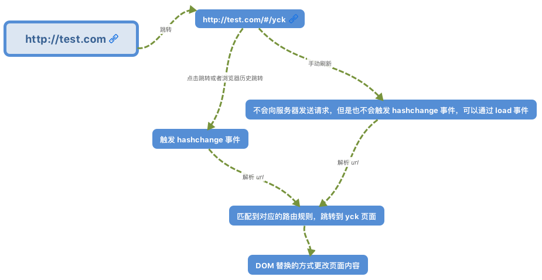
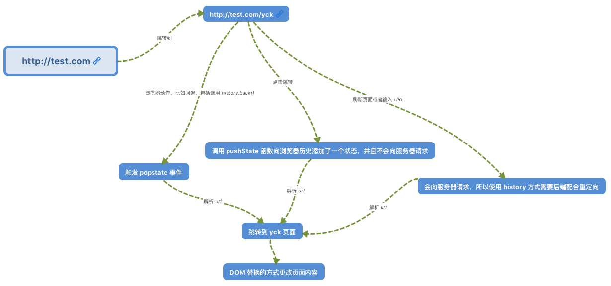

# Vue

## Vue 的 nextTick 原理

nextTick 可以让我们在下次 DOM 更新循环结束之后执行延迟回调，用于获得更新后的 DOM。

在 Vue 2.4 之前都是使用的 microtasks，但是 microtasks 的优先级过高，在某些情况下可能会出现比事件冒泡更快的情况，但如果都使用 macrotasks 又可能会出现渲染的性能问题。所以在新版本中，会默认使用 microtasks，但在特殊情况下会使用 macrotasks，比如 v-on。

对于实现 macrotasks ，会先判断是否能使用 setImmediate ，不能的话降级为 MessageChannel ，以上都不行的话就使用 setTimeout

```js
if (typeof setImmediate !== 'undefined' && isNative(setImmediate)) {
  macroTimerFunc = () => {
    setImmediate(flushCallbacks)
  }
} else if (
  typeof MessageChannel !== 'undefined' &&
  (isNative(MessageChannel) ||
    // PhantomJS
    MessageChannel.toString() === '[object MessageChannelConstructor]')
) {
  const channel = new MessageChannel()
  const port = channel.port2
  channel.port1.onmessage = flushCallbacks
  macroTimerFunc = () => {
    port.postMessage(1)
  }
} else {
  /* istanbul ignore next */
  macroTimerFunc = () => {
    setTimeout(flushCallbacks, 0)
  }
}
```

nextTick 同时也支持 Promise 的使用，会判断是否实现了 Promise

```js
export function nextTick(cb?: Function, ctx?: Object) {
  let _resolve
  // 将回调函数整合进一个数组中
  callbacks.push(() => {
    if (cb) {
      try {
        cb.call(ctx)
      } catch (e) {
        handleError(e, ctx, 'nextTick')
      }
    } else if (_resolve) {
      _resolve(ctx)
    }
  })
  if (!pending) {
    pending = true
    if (useMacroTask) {
      macroTimerFunc()
    } else {
      microTimerFunc()
    }
  }
  // 判断是否可以使用 Promise 
  // 可以的话给 _resolve 赋值
  // 这样回调函数就能以 promise 的方式调用
  if (!cb && typeof Promise !== 'undefined') {
    return new Promise(resolve => {
      _resolve = resolve
    })
  }
}
```

## Vue 生命周期

生命周期函数就是组件在初始化或者数据更新时会触发的钩子函数。


在初始化时，会调用以下代码，生命周期就是通过 callHook 调用的

```js
Vue.prototype._init = function(options) {
    initLifecycle(vm)
    initEvents(vm)
    initRender(vm)
    callHook(vm, 'beforeCreate') // 拿不到 props data
    initInjections(vm) 
    initState(vm)
    initProvide(vm)
    callHook(vm, 'created')
}
```

可以发现在以上代码中，beforeCreate 调用的时候，是获取不到 props 或者 data 中的数据的，因为这些数据的初始化都在 initState 中。

接下来会执行挂载函数

```js
export function mountComponent {
    callHook(vm, 'beforeMount')
    // ...
    if (vm.$vnode == null) {
        vm._isMounted = true
        callHook(vm, 'mounted')
    }
}
```

beforeMount 就是在挂载前执行的，然后开始创建 VDOM 并替换成真实 DOM，最后执行 mounted 钩子。这里会有个判断逻辑，如果是外部 new Vue({}) 的话，不会存在 $vnode ，所以直接执行 mounted 钩子了。如果有子组件的话，会递归挂载子组件，只有当所有子组件全部挂载完毕，才会执行根组件的挂载钩子。

接下来是数据更新时会调用的钩子函数

```js
function flushSchedulerQueue() {
  // ...
  for (index = 0; index < queue.length; index++) {
    watcher = queue[index]
    if (watcher.before) {
      watcher.before() // 调用 beforeUpdate
    }
    id = watcher.id
    has[id] = null
    watcher.run()
    // in dev build, check and stop circular updates.
    if (process.env.NODE_ENV !== 'production' && has[id] != null) {
      circular[id] = (circular[id] || 0) + 1
      if (circular[id] > MAX_UPDATE_COUNT) {
        warn(
          'You may have an infinite update loop ' +
            (watcher.user
              ? `in watcher with expression "${watcher.expression}"`
              : `in a component render function.`),
          watcher.vm
        )
        break
      }
    }
  }
  callUpdatedHooks(updatedQueue)
}

function callUpdatedHooks(queue) {
  let i = queue.length
  while (i--) {
    const watcher = queue[i]
    const vm = watcher.vm
    if (vm._watcher === watcher && vm._isMounted) {
      callHook(vm, 'updated')
    }
  }
}
```

上图还有两个生命周期没有说，分别为 activated 和 deactivated ，这两个钩子函数是 keep-alive 组件独有的。用 keep-alive 包裹的组件在切换时不会进行销毁，而是缓存到内存中并执行 deactivated 钩子函数，命中缓存渲染后会执行 actived 钩子函数。

最后就是销毁组件的钩子函数了

```js
Vue.prototype.$destroy = function() {
  // ...
  callHook(vm, 'beforeDestroy')
  vm._isBeingDestroyed = true
  // remove self from parent
  const parent = vm.$parent
  if (parent && !parent._isBeingDestroyed && !vm.$options.abstract) {
    remove(parent.$children, vm)
  }
  // teardown watchers
  if (vm._watcher) {
    vm._watcher.teardown()
  }
  let i = vm._watchers.length
  while (i--) {
    vm._watchers[i].teardown()
  }
  // remove reference from data ob
  // frozen object may not have observer.
  if (vm._data.__ob__) {
    vm._data.__ob__.vmCount--
  }
  // call the last hook...
  vm._isDestroyed = true
  // invoke destroy hooks on current rendered tree
  vm.__patch__(vm._vnode, null)
  // fire destroyed hook
  callHook(vm, 'destroyed')
  // turn off all instance listeners.
  vm.$off()
  // remove __vue__ reference
  if (vm.$el) {
    vm.$el.__vue__ = null
  }
  // release circular reference (#6759)
  if (vm.$vnode) {
    vm.$vnode.parent = null
  }
}
```

在执行销毁操作前会调用 beforeDestroy 钩子函数，然后进行一系列的销毁操作，如果有子组件的话，也会递归销毁子组件，所有子组件都销毁完毕后才会执行根组件的 destroyed 钩子函数。

## Vue 双向绑定

- 在初始化 data props 时，递归对象，给每一个属性双向绑定，对于数组而言，会拿到原型重写函数，实现手动派发更新。因为函数不能监听到数据的变动，和 proxy 比较一下。
- 除了以上数组函数，通过索引改变数组数据或者给对象添加新属性也不能触发，需要使用自带的set 函数，这个函数内部也是手动派发更新
- 在组件挂载时，会实例化渲染观察者，传入组件更新的回调。在实例化过程中，会对模板中的值对象进行求值，触发依赖收集。在触发依赖之前，会保存当前的渲染观察者，用于组件含有子组件的时候，恢复父组件的观察者。触发依赖收集后，会清理掉不需要的依赖，性能优化，防止不需要的地方去重复渲染。
- 改变值会触发依赖更新，会将收集到的所有依赖全部拿出来，放入 nextTick 中统一执行。执行过程中，会先对观察者进行排序，渲染的最后执行。先执行 beforeupdate 钩子函数，然后执行观察者的回调。在执行回调的过程中，可能 watch 会再次 push 进来，因为存在在回调中再次赋值，判断无限循环。

## v-model原理

- v:model 在模板编译的时候转换代码
- v-model 本质是 :value 和 v-on，但是略微有点区别。在输入控件下，有两个事件监听，输入中文时只有当输出中文才触发数据赋值
- v-model 和:bind 同时使用，前者优先级更高，如果 :value 会出现冲突
- v-model 因为语法糖的原因，还可以用于父子通信

## watch 和 computed 的区别和运用的场景

- 前者是计算属性，依赖其他属性计算值。并且 computer 的值有缓存，只有当计算值变化才变化触发渲染。后者监听到值得变化就会执行回调
- computer 就是简单计算一下，适用于渲染页面。watch 适合做一些复杂业务逻辑
- 前者有依赖两个 watcher，computer watcher 和渲染 watcher。判断计算出的值变化后渲染 watcher 派发更新触发渲染

## Vue 的父子通信

- 使用 v-model 实现父传子，子传父。因为 v-model 默认解析成 :value 和 :input
- 父传子
  - 通过 props
  - 通过 $children 访问子组件数组，注意该数组乱序
  - 对于多级父传子，可以使用 v-bind={$attrs} ，通过对象的方式筛选出父组件中传入但子组件不需要的 props
  - $listens 包含了父作用域中的 (不含 .native 修饰器的) v-on 事件监听器。
- 子传父
  - 父组件传递函数给子组件，子组件通过 $emit 触发
  - 修改父组件的 props
  - 通过 $parent 访问父组件
  - .sync
- 平行组件
  - EventBus
- Vuex 解决一切

## 路由原理

前端路由实现起来其实很简单，本质就是监听 URL 的变化，然后匹配路由规则，显示相应的页面，并且无须刷新。目前单页面使用的路由就只有两种实现方式

- hash 模式
- history 模式

www.test.com/#/ 就是 Hash URL，当 # 后面的哈希值发生变化时，不会向服务器请求数据，可以通过 hashchange 事件来监听到 URL 的变化，从而进行跳转页面。



History 模式是 HTML5 新推出的功能，比之 Hash URL 更加美观



## MVVM

MVVM 由以下三个内容组成

- View：界面
- Model：数据模型
- ViewModel：作为桥梁负责沟通 View 和 Model

在 JQuery 时期，如果需要刷新 UI 时，需要先取到对应的 DOM 再更新 UI，这样数据和业务的逻辑就和页面有强耦合。

在 MVVM 中，UI 是通过数据驱动的，数据一旦改变就会相应的刷新对应的 UI，UI 如果改变，也会改变对应的数据。这种方式就可以在业务处理中只关心数据的流转，而无需直接和页面打交道。ViewModel 只关心数据和业务的处理，不关心 View 如何处理数据，在这种情况下，View 和 Model 都可以独立出来，任何一方改变了也不一定需要改变另一方，并且可以将一些可复用的逻辑放在一个 ViewModel 中，让多个 View 复用这个 ViewModel。

在 MVVM 中，最核心的也就是数据双向绑定，例如 Angluar 的脏数据检测，Vue 中的数据劫持。

## 脏数据检测

当触发了指定事件后会进入脏数据检测，这时会调用 $digest 循环遍历所有的数据观察者，判断当前值是否和先前的值有区别，如果检测到变化的话，会调用 $watch 函数，然后再次调用 $digest 循环直到发现没有变化。循环至少为二次 ，至多为十次。

脏数据检测虽然存在低效的问题，但是不关心数据是通过什么方式改变的，都可以完成任务，但是这在 Vue 中的双向绑定是存在问题的。并且脏数据检测可以实现批量检测出更新的值，再去统一更新 UI，大大减少了操作 DOM 的次数。所以低效也是相对的，这就仁者见仁智者见智了。

## 数据劫持

Vue 内部使用了 Object.defineProperty() 来实现双向绑定，通过这个函数可以监听到 set 和 get 的事件。

```js
var data = { name: 'yck' }
observe(data)
let name = data.name // -> get value
data.name = 'yyy' // -> change value

function observe(obj) {
  // 判断类型
  if (!obj || typeof obj !== 'object') {
    return
  }
  Object.keys(obj).forEach(key => {
    defineReactive(obj, key, obj[key])
  })
}

function defineReactive(obj, key, val) {
  // 递归子属性
  observe(val)
  Object.defineProperty(obj, key, {
    enumerable: true,
    configurable: true,
    get: function reactiveGetter() {
      console.log('get value')
      return val
    },
    set: function reactiveSetter(newVal) {
      console.log('change value')
      val = newVal
    }
  })
}
```

以上代码简单的实现了如何监听数据的 set 和 get 的事件，但是仅仅如此是不够的，还需要在适当的时候给属性添加发布订阅

```js
<div>
    {{name}}
</div>
```

在解析如上模板代码时，遇到 {{name}} 就会给属性 name 添加发布订阅。

```js
// 通过 Dep 解耦
class Dep {
  constructor() {
    this.subs = []
  }
  addSub(sub) {
    // sub 是 Watcher 实例
    this.subs.push(sub)
  }
  notify() {
    this.subs.forEach(sub => {
      sub.update()
    })
  }
}
// 全局属性，通过该属性配置 Watcher
Dep.target = null

function update(value) {
  document.querySelector('div').innerText = value
}

class Watcher {
  constructor(obj, key, cb) {
    // 将 Dep.target 指向自己
    // 然后触发属性的 getter 添加监听
    // 最后将 Dep.target 置空
    Dep.target = this
    this.cb = cb
    this.obj = obj
    this.key = key
    this.value = obj[key]
    Dep.target = null
  }
  update() {
    // 获得新值
    this.value = this.obj[this.key]
    // 调用 update 方法更新 Dom
    this.cb(this.value)
  }
}
var data = { name: 'yck' }
observe(data)
// 模拟解析到 `{{name}}` 触发的操作
new Watcher(data, 'name', update)
// update Dom innerText
data.name = 'yyy' 
```

接下来,对 defineReactive 函数进行改造

```js
function defineReactive(obj, key, val) {
  // 递归子属性
  observe(val)
  let dp = new Dep()
  Object.defineProperty(obj, key, {
    enumerable: true,
    configurable: true,
    get: function reactiveGetter() {
      console.log('get value')
      // 将 Watcher 添加到订阅
      if (Dep.target) {
        dp.addSub(Dep.target)
      }
      return val
    },
    set: function reactiveSetter(newVal) {
      console.log('change value')
      val = newVal
      // 执行 watcher 的 update 方法
      dp.notify()
    }
  })
}
```

以上实现了一个简易的双向绑定，核心思路就是手动触发一次属性的 getter 来实现发布订阅的添加。

## Proxy 与 Object.defineProperty 对比

Object.defineProperty 虽然已经能够实现双向绑定了，但是他还是有缺陷的。

- 只能对属性进行数据劫持，所以需要深度遍历整个对象
- 对于数组不能监听到数据的变化

虽然 Vue 中确实能检测到数组数据的变化，但是其实是使用了 hack 的办法，并且也是有缺陷的。

```js
const arrayProto = Array.prototype
export const arrayMethods = Object.create(arrayProto)
// hack 以下几个函数
const methodsToPatch = [
  'push',
  'pop',
  'shift',
  'unshift',
  'splice',
  'sort',
  'reverse'
]
methodsToPatch.forEach(function (method) {
  // 获得原生函数
  const original = arrayProto[method]
  def(arrayMethods, method, function mutator (...args) {
    // 调用原生函数
    const result = original.apply(this, args)
    const ob = this.__ob__
    let inserted
    switch (method) {
      case 'push':
      case 'unshift':
        inserted = args
        break
      case 'splice':
        inserted = args.slice(2)
        break
    }
    if (inserted) ob.observeArray(inserted)
    // 触发更新
    ob.dep.notify()
    return result
  })
})
```

反观 Proxy 就没以上的问题，原生支持监听数组变化，并且可以直接对整个对象进行拦截，所以 Vue 也将在下个大版本中使用 Proxy 替换 Object.defineProperty

```js
let onWatch = (obj, setBind, getLogger) => {
  let handler = {
    get(target, property, receiver) {
      getLogger(target, property)
      return Reflect.get(target, property, receiver);
    },
    set(target, property, value, receiver) {
      setBind(value);
      return Reflect.set(target, property, value);
    }
  };
  return new Proxy(obj, handler);
};

let obj = { a: 1 }
let value
let p = onWatch(obj, (v) => {
  value = v
}, (target, property) => {
  console.log(`Get '${property}' = ${target[property]}`);
})
p.a = 2 // bind `value` to `2`
p.a // -> Get 'a' = 2
```

## 虚拟 DOM

[深入框架本源系列 —— Virtual Dom](https://juejin.im/post/5b10dd36e51d4506e04cf802)

## 路由鉴权

- 登录页和其他页面分开，登录以后实例化 Vue 并且初始化需要的路由
- 动态路由，通过 addRoute 实现

## Vue 和 React 区别

- Vue 表单支持双向绑定开发更方便
- 改变数据方式不同，setState 有使用坑
- props Vue 可变，React 不可变
- 判断是否需要更新 React 可以通过钩子函数判断，Vue 使用依赖追踪，修改了什么才渲染什么
- React 16以后 有些钩子函数会执行多次
- React 需要使用 JSX，需要 Babel 编译。Vue 虽然可以使用模板，但是也可以通过直接编写 render 函数不需要编译就能运行。
- 生态 React 相对较好

::: tip 参考链接
[大厂面经](https://juejin.im/post/5ba34e54e51d450e5162789b), by 夕阳.
:::