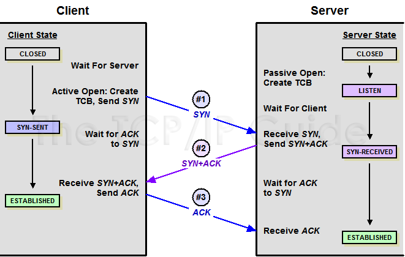
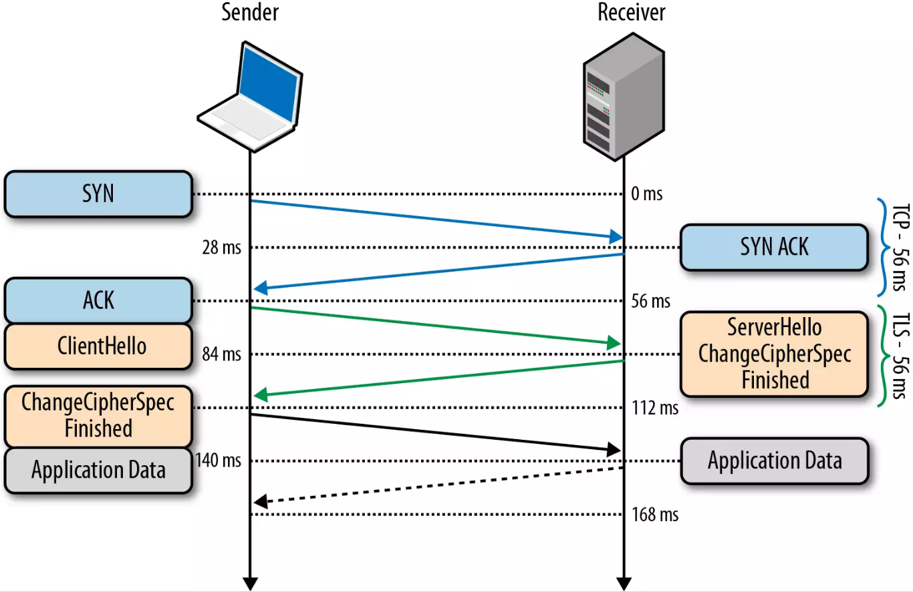

# 网络

## TCP 3次握手

在 TCP 协议中，主动发起请求的一端为客户端，被动连接的一端称为服务端。不管是客户端还是服务端，TCP 连接建立完后都能发送和接收数据，所以 TCP 也是一个全双工的协议。

起初，两端都为 CLOSED 状态。在通信开始前，双方都会创建 TCB。 服务器创建完 TCB 后遍进入 LISTEN 状态，此时开始等待客户端发送数据。

**第一次握手**:

客户端向服务端发送连接请求报文段。该报文段中包含自身的数据通讯初始序号。请求发送后，客户端便进入 SYN-SENT 状态，x 表示客户端的数据通信初始序号。

**第二次握手**:

服务端收到连接请求报文段后，如果同意连接，则会发送一个应答，该应答中也会包含自身的数据通讯初始序号，发送完成后便进入 SYN-RECEIVED 状态。

**第三次握手**:

当客户端收到连接同意的应答后，还要向服务端发送一个确认报文。客户端发完这个报文段后便进入ESTABLISHED 状态，服务端收到这个应答后也进入 ESTABLISHED 状态，此时连接建立成功。

PS：第三次握手可以包含数据，通过 TCP 快速打开（TFO）技术。其实只要涉及到握手的协议，都可以使用类似 TFO 的方式，客户端和服务端存储相同 cookie，下次握手时发出 cookie 达到减少 RTT 的目的。

**你是否有疑惑明明两次握手就可以建立起连接，为什么还需要第三次应答**？

因为这是为了防止失效的连接请求报文段被服务端接收，从而产生错误。

可以想象如下场景。客户端发送了一个连接请求 A，但是因为网络原因造成了超时，这时 TCP 会启动超时重传的机制再次发送一个连接请求 B。此时请求顺利到达服务端，服务端应答完就建立了请求。如果连接请求 A 在两端关闭后终于抵达了服务端，那么这时服务端会认为客户端又需要建立 TCP 连接，从而应答了该请求并进入 ESTABLISHED 状态。此时客户端其实是 CLOSED 状态，那么就会导致服务端一直等待，造成资源的浪费。

PS：在建立连接中，任意一端掉线，TCP 都会重发 SYN 包，一般会重试五次，在建立连接中可能会遇到 SYN FLOOD 攻击。遇到这种情况你可以选择调低重试次数或者干脆在不能处理的情况下拒绝请求。

## TCP 拥塞控制

拥塞处理和流量控制不同，后者是作用于接收方，保证接收方来得及接受数据。而前者是作用于网络，防止过多的数据拥塞网络，避免出现网络负载过大的情况。

拥塞处理包括了四个算法，分别为：慢开始，拥塞避免，快速重传，快速恢复。

## 慢开始算法

慢开始算法，顾名思义，就是在传输开始时将发送窗口慢慢指数级扩大，从而避免一开始就传输大量数据导致网络拥塞。

慢开始算法步骤具体如下

- 连接初始设置拥塞窗口（Congestion Window） 为 1 MSS（一个分段的最大数据量）
- 每过一个 RTT 就将窗口大小乘二
- 指数级增长肯定不能没有限制的，所以有一个阈值限制，当窗口大小大于阈值时就会启动拥塞避免算法。

## 拥塞避免算法

拥塞避免算法相比简单点，每过一个 RTT 窗口大小只加一，这样能够避免指数级增长导致网络拥塞，慢慢将大小调整到最佳值。

在传输过程中可能定时器超时的情况，这时候 TCP 会认为网络拥塞了，会马上进行以下步骤：

- 将阈值设为当前拥塞窗口的一半
- 将拥塞窗口设为 1 MSS
- 启动拥塞避免算法

## 快速重传

快速重传一般和快恢复一起出现。一旦接收端收到的报文出现失序的情况，接收端只会回复最后一个顺序正确的报文序号（没有 Sack 的情况下）。如果收到三个重复的 ACK，无需等待定时器超时再重发而是启动快速重传。具体算法分为两种：

**TCP Taho 实现如下**:

- 将阈值设为当前拥塞窗口的一半
- 将拥塞窗口设为 1 MSS
- 重新开始慢开始算法

**TCP Reno 实现如下**:

- 拥塞窗口减半
- 将阈值设为当前拥塞窗口
- 进入快恢复阶段（重发对端需要的包，一旦收到一个新的 ACK 答复就退出该阶段）
- 使用拥塞避免算法

## TCP New Ren 改进后的快恢复

TCP New Reno 算法改进了之前 TCP Reno 算法的缺陷。在之前，快恢复中只要收到一个新的 ACK 包，就会退出快恢复。

在 TCP New Reno 中，TCP 发送方先记下三个重复 ACK 的分段的最大序号。

假如我有一个分段数据是 1 ~ 10 这十个序号的报文，其中丢失了序号为 3 和 7 的报文，那么该分段的最大序号就是 10。发送端只会收到 ACK 序号为 3 的应答。这时候重发序号为 3 的报文，接收方顺利接收并会发送 ACK 序号为 7 的应答。这时候 TCP 知道对端是有多个包未收到，会继续发送序号为 7 的报文，接收方顺利接收并会发送 ACK 序号为 11 的应答，这时发送端认为这个分段接收端已经顺利接收，接下来会退出快恢复阶段。

## HTTPS 握手

HTTPS 还是通过了 HTTP 来传输信息，但是信息通过 TLS 协议进行了加密。

## TLS

TLS 协议位于传输层之上，应用层之下。首次进行 TLS 协议传输需要两个 RTT ，接下来可以通过 Session Resumption 减少到一个 RTT。

在 TLS 中使用了两种加密技术，分别为：对称加密和非对称加密。

对称加密：

对称加密就是两边拥有相同的秘钥，两边都知道如何将密文加密解密。

非对称加密：

有公钥私钥之分，公钥所有人都可以知道，可以将数据用公钥加密，但是将数据解密必须使用私钥解密，私钥只有分发公钥的一方才知道。

TLS 握手过程如下图：

- 客户端发送一个随机值，需要的协议和加密方式
- 服务端收到客户端的随机值，自己也产生一个随机值，并根据客户端需求的协议和加密方式来使用对应的方式，发送自己的证书（如果需要验证客户端证书需要说明）
- 客户端收到服务端的证书并验证是否有效，验证通过会再生成一个随机值，通过服务端证书的公钥去加密这个随机值并发送给服务端，如果服务端需要验证客户端证书的话会附带证书
- 服务端收到加密过的随机值并使用私钥解密获得第三个随机值，这时候两端都拥有了三个随机值，可以通过这三个随机值按照之前约定的加密方式生成密钥，接下来的通信就可以通过该密钥来加密解密

通过以上步骤可知，在 TLS 握手阶段，两端使用非对称加密的方式来通信，但是因为非对称加密损耗的性能比对称加密大，所以在正式传输数据时，两端使用对称加密的方式通信。

PS：以上说明的都是 TLS 1.2 协议的握手情况，在 1.3 协议中，首次建立连接只需要一个 RTT，后面恢复连接不需要 RTT 了。

## 从输入 URL 到页面加载全过程

- 首先做 DNS 查询，如果这一步做了智能 DNS 解析的话，会提供访问速度最快的 IP 地址回来
- 接下来是 TCP 握手，应用层会下发数据给传输层，这里 TCP 协议会指明两端的端口号，然后下发给网络层。网络层中的 IP 协议会确定 IP 地址，并且指示了数据传输中如何跳转路由器。然后包会再被封装到数据链路- 层的数据帧结构中，最后就是物理层面的传输了
- TCP 握手结束后会进行 TLS 握手，然后就开始正式的传输数据
- 数据在进入服务端之前，可能还会先经过负责负载均衡的服务器，它的作用就是将请求合理的分发到多台服务器上，这时假设服务端会响应一个 HTML 文件
- 首先浏览器会判断状态码是什么，如果是 200 那就继续解析，如果 400 或 500 的话就会报错，如果 300 的话会进行重定向，这里会有个重定向计数器，避免过多次的重定向，超过次数也会报错
- 浏览器开始解析文件，如果是 gzip 格式的话会先解压一下，然后通过文件的编码格式知道该如何去解码文件
- 文件解码成功后会正式开始渲染流程，先会根据 HTML 构建 DOM 树，有 CSS 的话会去构建 CSSOM 树。如果遇到 script 标签的话，会判断是否存在 async 或者 defer ，前者会并行进行下载并执行 JS，后者会- 先下载文件，然后等待 HTML 解析完成后顺序执行，如果以上都没有，就会阻塞住渲染流程直到 JS 执行完毕。遇到文件下载的会去下载文件，这里如果使用 HTTP 2.0 协议的话会极大的提高多图的下载效率。
- 初始的 HTML 被完全加载和解析后会触发 DOMContentLoaded 事件
- CSSOM 树和 DOM 树构建完成后会开始生成 Render 树，这一步就是确定页面元素的布局、样式等等诸多方面的东西
- 在生成 Render 树的过程中，浏览器就开始调用 GPU 绘制，合成图层，将内容显示在屏幕上了

## HTTP 常用返回码

**2XX 成功**:

- 200 OK，表示从客户端发来的请求在服务器端被正确处理
- 204 No content，表示请求成功，但响应报文不含实体的主体部分
- 205 Reset Content，表示请求成功，但响应报文不含实体的主体部分，但是与 204 响应不同在于要求请求方重置内容
- 206 Partial Content，进行范围请求

**3XX 重定向**:

- 301 moved permanently，永久性重定向，表示资源已被分配了新的 URL
- 302 found，临时性重定向，表示资源临时被分配了新的 URL
- 303 see other，表示资源存在着另一个 URL，应使用 GET 方法获取资源
- 304 not modified，表示服务器允许访问资源，但因发生请求未满足条件的情况
- 307 temporary redirect，临时重定向，和302含义类似，但是期望客户端保持请求方法不变向新的地址发出请求

**4XX 客户端错误**:

- 400 bad request，请求报文存在语法错误
- 401 unauthorized，表示发送的请求需要有通过 HTTP 认证的认证信息
- 403 forbidden，表示对请求资源的访问被服务器拒绝
- 404 not found，表示在服务器上没有找到请求的资源

**5XX 服务器错误**:

- 500 internal sever error，表示服务器端在执行请求时发生了错误
- 501 Not Implemented，表示服务器不支持当前请求所需要的某个功能
- 503 service unavailable，表明服务器暂时处于超负载或正在停机维护，无法处理请求

::: tip 参考链接
[大厂面经](https://juejin.im/post/5ba34e54e51d450e5162789b), by 夕阳.
:::