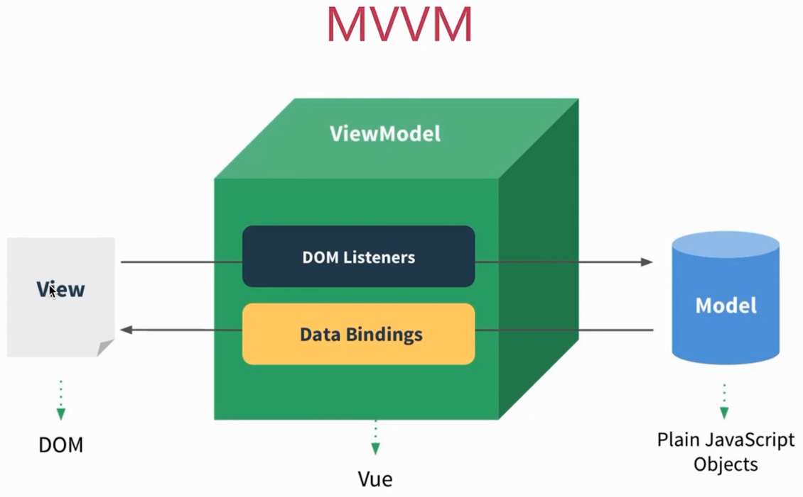

# MVVM

### MVVM 三要素

- 响应式: `vue` 如何监听到 `data` 的每个属性变化

- 模版引擎: `vue` 的模版如何被解析, 指令如何被处理

- 渲染: `vue` 的模版如何被渲染成 `html`? 以及渲染过程

### MVC

### MVVM

- `Model` - 模型、数据

- `View` - 视图、模版(视图和模型是分离的)

- `ViewModel` - 连接 `Model` 和 `View`

