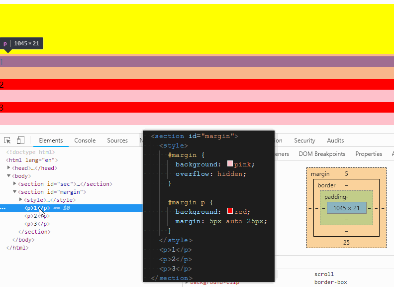
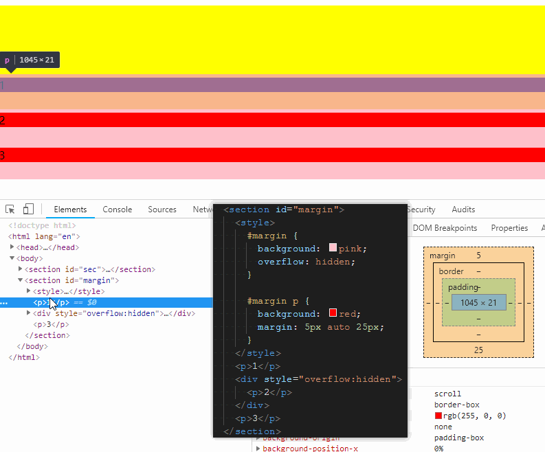
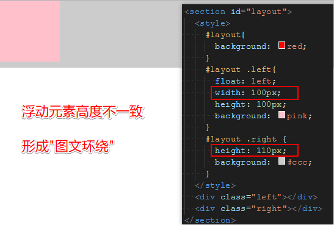
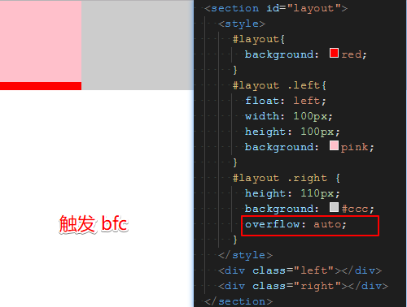
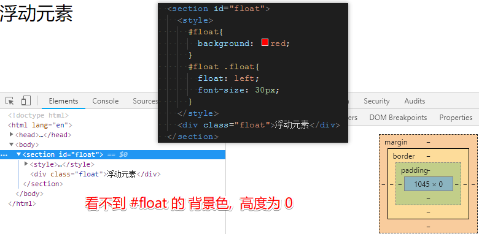
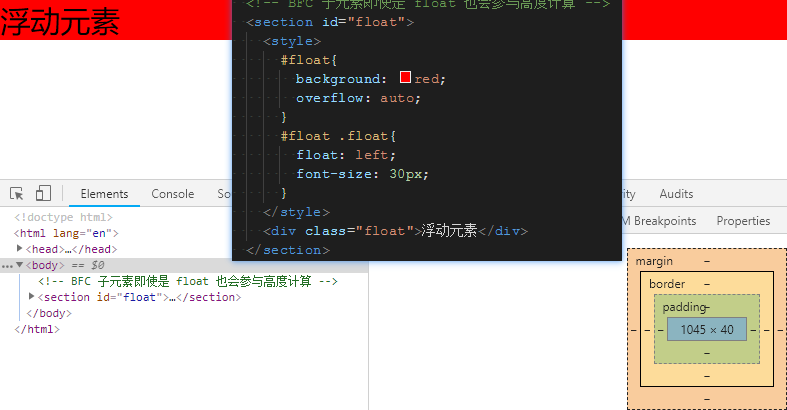

# BFC 使用场景

- 利用 `BFC` 清除垂直边距重叠

`p` 元素之间的 `margin` 垂直边距重叠:

给第二个 `p` 元素增加一个父元素, 加上 `overflow: hidden` 触发 `BFC`, 清除 `margin` 垂直边距重叠:

- `BFC` 不与 `float` 重叠

利用 `BFC` 去除 浮动元素重叠:

- BFC 触发 `float` 元素参与计算

`overflow: auto` 触发 `BFC`

