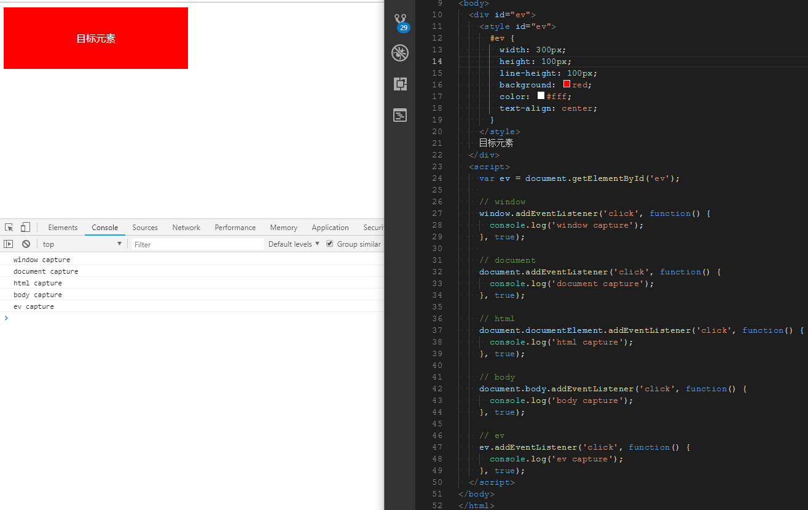

# 捕获演示

```html
<!DOCTYPE html>
<html lang="en">
<head>
  <meta charset="UTF-8">
  <title>event</title>
</head>
<body>
  <div id="ev">
    <style id="ev">
      #ev {
        width: 300px;
        height: 100px;
        line-height: 100px;
        background: red;
        color: #fff;
        text-align: center;
      }
    </style>
    目标元素
  </div>
  <script>
    var ev = document.getElementById('ev');

    // window
    window.addEventListener('click', function() {
      console.log('window capture');
    }, true);

    // document
    document.addEventListener('click', function() {
      console.log('document capture');
    }, true);

    // html
    document.documentElement.addEventListener('click', function() {
      console.log('html capture');
    }, true);

    // body
    document.body.addEventListener('click', function() {
      console.log('body capture');
    }, true);

    // ev
    ev.addEventListener('click', function() {
      console.log('ev capture');
    }, true);
  </script>
</body>
</html>
```

