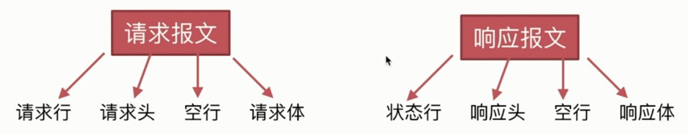

# HTTP 报文的组成部分

**请求报文**:

请求行、请求头、空行、请求体

**响应报文**:

状态行、响应头、空行、响应体



- 请求示例

`Request Headers`:

```bash
GET / HTTP/1.1
Host: imooc.com
Connection: keep-alive
Pragma: no-cache
Cache-Control: no-cache
Upgrade-Insecure-Requests: 1
User-Agent: Mozilla/5.0 (Windows NT 10.0; WOW64) AppleWebKit/537.36 (KHTML, like Gecko) Chrome/69.0.3497.81 Safari/537.36
Accept: text/html,application/xhtml+xml,application/xml;q=0.9,image/webp,image/apng,*/*;q=0.8
Accept-Encoding: gzip, deflate
Accept-Language: zh-CN,zh;q=0.9,en;q=0.8
Cookie: imooc_uuid=59889957-941f-0a5233730096;
```

`Response Headers`:

```bash
HTTP/1.1 200 OK
Server: nginx
Date: Mon, 10 Sep 2018 14:26:48 GMT
Content-Type: text/css
Content-Length: 9547
Connection: keep-alive
Last-Modified: Thu, 09 Aug 2018 10:43:57 GMT
Vary: Accept-Encoding
ETag: W/"5b6c1aed-be7b"
Expires: Sun, 07 Oct 2018 02:38:55 GMT
Cache-Control: max-age=2592000
Content-Encoding: gzip
X-Varnish: 195965904 82919848
Age: 301673
Via: 1.1 varnish (Varnish/6.0)
X-Cache: HIT from CS42
Accept-Ranges: bytes
```