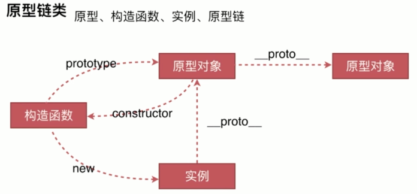
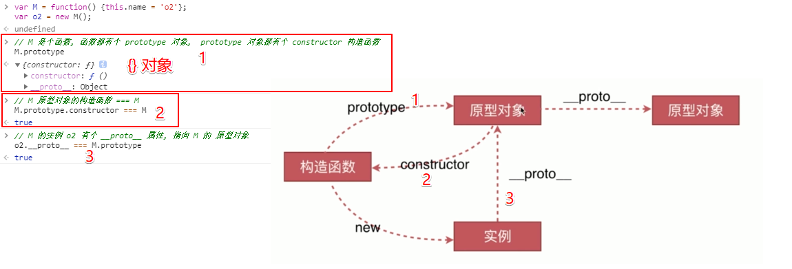

# 原型、构造函数、实例、原型链

- 实例:

`var o1 = {name: 'o1'};`

`var o2 = new M();`

`o1` 和 `o2` 都是实例.

- 构造函数:

`var M = function() {this.name = 'o2'};`

`var o2 = new M();`

函数都可以使用 `new`, 使用 `new` 的函数就是构造函数.

任何函数都可以当作构造函数.

- 原型对象:

函数都有一个 `prototype` 属性, 这个 `prototype` 就是原型对象.

原型对象都有个 `constructor` 构造器, 这个构造器会默认声明的那个函数.



- `__proto__ 属性`

- `prototype 对象`

- 只有对象有 `prototype`

- 函数也是对象



```js
var p = {name: 'o3'};
var o3 = Object.create(p);

// true
o3.__proto__ === p

// "o3", 本身没有, 通过原型链找到
o3.name
```