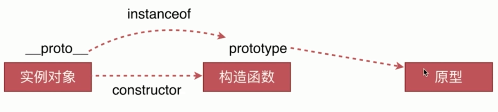

# instanceof 原理

`实例对象.__proto__ === 构造函数.prototype`

在一条链上的 `instanceof` 都会返回 `true`



```js
var M = function() {this.name = 'o2'};
var o2 = new M();

// true
o2 instanceof M

// true
M instanceof Object

// true
M.prototype.__proto__ === Object.prototype

// true
o2.__proto__.constructor === M

// false
o2.__proto__.constructor === Object
```