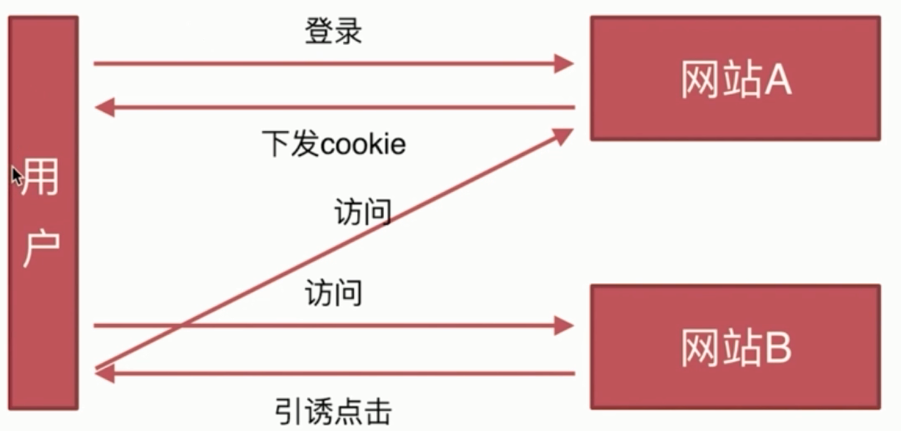

# CSRF

- 基本概念和缩写

- 攻击原理

- 防御措施

### 基本概念和缩写

`CSRF`, 跨站请求伪造, 英文全称 `Cross-site request forgery`.

### CSRF 攻击原理

大致如下:

- `用户A` **登录** `网站A`. 生成 `cookie`.

- `用户A` 访问 `网站B`, 在 `网站B` 点击了一个链接

- 点击链接后, `网站B` 利用 `用户A` 的 `cookie` 去访问 `网站A`.

### CSRF 防御措施

- `Token` 验证: 访问接口, 服务器给你个 `token`, 再次访问浏览器只自动携带 `cookie`, 如果没有带 `token` 的话就认为没通过验证.

- `Referer` 验证: 页面来源

- 隐藏令牌: 类似 `token`, 一般隐藏在 `http` 头中