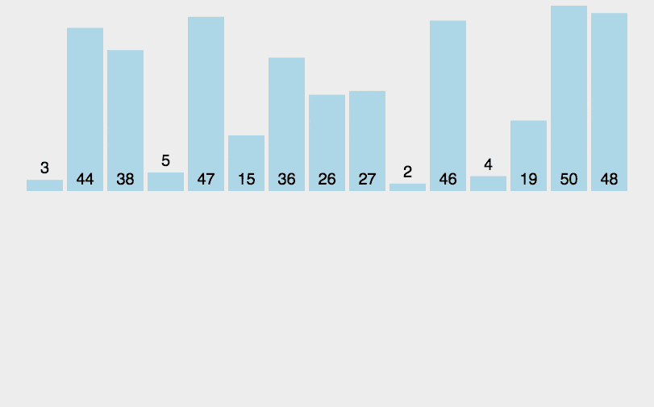

# 插入排序

插入排序也比较简单。就像打扑克一样，依次将拿到的元素插入到正确的位置即可。

将第一待排序序列第一个元素看做一个有序序列，把第二个元素到最后一个元素当成是未排序序列。

从头到尾依次扫描未排序序列，将扫描到的每个元素插入有序序列的适当位置。（如果待插入的元素与有序序列中的某个元素相等，则将待插入元素插入到相等元素的后面。）



```js
// 插入排序 从下标1开始每增1项排序一次，越往后遍历次数越多
function sort1(array) {
  var len = array.length,
      i, j, tmp, result;
  
  // 设置数组副本
  result = array.slice(0);
  for(i=1; i < len; i++){
    tmp = result[i];
    j = i - 1;
    while(j>=0 && tmp < result[j]){
      result[j+1] = result[j];
      j--;
    }
    result[j+1] = tmp;
  }
  return result;
}
```

### 二分插入排序

插入排序的一种优化实现， 通过二分法减少遍历时间。

```js
// 先在有序区通过二分查找的方法找到移动元素的起始位置，
// 然后通过这个起始位置将后面所有的元素后移
function sort2(array) {
  var len = array.length,
      i, j, tmp, low, high, mid, result;
  // 赋予数组副本
  result = array.slice(0);
  for(i = 1; i < len; i++){
    tmp = result[i];
    low = 0;
    high = i - 1;
    while(low <= high){
      mid = parseInt((low + high)/2, 10);
      if(tmp < result[mid]) high = mid - 1;
      else low = mid + 1;
    }
    for(j = i - 1; j >= high+1; j--){
      result[j+1] = result[j];
    }
    result[j+1] = tmp;
  }
  return result;
}
```