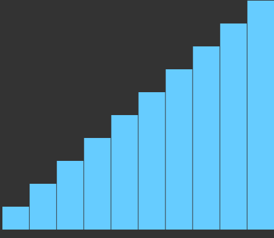

# 希尔排序

排序思路：先将整个待排序记录序列分割成若干个子序列，在序列内分别进行直接插入排序，待整个序列基本有序时，再对全体记录进行一次直接插入排序。



```js
// 希尔排序：先将整个待排序记录序列分割成若干个子序列
// 在序列内分别进行直接插入排序，待整个序列基本有序时，
// 再对全体记录进行一次直接插入排序
function sort3(array){
  var len = array.length, gap = parseInt(len/2), 
      i, j, tmp, result;
  // 复制数组
  result = array.slice(0);
  while(gap > 0){
    for(i = gap; i < len; i++){
      tmp = result[i];
      j = i - gap;
      while(j>=0 && tmp < result[j]){
        result[j + gap] = result[j];
        j = j - gap;
      }
      result[j + gap] = tmp;
    }
    gap = parseInt(gap/2);
  }
  return result;
}
```