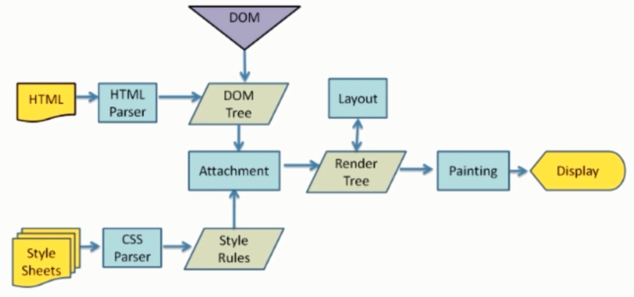
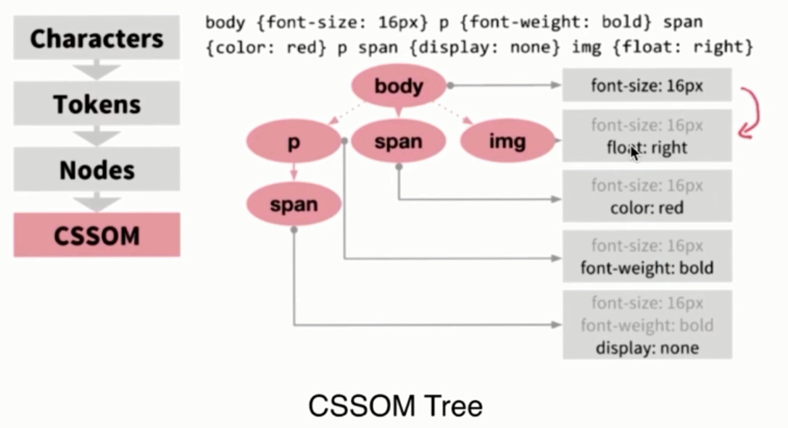
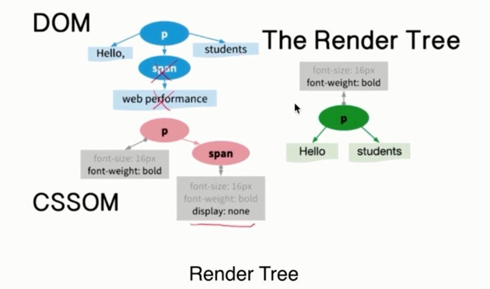
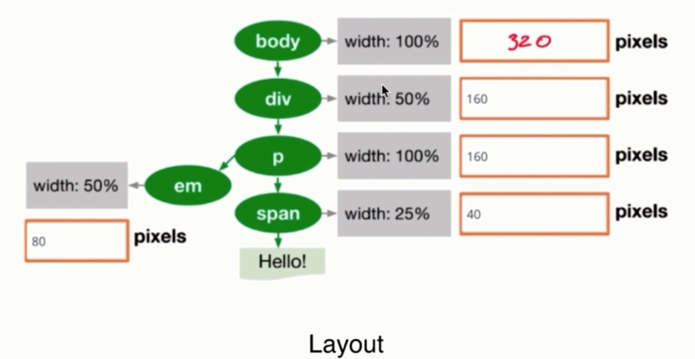

# 浏览器渲染过程

从上面这个图中，我们可以看到那么几个事：

- 浏览器会解析：

解析 `HTML` 会产生一个`DOM Tree`。 `CSS`，解析 `CSS` 会产生 `CSS规则树`。

- 解析完成后，浏览器引擎会通过 `DOM Tree` 和 `CSS Rule Tree` 来构造 `Rendering Tree`。注意：

`Rendering Tree` 渲染树并不等同于 `DOM树` ，因为一些像 `Header` 或 `display:none` 的东西就没必要放在渲染树中了。 `CSS` 的 `Rule Tree` 主要是为了完成匹配并把 `CSS Rule` 附加上 `Rendering Tree`上的每个 `Element`。也就是DOM结点。也就是所谓的 `Frame` 。 然后，计算每个 `Frame`（也就是每个 `Element` ）的位置，这又叫 `layout` 和 `reflow` 过程。

- 最后通过调用操作系统 `Native GUI` 的 `API` 绘制。

### DOM-Tree

### CSSOM-Tree

### Render-tree

### Layout

